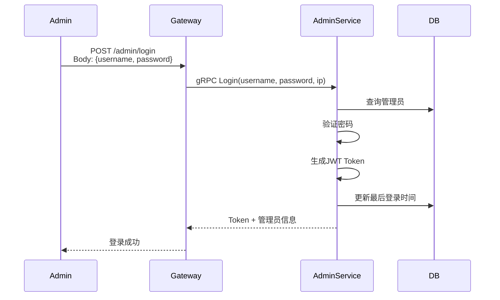
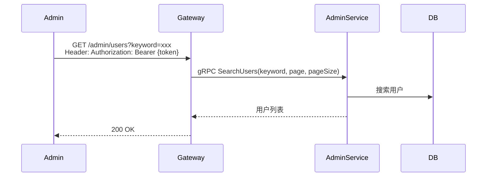
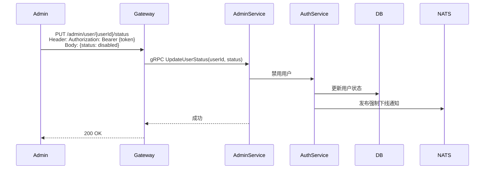

# 管理后台设计

## 1. 概述

Admin服务提供后台管理功能，包括管理员管理、用户管理、群组管理、系统配置、审计日志等。

## 2. 功能列表

### 2.1 管理员管理
- [x] 管理员登录
- [x] 管理员列表
- [x] 创建管理员
- [x] 禁用/启用管理员
- [x] 重置密码

### 2.2 用户管理
- [x] 搜索用户
- [x] 查看用户详情
- [x] 禁用/启用用户
- [x] 封禁/解封用户

### 2.3 群组管理
- [x] 查看群组信息
- [x] 解散群组

### 2.4 系统管理
- [x] 系统统计
- [x] 系统配置管理
- [x] 审计日志

## 3. 管理员角色

| 角色 | 说明 |
|------|------|
| super | 超级管理员 |
| admin | 普通管理员 |
| operator | 操作员 |

## 4. 数据模型

### 4.1 AdminUser 表

```go
type AdminUser struct {
    ID        string    // 管理员ID
    Username  string    // 用户名
    Password  string    // 密码哈希
    Role      string    // 角色
    Status    int8      // 状态: 1-正常 2-禁用
    CreatedAt time.Time
    UpdatedAt time.Time
}
```

### 4.2 AuditLog 表

```go
type AuditLog struct {
    ID          string    // 日志ID
    AdminID     string    // 管理员ID
    Action      string    // 操作类型
    TargetType  string    // 目标类型
    TargetID    string    // 目标ID
    Details     string    // 详情(JSON)
    IPAddress   string    // IP地址
    CreatedAt   time.Time
}
```

### 4.3 SystemConfig 表

```go
type SystemConfig struct {
    ID        string    // 配置Key
    Value     string    // 配置值
    CreatedAt time.Time
    UpdatedAt time.Time
}
```

## 5. 业务流程

### 5.1 管理员登录



### 5.2 用户管理



### 5.3 禁用/启用用户


