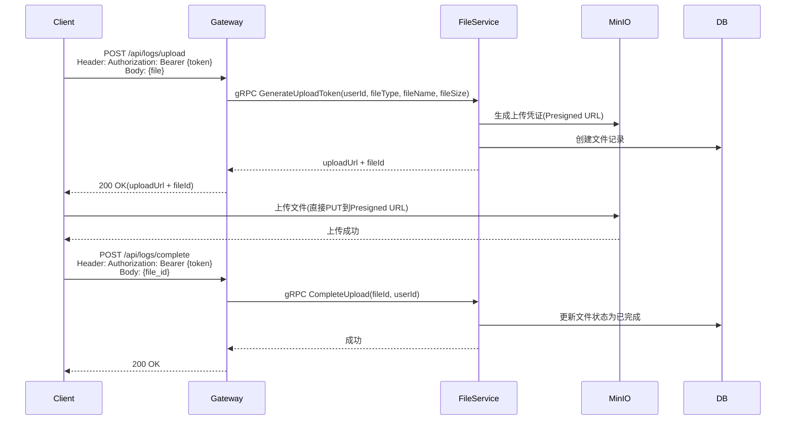
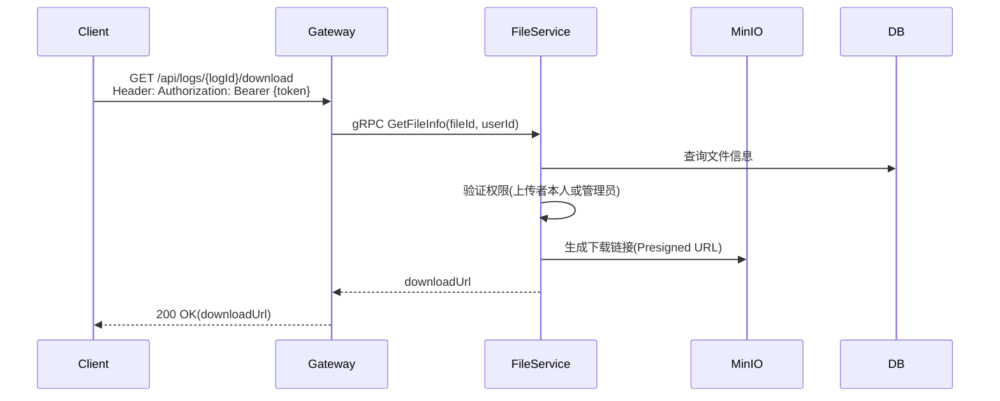
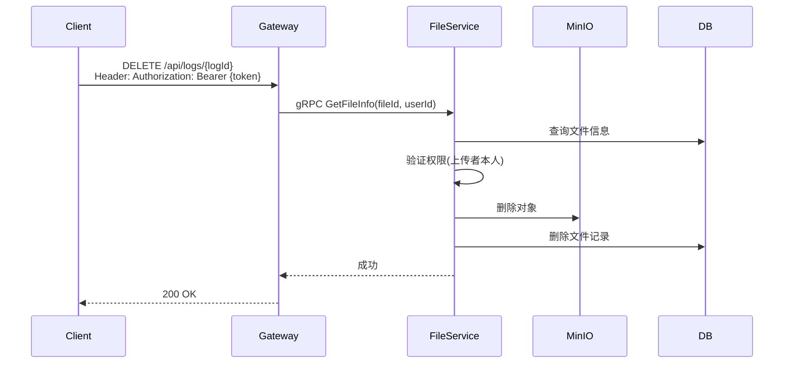
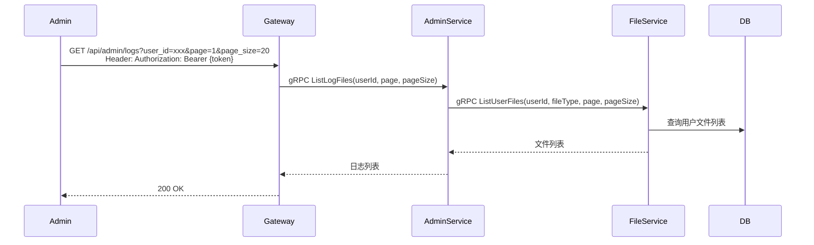

# 客户端日志管理功能设计

## 1. 概述

日志管理功能提供客户端日志文件的上传、下载、列表、删除能力。用户可以上传自己的客户端日志，管理员可查看和下载用户日志用于问题排查。

## 2. 功能列表

- [x] 上传日志文件
- [x] 下载日志文件
- [x] 获取日志列表
- [x] 删除日志文件

## 3. 业务流程

### 3.1 上传日志文件



### 3.2 下载日志文件



### 3.3 删除日志文件



### 3.4 管理员查看日志列表



## 4. API设计

### 4.1 上传日志文件(获取上传凭证)

```
POST /api/logs/upload
Header: Authorization: Bearer {token}
Body: multipart/form-data
- file: 日志文件
```

**响应**
```json
{
  "file_id": "xxx",
  "upload_url": "xxx",
  "expires_in": 3600
}
```

### 4.2 完成上传

```
POST /api/logs/complete
Header: Authorization: Bearer {token}
Body: {
  "file_id": "xxx"
}
```

### 4.3 获取当前用户日志列表

```
GET /api/logs?page=1&page_size=20
Header: Authorization: Bearer {token}
```

**响应**
```json
{
  "logs": [
    {
      "log_id": "xxx",
      "file_id": "xxx",
      "file_name": "app.log",
      "file_size": 1024000,
      "created_at": "2026-04-09T10:00:00Z"
    }
  ],
  "total": 100,
  "page": 1,
  "page_size": 20
}
```

### 4.4 下载日志文件

```
GET /api/logs/{logId}/download
Header: Authorization: Bearer {token}
```

**响应**
```json
{
  "download_url": "xxx",
  "expires_in": 3600
}
```

### 4.5 删除日志文件

```
DELETE /api/logs/{logId}
Header: Authorization: Bearer {token}
```

**响应**
```json
{
  "success": true
}
```

### 4.6 管理员获取所有日志列表

```
GET /api/admin/logs?user_id=xxx&page=1&page_size=20
Header: Authorization: Bearer {token}
```

## 5. 数据模型

### 5.1 客户端日志

客户端日志使用 FileService 的 `FileInfo` 模型，通过 `file_type = "log"` 区分。

```go
type FileInfo struct {
    FileID    string    // 文件ID
    UserID    string    // 上传用户ID
    FileName  string    // 文件名
    FileType  string    // 文件类型(log)
    FileSize  int64     // 文件大小
    CreatedAt time.Time // 上传时间
}
```

### 5.2 proto定义

```protobuf
// LogFile 日志文件信息
message LogFile {
  string log_id = 1;
  string file_id = 2;
  string file_name = 3;
  int64 file_size = 4;
  string user_id = 5;
  int64 created_at = 6;
}

// UploadLogRequest 上传日志请求
message UploadLogRequest {
  string user_id = 1;
  string file_name = 2;
  int64 file_size = 3;
  string file_type = 4;  // 固定为 "log"
}

// UploadLogResponse 上传日志响应
message UploadLogResponse {
  string file_id = 1;
  string upload_url = 2;
  int64 expires_in = 3;
}

// CompleteLogUploadRequest 完成上传请求
message CompleteLogUploadRequest {
  string file_id = 1;
  string user_id = 2;
}

// ListLogFilesRequest 获取日志列表请求
message ListLogFilesRequest {
  string user_id = 1;
  string file_type = 2;  // 固定为 "log"
  int32 page = 3;
  int32 page_size = 4;
}

// ListLogFilesResponse 获取日志列表响应
message ListLogFilesResponse {
  repeated LogFile logs = 1;
  int64 total = 2;
  int32 page = 3;
  int32 page_size = 4;
}

// GetLogDownloadURLRequest 获取下载链接请求
message GetLogDownloadURLRequest {
  string file_id = 1;
  string user_id = 2;
  int32 expires_minutes = 3;
}

// GetLogDownloadURLResponse 获取下载链接响应
message GetLogDownloadURLResponse {
  string download_url = 1;
  int64 expires_in = 2;
}

// DeleteLogFileRequest 删除日志请求
message DeleteLogFileRequest {
  string file_id = 1;
  string user_id = 2;
}

// DeleteLogFileResponse 删除日志响应
message DeleteLogFileResponse {
  bool success = 1;
}
```

## 6. 权限控制

| 操作 | 权限要求 |
|------|----------|
| 上传日志 | 所有登录用户 |
| 下载日志 | 上传者本人或管理员 |
| 查看自己的日志列表 | 上传者本人 |
| 管理员查看所有日志 | 管理员 |
| 删除日志 | 上传者本人 |

## 7. 存储设计

- **MinIO Bucket**: `client-logs` (私有桶)
- **文件存储路径**: `logs/{user_id}/{year}/{month}/{file_id}_{filename}`
- **文件类型标识**: `file_type = "log"`

## 8. 依赖服务

- **FileService**: 文件上传下载
- **MinIO**: 对象存储
- **PostgreSQL**: 文件元信息存储