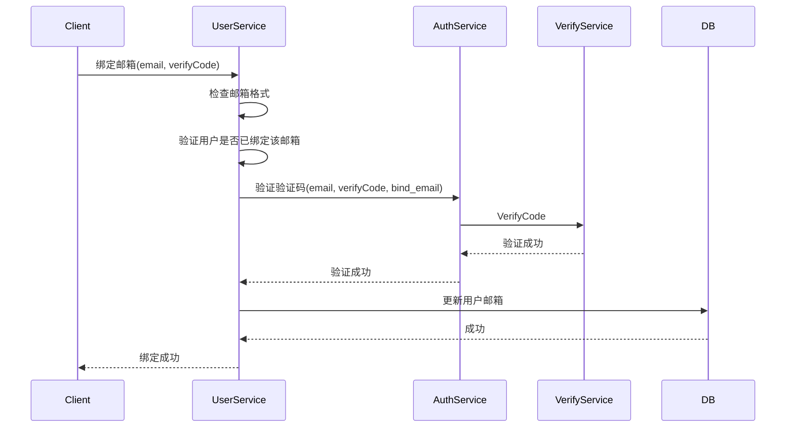

# 绑定邮箱设计

## 1. 概述

绑定邮箱功能允许用户将邮箱绑定到账号，用于登录、找回密码、接收通知等场景。首次绑定邮箱需要进行验证码验证。

## 2. 功能列表

- [x] 绑定邮箱（需验证码）
- [x] 绑定前检查邮箱是否已被占用

## 3. 业务流程



## 4. 验证规则

| 字段 | 规则 |
|------|------|
| 邮箱 | 有效邮箱格式 |
| 验证码 | 6位数字，有效期5分钟 |
| 绑定检查 | 邮箱未被其他用户占用 |

## 5. API设计

### 5.1 请求

```protobuf
message BindEmailRequest {
    string user_id = 1;
    string email = 2;
    string verify_code = 3;
}
```

### 5.2 响应

```protobuf
message BindEmailResponse {
    string email = 1;
    bool is_primary = 2;  // 是否设为主要联系方式
}
```

### 5.3 错误码

| 错误码 | 说明 |
|--------|------|
| 10206 | 验证码错误 |
| 10207 | 验证码已过期 |
| 20108 | 邮箱格式错误 |
| 20109 | 邮箱已被占用 |
| 10104 | 用户不存在 |

## 6. 安全考虑

1. **验证码一次性使用**：验证成功后立即失效
2. **邮箱唯一性**：同一邮箱只能绑定一个账号
3. **脱敏显示**：API返回时对邮箱进行脱敏处理（如 a***@example.com）
4. **绑定日志**：记录绑定操作日志供审计
5. **邮箱验证邮件**：绑定成功后发送确认邮件

## 7. 依赖服务

- **Auth Service**: 验证码验证
- **Verify Service**: 验证码校验与消费
- **PostgreSQL**: 用户信息持久化

---

返回: [认证服务总体设计](../auth/README.md)
