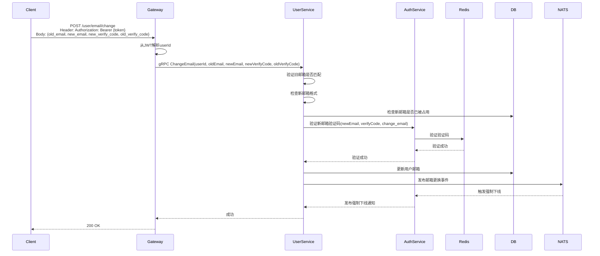

# 更换邮箱设计

## 1. 概述

更换邮箱功能允许用户将已绑定的邮箱更换为新的邮箱。更换邮箱需要先验证旧邮箱（或通过其他方式验证身份），确保操作安全性。

## 2. 功能列表

- [x] 更换邮箱（需验证码）
- [x] 更换前检查新邮箱是否已被占用
- [x] 更换后使旧邮箱相关的会话失效

## 3. 业务流程



## 4. 验证规则

| 字段 | 规则 |
|------|------|
| 新邮箱 | 有效邮箱格式 |
| 验证码 | 6位数字，有效期5分钟 |
| 绑定检查 | 新邮箱未被其他用户占用 |
| 旧邮箱验证 | 需验证旧邮箱验证码或使用其他身份验证方式 |

## 5. API设计

### 5.1 请求

```protobuf
message ChangeEmailRequest {
    string user_id = 1;
    string old_email = 2;       // 旧邮箱
    string new_email = 3;       // 新邮箱
    string new_verify_code = 4; // 新邮箱验证码
    string old_verify_code = 5; // 旧邮箱验证码（可选，用于验证身份）
}
```

### 5.2 响应

```protobuf
message ChangeEmailResponse {
    string old_email = 1; // 旧邮箱（脱敏）
    string new_email = 2; // 新邮箱
}
```

### 5.3 错误码

| 错误码 | 说明 |
|--------|------|
| 10206 | 验证码错误 |
| 10207 | 验证码已过期 |
| 20108 | 新邮箱格式错误 |
| 20109 | 新邮箱已被占用 |
| 20111 | 旧邮箱不匹配 |
| 10104 | 用户不存在 |

## 6. 安全考虑

1. **旧邮箱验证**：必须验证旧邮箱或使用其他身份验证方式
2. **验证码一次性使用**：验证成功后立即失效
3. **邮箱唯一性**：同一邮箱只能绑定一个账号
4. **强制下线**：更换邮箱后，其他设备需要重新登录
5. **安全通知**：更换成功后发送通知到旧邮箱

## 7. 依赖服务

- **Auth Service**: 验证码验证
- **Verify Service**: 验证码校验与消费
- **Session Service**: 会话管理
- **PostgreSQL**: 用户信息持久化

---

返回: [认证服务总体设计](../auth/README.md)
