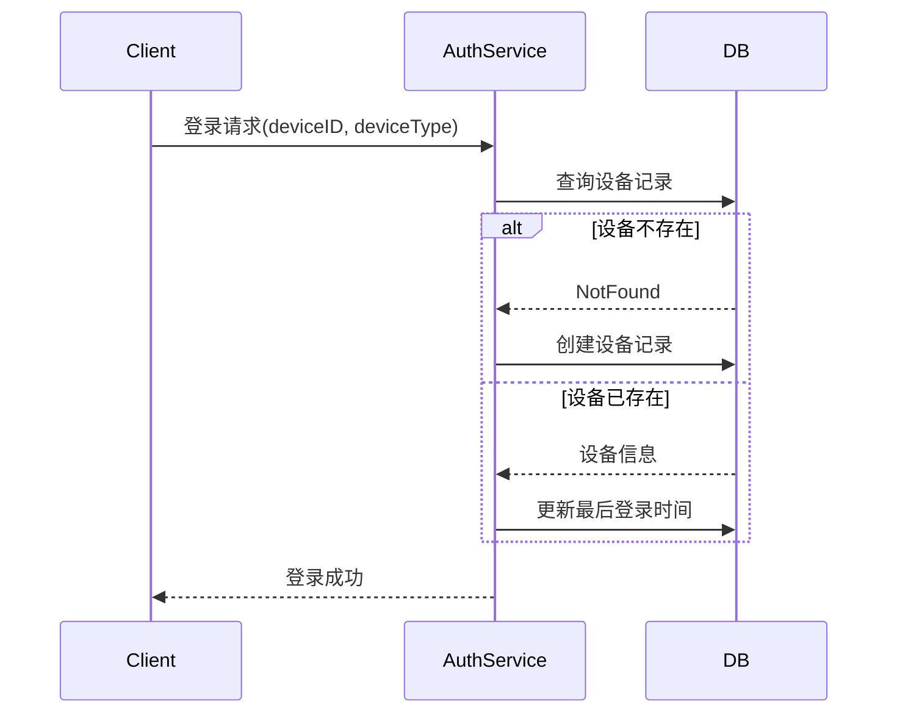

# 设备管理设计

## 1. 概述

设备管理用于记录用户登录设备信息，支持多设备登录场景和设备安全管控。

## 2. 功能列表

- [x] 设备记录创建
- [x] 设备最后登录时间更新
- [x] 用户设备列表查询
- [x] 设备下线（多端互踢）

## 3. 数据模型

```go
type UserDevice struct {
    ID          int64      // 主键ID
    UserID      string     // 用户ID
    DeviceID    string     // 设备唯一标识
    DeviceType  string     // 设备类型: ios/android/web/pc/h5
    DeviceName  string     // 设备名称
    DeviceModel string     // 设备型号
    OSVersion   string     // 操作系统版本
    AppVersion  string     // App版本
    LastLoginAt *time.Time // 最后登录时间
    LastLoginIP string     // 最后登录IP
    CreatedAt   time.Time
    UpdatedAt   time.Time
}
```

## 4. 设备类型

| 类型 | 说明 |
|------|------|
| ios | iOS 应用 |
| android | Android 应用 |
| web | Web 浏览器 |
| pc | PC 客户端 |
| h5 | H5 页面 |

## 5. 业务流程

### 5.1 设备记录



### 5.2 设备列表查询

```protobuf
message GetUserDevicesRequest {
    string user_id = 1;
}

message GetUserDevicesResponse {
    repeated DeviceInfo devices = 1;
}

message DeviceInfo {
    string device_id = 1;
    string device_type = 2;
    google.protobuf.Timestamp last_login_at = 3;
}
```

## 6. 多端互踢策略

设备管理支持配置多端互踢策略：

| 策略 | 说明 |
|------|------|
| allow_multi | 允许多设备登录 |
| kick_web | 登录PC时踢掉Web |
| kick_mobile | 登录Mobile时踢掉其他端 |
| kick_all | 只保留当前登录 |

互踢时通过 NATS 发布通知：
```
notification.auth.force_logout.{user_id}
```

## 7. 依赖服务

- **PostgreSQL**: 设备持久化
- **Redis**: 设备在线状态缓存
- **NATS**: 强制下线通知
