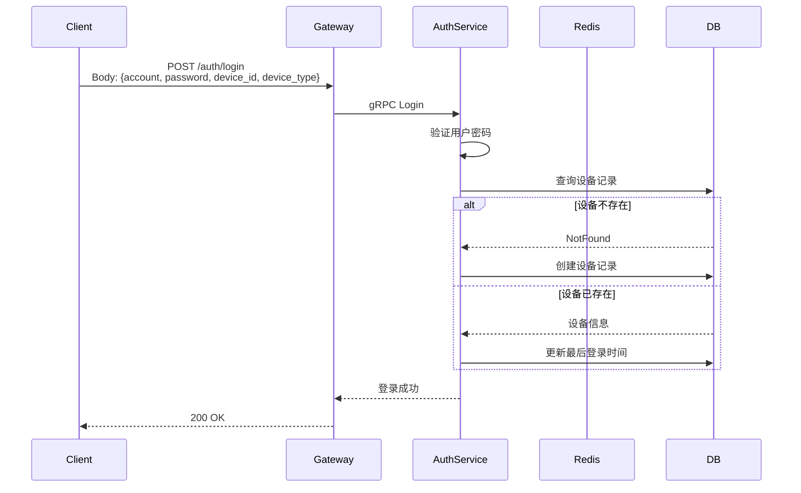
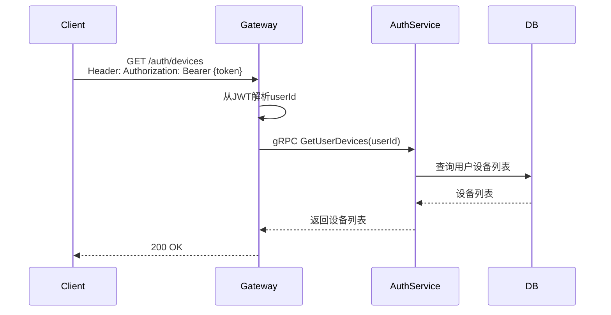
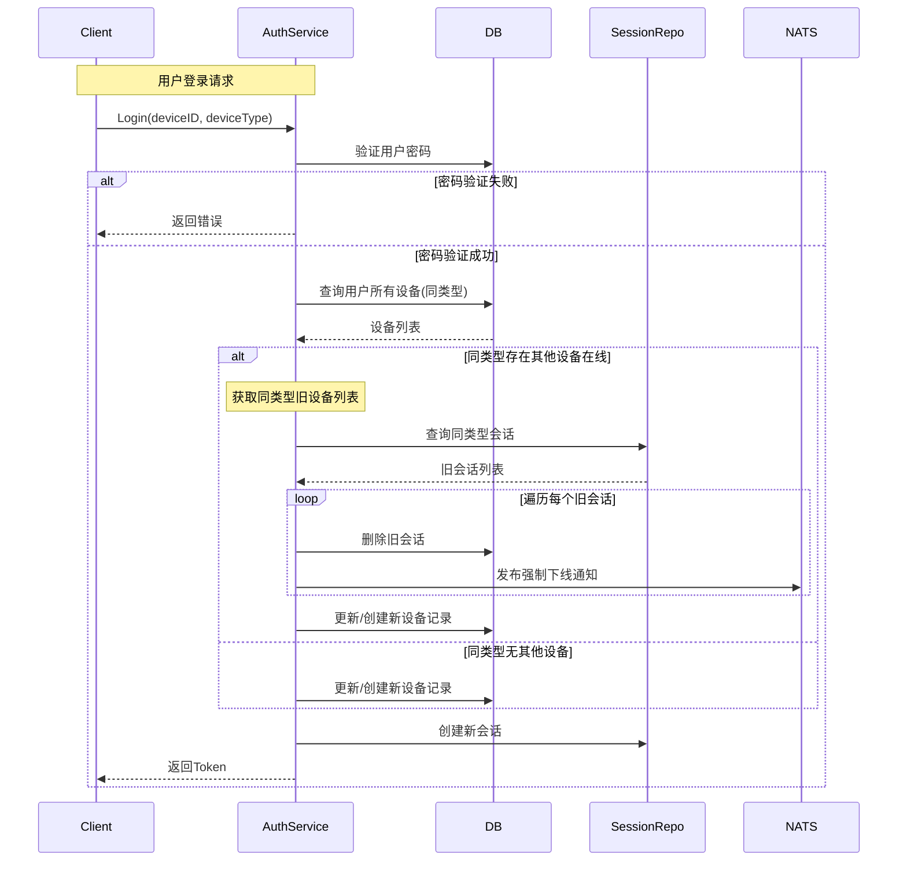

# 设备管理设计

## 1. 概述

设备管理用于记录用户登录设备信息，支持多设备登录场景和设备安全管控。

## 2. 功能列表

- [x] 设备记录创建
- [x] 设备最后登录时间更新
- [x] 用户设备列表查询
- [x] 设备下线（多端互踢）

## 3. 数据模型

```go
type UserDevice struct {
    ID            int64      // 主键ID
    UserID        string     // 用户ID
    DeviceID      string     // 设备唯一标识
    DeviceType    string     // 设备类型: ios/android/web/pc/h5
    ClientVersion string     // 客户端版本
    LastLoginAt   *time.Time // 最后登录时间
    LastLoginIP   string     // 最后登录IP
    CreatedAt     time.Time
    UpdatedAt     time.Time
}
```

## 4. 设备类型

| 类型 | 说明 |
|------|------|
| ios | iOS 应用 |
| android | Android 应用 |
| web | Web 浏览器 |
| pc | PC 客户端 |
| h5 | H5 页面 |

## 5. 业务流程

### 5.1 设备记录



### 5.2 设备列表查询



## 6. 多设备登录策略

### 6.1 策略规则

同一用户可同时登录不同类型的设备，同类型设备只允许一个在线。

| 场景 | 行为 |
|------|------|
| 登录 iOS，再登录 Android | 两者都保持在线 |
| 登录 iOS，再登录 iOS | 强制下线旧的 iOS 设备 |
| 登录 Web，再登录 Web | 强制下线旧的 Web 设备 |
| 登录 PC，再登录 iOS | 两者都保持在线 |

### 6.2 业务流程



### 6.3 详细流程步骤

**步骤 1: 验证登录凭证**
- 验证账号密码
- 验证设备类型

**步骤 2: 检查同类型设备在线状态**
- 根据 `user_id` 和 `device_type` 查询该用户同类型设备
- 根据 `device_type` 查询对应会话

**步骤 3: 强制下线旧设备**
- 删除同类型的旧会话记录
- 通过 NATS 发布强制下线通知

**步骤 4: 创建新会话**
- 更新或创建设备记录
- 创建新会话，生成 Token

### 6.4 强制下线通知

通过 NATS 发布强制下线通知，通知客户端下线：

```
Topic: notification.auth.force_logout.{user_id}

Payload:
{
    "type": "auth.force_logout",
    "device_id": "旧设备ID",
    "device_type": "ios",
    "reason": "new_device_login"
}
```

客户端订阅该主题收到通知后，清除本地 Token 并跳转到登录页。

## 7. API 设计

### 7.1 获取用户设备列表

```protobuf
message GetUserDevicesRequest {
    string user_id = 1;
}

message GetUserDevicesResponse {
    repeated DeviceInfo devices = 1;
}

message DeviceInfo {
    string device_id = 1;
    string device_type = 2;
    string client_version = 3;
    google.protobuf.Timestamp last_login_at = 4;
    string last_login_ip = 5;
}
```

### 7.2 强制下线

```protobuf
message ForceLogoutRequest {
    string user_id = 1;
    string device_id = 2;
    string reason = 3;
}
```

## 8. 核心接口

### 8.1 登录时处理同类型设备

```go
// 处理同类型设备登录，强制下线旧设备
func (s *authServiceImpl) handleSameTypeDeviceKick(ctx context.Context, userID, deviceID, deviceType string) error {
    // 查询同类型的其他设备
    devices, err := s.deviceRepo.GetByUserIDAndDeviceType(ctx, userID, deviceType)
    if err != nil {
        return err
    }

    for _, device := range devices {
        // 跳过当前登录的设备
        if device.DeviceID == deviceID {
            continue
        }

        // 删除旧会话
        if err := s.sessionRepo.DeleteByUserIDAndDeviceID(ctx, userID, device.DeviceID); err != nil {
            logger.Warn("Failed to delete old session", zap.Error(err))
        }

        // 发布强制下线通知
        if err := s.notification.Publish(ctx, notification.TypeAuthForceLogout, userID, map[string]interface{}{
            "device_id":   device.DeviceID,
            "device_type": device.DeviceType,
            "reason":      "new_device_login",
        }); err != nil {
            logger.Warn("Failed to publish force logout notification", zap.Error(err))
        }
    }

    return nil
}
```

## 9. 依赖服务

- **PostgreSQL**: 设备持久化、会话持久化
- **Redis**: 设备在线状态缓存（可选）
- **NATS**: 强制下线通知
