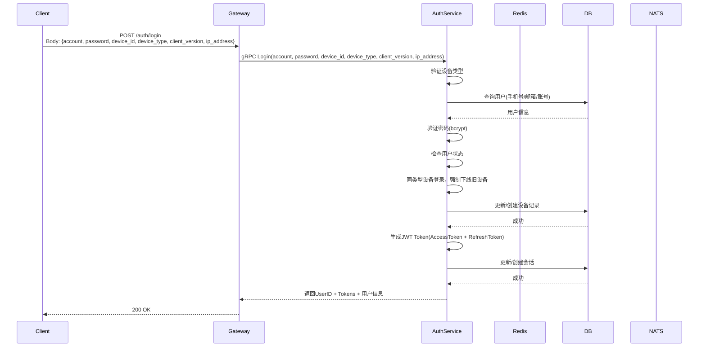

# 用户登录设计

## 1. 概述

用户登录功能支持手机号、邮箱、账号密码登录，登录成功后返回认证令牌。

## 2. 功能列表

- [x] 账号密码登录（支持手机号/邮箱/账号）
- [x] 设备记录管理
- [x] 多设备登录支持
- [x] 登录状态返回

## 3. 业务流程



## 4. API设计

### 4.1 请求

```protobuf
message LoginRequest {
    string account = 1;          // 账号(手机号/邮箱/用户名)
    string password = 2;        // 密码
    string device_type = 3;     // 设备类型 (iOS/Android/Web)
    string device_id = 4;       // 设备ID
    string client_version = 5;  // 客户端版本号，用于客户端升级判断
    string ip_address = 6;      // 客户端IP地址
}
```

### 4.2 响应

```protobuf
message LoginResponse {
    string user_id = 1;
    string access_token = 2;
    string refresh_token = 3;
    int64 expires_in = 4;        // 7200秒(2小时)
    common.UserInfo user = 5;
}
```

### 4.3 错误码

| 错误码 | 说明 |
|--------|------|
| 1 | 参数错误 |
| 10104 | 用户不存在 |
| 10105 | 密码错误 |
| 10106 | 账号已被禁用 |

## 5. 设备处理

登录时自动记录设备信息：
- 首次登录：创建设备记录
- 重复登录：更新最后登录时间
- 同类型设备登录：强制下线旧设备（通过NATS推送通知）

## 6. 依赖服务

- **PostgreSQL**: 用户、设备、会话持久化
- **Redis**: Token缓存（可选）
- **NATS**: 强制下线通知推送
