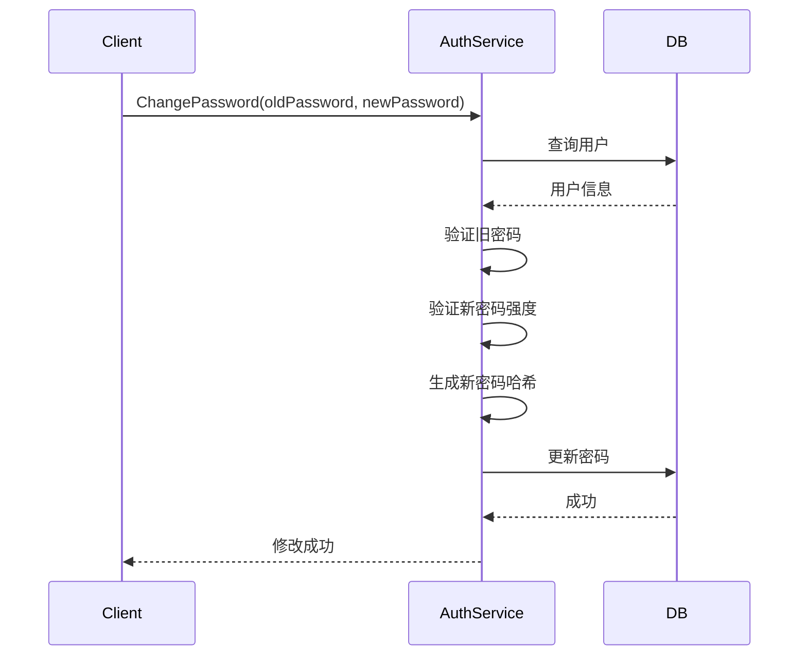
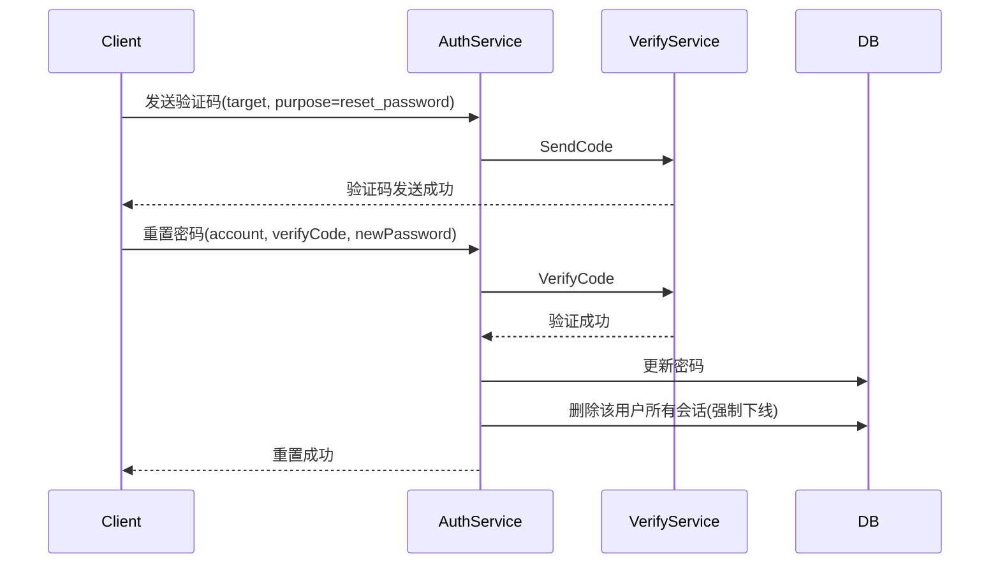

# 密码管理设计

## 1. 概述

密码管理提供修改密码和忘记密码功能，保障用户账号安全。

## 2. 功能列表

- [x] 修改密码（已登录）
- [x] 忘记密码（验证码重置）
- [x] 密码强度校验

## 3. 修改密码

### 3.1 业务流程



### 3.2 API

```protobuf
message ChangePasswordRequest {
    string old_password = 1;
    string new_password = 2;
}
```

### 3.3 错误码

| 错误码 | 说明 |
|--------|------|
| 10105 | 旧密码错误 |
| 10103 | 新密码强度不足 |

## 4. 忘记密码

### 4.1 业务流程



### 4.2 API

```protobuf
message ResetPasswordRequest {
    string account = 1;       // 手机号或邮箱
    string verify_code = 2;   // 验证码
    string new_password = 3; // 新密码
}
```

### 4.3 错误码

| 错误码 | 说明 |
|--------|------|
| 10206 | 验证码错误 |
| 10207 | 验证码已过期 |
| 10104 | 用户不存在 |
| 10103 | 新密码强度不足 |

### 4.4 验证码用途

| 用途 | 说明 |
|------|------|
| register | 注册验证码 |
| reset_password | 重置密码 |
| bind_phone | 绑定手机 |
| bind_email | 绑定邮箱 |
| change_phone | 更换手机 |
| change_email | 更换邮箱 |

## 5. 密码强度规则

- 最少 8 位
- 必须包含大小写字母
- 必须包含数字
- 不能与用户名相同

## 6. 安全考虑

1. **密码存储**: bcrypt 加密
2. **传输安全**: HTTPS 传输
3. **历史记录**: 可选记录密码历史防止重复
4. **强制下线**: 密码修改后其他设备需要重新登录
