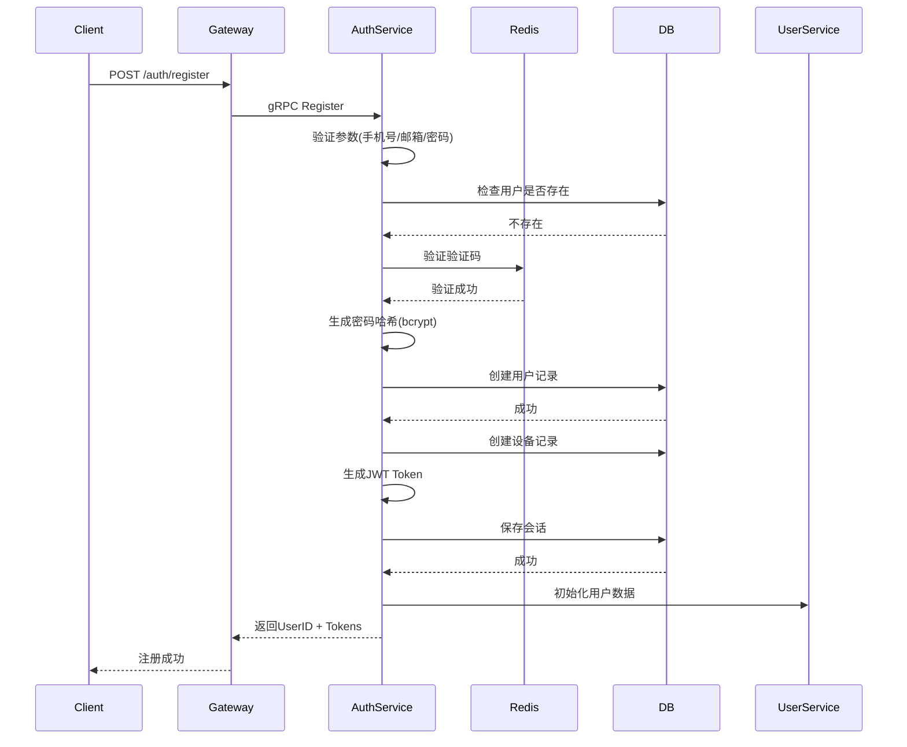

# 用户注册设计

## 1. 概述

用户注册功能支持手机号和邮箱两种注册方式，注册成功后自动创建用户账号并生成认证令牌。

## 2. 功能列表

- [x] 手机号注册（需验证码）
- [x] 邮箱注册（需验证码）
- [x] 密码强度校验
- [x] 自动生成唯一UserID
- [x] 用户信息初始化

## 3. 数据模型

### 3.1 User 表

```go
type User struct {
    ID           string         // 用户唯一ID (UUID)
    Phone        *string        // 手机号（唯一）
    Email        *string        // 邮箱（唯一）
    PasswordHash string         // 密码哈希
    Status       int            // 1-正常 2-禁用
    CreatedAt    time.Time      // 创建时间
    UpdatedAt    time.Time      // 更新时间
    DeletedAt    gorm.DeletedAt // 软删除
}
```

### 3.2 UserDevice 表

```go
type UserDevice struct {
    ID          string    // 设备ID
    UserID      string    // 用户ID
    DeviceID    string    // 设备标识
    DeviceType  string    // 设备类型 (ios/android/web/pc)
    LastLoginAt *time.Time// 最后登录时间
    CreatedAt   time.Time
    UpdatedAt   time.Time
}
```

### 3.3 UserSession 表

```go
type UserSession struct {
    ID                    string    // 会话ID
    UserID                string    // 用户ID
    DeviceID              string    // 设备ID
    AccessToken           string    // 访问令牌
    RefreshToken          string    // 刷新令牌
    AccessTokenExpiresAt  time.Time // AccessToken过期时间
    RefreshTokenExpiresAt time.Time // RefreshToken过期时间
    CreatedAt             time.Time
    UpdatedAt             time.Time
}
```

## 4. 业务流程



## 5. API设计

### 5.1 请求

```protobuf
message RegisterRequest {
    string phone_number = 1;      // 手机号
    string email = 2;             // 邮箱
    string password = 3;          // 密码
    string verify_code = 4;       // 验证码
    string device_id = 5;         // 设备ID
    string device_type = 6;       // 设备类型
    string nickname = 7;           // 昵称(可选)
}
```

### 5.2 响应

```protobuf
message RegisterResponse {
    string user_id = 1;
    string access_token = 2;
    string refresh_token = 3;
    int32 expires_in = 4;         // 7200秒(2小时)
}
```

### 5.3 错误码

| 错误码 | 说明 |
|--------|------|
| 1 | 参数错误 |
| 10101 | 用户已存在 |
| 10104 | 用户不存在 |
| 10103 | 密码强度不足 |
| 10206 | 验证码错误 |
| 10207 | 验证码已过期 |
| 10106 | 账号已被禁用 |

## 6. 安全考虑

1. **密码存储**: 使用 bcrypt 加密存储，不存储明文
2. **密码强度**: 至少8位，包含大小写字母和数字
3. **验证码**: 验证码一次性使用，5分钟有效期
4. **Token**: AccessToken 2小时，RefreshToken 7天
5. **用户ID**: 使用 UUID 生成，确保唯一性

## 7. 依赖服务

- **Redis**: 验证码存储、频控
- **PostgreSQL**: 用户、设备、会话持久化
- **UserService**: 初始化用户数据
