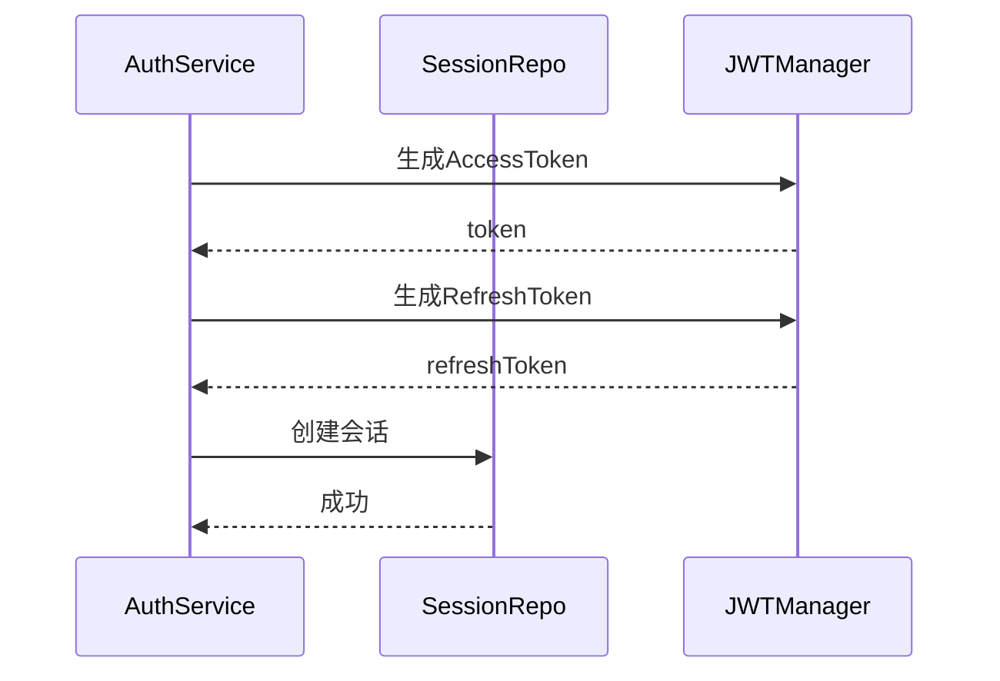
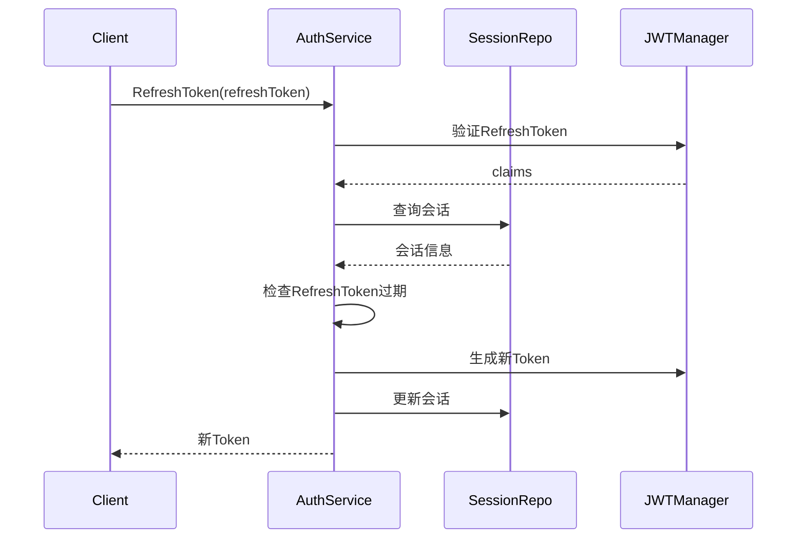
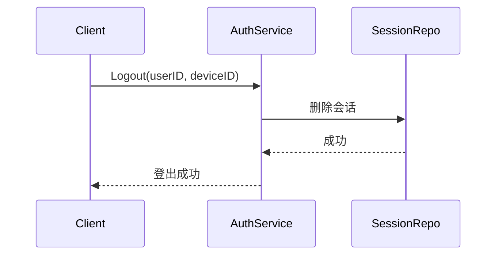

# 会话管理设计

## 1. 概述

会话管理维护用户的登录会话状态，支持 Token 刷新和多设备登录。

## 2. 功能列表

- [x] 会话创建
- [x] 会话更新
- [x] 会话删除（登出）
- [x] Token 刷新

## 3. 数据模型

```go
type UserSession struct {
    ID                    string    // 会话ID
    UserID                string    // 用户ID
    DeviceID              string    // 设备ID
    AccessToken           string    // 访问令牌
    RefreshToken          string    // 刷新令牌
    AccessTokenExpiresAt  time.Time // AccessToken过期时间
    RefreshTokenExpiresAt time.Time // RefreshToken过期时间
    CreatedAt             time.Time
    UpdatedAt             time.Time
}
```

## 4. 业务流程

### 4.1 登录创建会话



### 4.2 Token 刷新



### 4.3 登出删除会话



## 5. 过期检查

```go
func (s *UserSession) IsRefreshTokenExpired() bool {
    return time.Now().After(s.RefreshTokenExpiresAt)
}
```

RefreshToken 过期时需要重新登录。

## 6. 依赖服务

- **PostgreSQL**: 会话持久化
- **Redis**: 会话缓存（可选）
