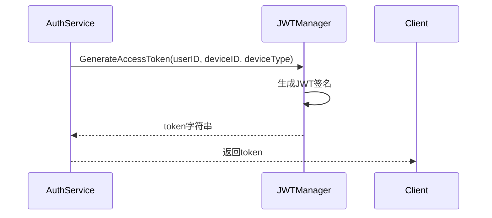
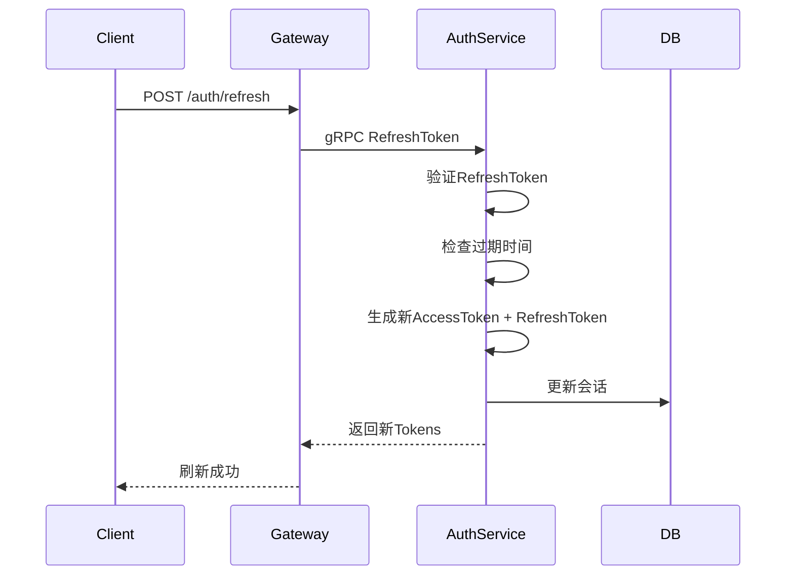

# Token 管理设计

## 1. 概述

Token 管理负责生成、验证、刷新访问令牌，支持多设备登录场景。

## 2. 功能列表

- [x] AccessToken 生成与验证
- [x] RefreshToken 生成与验证
- [x] Token 刷新机制
- [x] Token 有效期管理

## 3. Token 规格

| Token 类型 | 有效期 | 用途 |
|-----------|--------|------|
| AccessToken | 2小时 | API 访问授权 |
| RefreshToken | 7天 | 刷新 AccessToken |

## 4. Token 结构

### 4.1 AccessToken Claims

```go
type Claims struct {
    UserID    string `json:"user_id"`
    DeviceID  string `json:"device_id"`
    DeviceType string `json:"device_type"`
    Exp       int64  `json:"exp"`
    Iat       int64  `json:"iat"`
}
```

### 4.2 Token 生成流程



## 5. Token 刷新



## 6. 错误码

| 错误码 | 说明 |
|--------|------|
| 10107 | RefreshToken无效 |
| 10108 | RefreshToken已过期 |

## 7. 安全考虑

1. **签名算法**: RS256 (非对称加密)
2. **密钥管理**: 配置文件或密钥管理系统
3. **Token 存储**: 会话表存储 Token 映射
4. **登出处理**: 删除会话记录使 Token 失效
