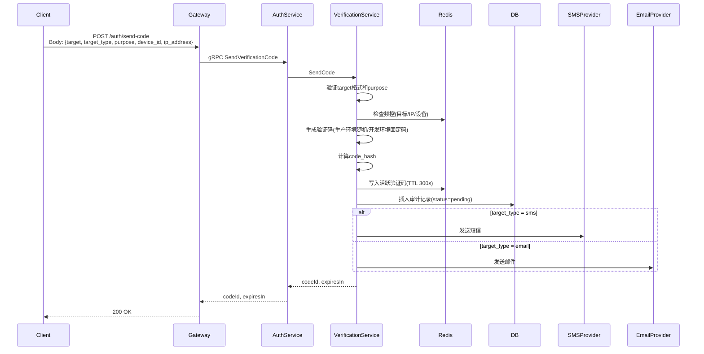
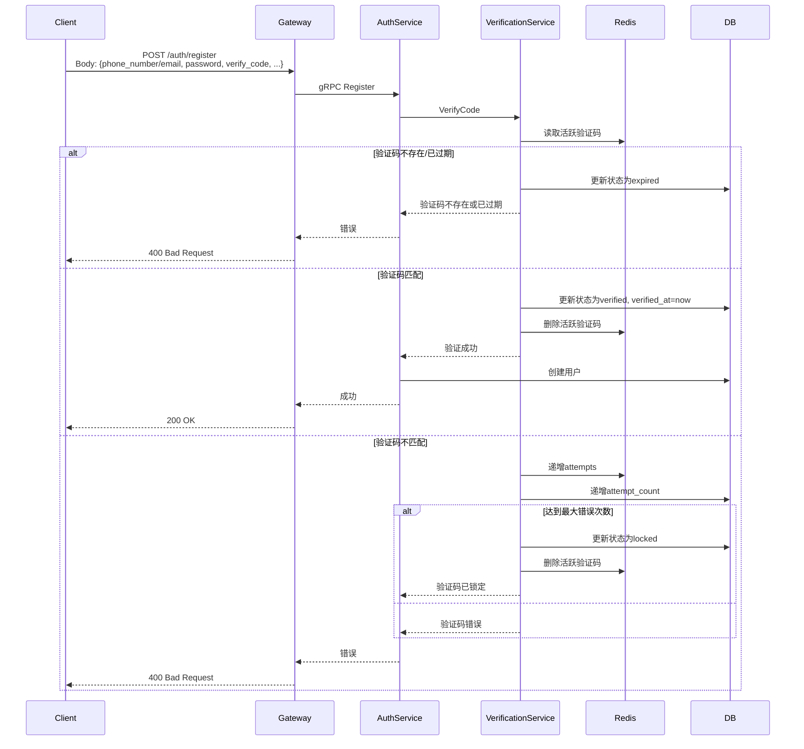

# 验证码设计

## 1. 概述

验证码用于认证相关场景的人机确认与目标归属校验，支持短信和邮箱两种方式。

## 2. 功能列表

- [x] 发送验证码（短信/邮箱）
- [x] 验证码校验与消费
- [x] 频率限制（目标/IP/设备）
- [x] 错误次数锁定
- [x] 验证码哈希存储
- [x] 开发环境固定码

## 3. 验证码用途

| 用途 | 说明 |
|------|------|
| register | 注册账号 |
| reset_password | 重置密码 |
| bind_phone | 绑定手机号 |
| change_phone | 更换手机号 |
| bind_email | 绑定邮箱 |
| change_email | 更换邮箱 |

## 4. 数据模型

### 4.1 verification_codes 表

```go
type VerificationCode struct {
    CodeID          string    // 验证码唯一标识
    Target          string    // 手机号或邮箱
    TargetType      string    // sms/email
    Purpose         string    // 业务用途
    CodeHash        string    // 验证码哈希值
    Status          int       // 0-pending 1-verified 2-expired 3-locked 4-cancelled
    ExpiresAt       time.Time // 过期时间
    VerifiedAt      *time.Time// 验证时间
    SendIP          string    // 发送IP
    SendDeviceID    string    // 发送设备ID
    AttemptCount    int       // 错误次数
    Provider        string    // 发送渠道
    CreatedAt       time.Time
    UpdatedAt       time.Time
}
```

### 4.2 Redis Key 设计

```text
auth:vc:{purpose}:{target_hash}
  fields: code_id, code_hash, target_type, expires_at, attempts, max_attempts, device_id
  ttl: 300s

auth:vc:rl:target:{purpose}:{target_hash}:1m    # 目标每分钟限流
auth:vc:rl:target:{purpose}:{target_hash}:24h   # 目标每天限流
auth:vc:rl:ip:{ip}:1h                           # IP每小时限流
auth:vc:rl:device:{device_id}:24h               # 设备每天限流
```

## 5. 业务流程

### 5.1 发送验证码



### 5.2 验证码校验（注册场景）



## 6. API设计

### 6.1 发送验证码

```protobuf
message SendVerificationCodeRequest {
    string target = 1;         // 手机号或邮箱
    string target_type = 2;    // sms/email
    string purpose = 3;        // register/reset_password/bind_phone/change_phone/bind_email/change_email
    string device_id = 4;
    string ip_address = 5;
}

message SendVerificationCodeResponse {
    string code_id = 1;
    int64 expires_in = 2;      // 300秒
}
```

## 7. 频率限制

| 维度 | 默认值 |
|------|--------|
| 同一目标每分钟 | 1 次 |
| 同一目标每天 | 10 次 |
| 同一IP每小时 | 200 次 |
| 同一设备每天 | 100 次 |
| 验证码最大错误次数 | 5 次 |
| 验证码有效期 | 300 秒 |

## 8. 安全考虑

1. **不存明文**：验证码只保存哈希值，不在Redis、数据库、日志中落明文
2. **目标脱敏**：Redis Key 使用 SHA-256 哈希后的目标值，避免暴露手机号/邮箱
3. **一次性使用**：验证成功后立即删除活跃验证码
4. **开发环境固定码**：非 release 环境可使用固定码 `123456` 便于测试

## 9. 依赖服务

- **Redis**: 活跃验证码存储、频控计数
- **PostgreSQL**: 验证码审计记录
- **短信/邮件发送器**: SMS Provider / SMTP

---

返回: [认证服务总体设计](./README.md)
