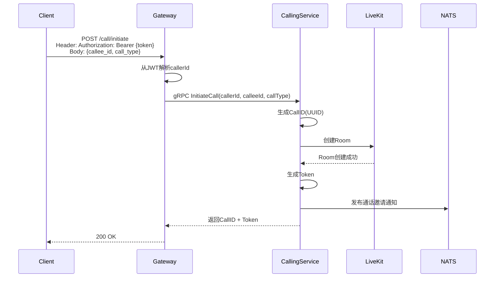
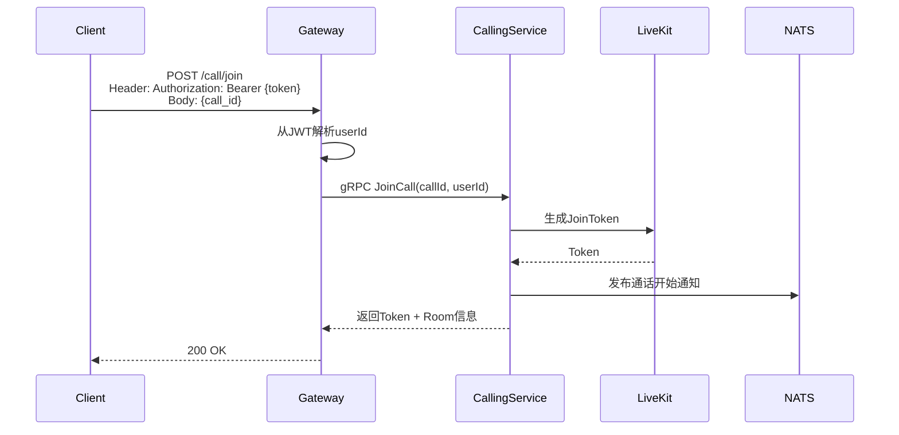
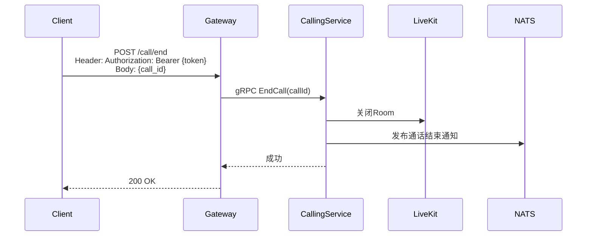
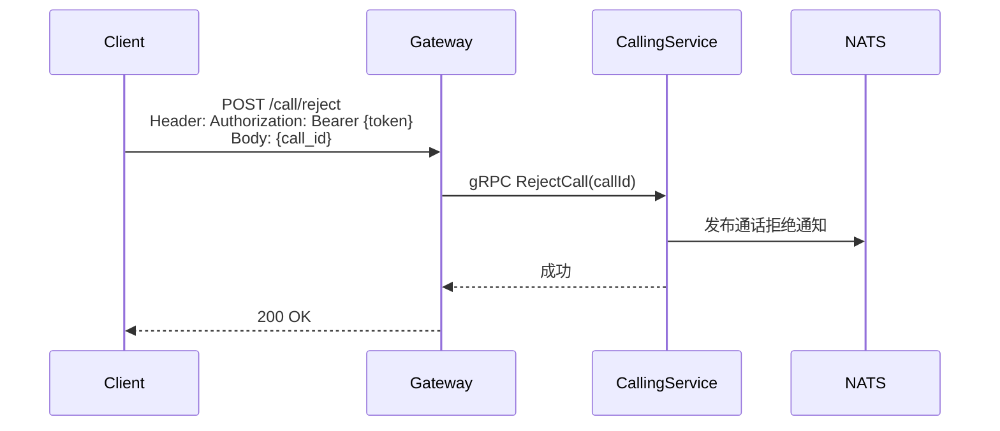

# 音视频通话设计

## 1. 概述

Calling Service 基于 LiveKit 实现一对一音视频通话功能。

## 2. 功能列表

- [x] 发起通话
- [x] 接听/拒绝通话
- [x] 结束通话
- [x] 通话记录查询

## 3. 业务流程

### 3.1 发起通话



### 3.2 接听通话



### 3.3 结束通话



### 3.4 拒绝通话



## 4. API设计

### 4.1 发起通话

```protobuf
message InitiateCallRequest {
    string caller_id = 1;
    string callee_id = 2;
    string call_type = 3; // audio/video
}

message InitiateCallResponse {
    string call_id = 1;
    string token = 2;
    int64 created_at = 3;
}
```

### 4.2 接听通话

```protobuf
message JoinCallRequest {
    string call_id = 1;
    string user_id = 2;
}

message JoinCallResponse {
    string token = 1;
    string room_name = 2;
}
```

## 5. 通话类型

| 类型 | 说明 |
|------|------|
| audio | 语音通话 |
| video | 视频通话 |

## 6. 通知主题

- `notification.livekit.call_invite.{user_id}` - 通话邀请
- `notification.livekit.call_status.{call_id}` - 通话状态变更
- `notification.livekit.call_rejected.{user_id}` - 通话拒绝
