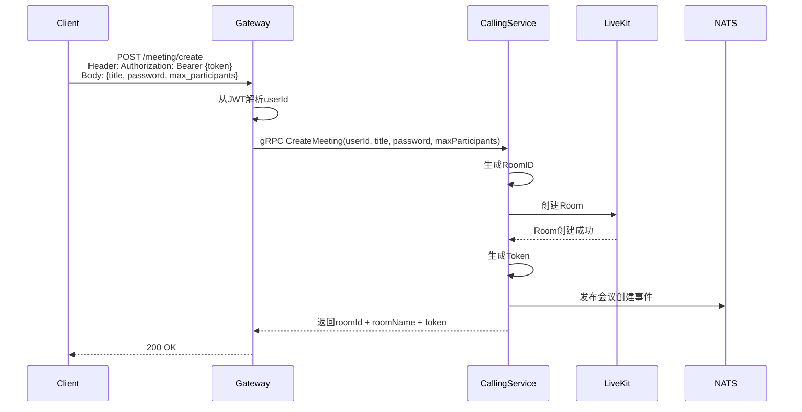
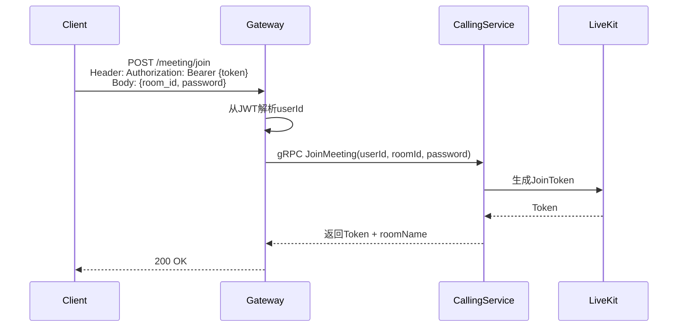
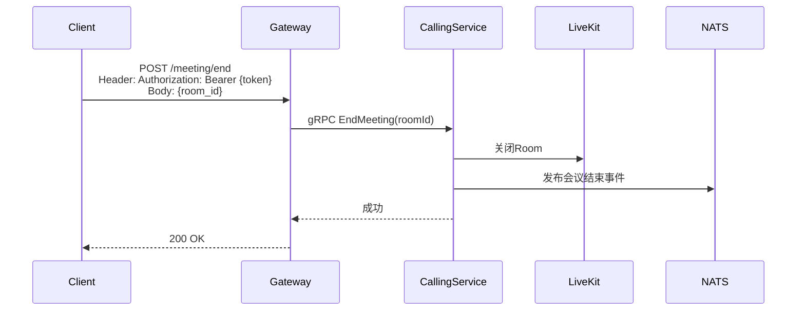

# 视频会议设计

## 1. 概述

视频会议功能支持创建会议室、多人视频会议、屏幕共享等。

## 2. 功能列表

- [x] 创建会议室
- [x] 加入会议
- [x] 结束会议
- [x] 会议列表查询

## 3. 业务流程

### 3.1 创建会议



### 3.2 加入会议



### 3.3 结束会议



## 4. API设计

### 3.1 创建会议

```protobuf
message CreateMeetingRequest {
    string creator_id = 1;
    string title = 2;
    string password = 3; // 可选
    int32 max_participants = 4;
}

message CreateMeetingResponse {
    string room_id = 1;
    string room_name = 2;
    string token = 3;
}
```

### 3.2 加入会议

```protobuf
message JoinMeetingRequest {
    string user_id = 1;
    string room_id = 2;
    string password = 3;
}

message JoinMeetingResponse {
    string token = 1;
    string room_name = 2;
}
```

## 4. 会议设置

| 设置项 | 说明 |
|--------|------|
| 成员入会静音 | 新成员入会自动静音 |
| 允许成员自我解除静音 | |
| 允许成员开启视频 | |
| 主持人共享屏幕 | 只有主持人可共享 |
| 会议密码 | 可选 |

## 5. 依赖服务

- **LiveKit**: 视频会议引擎
