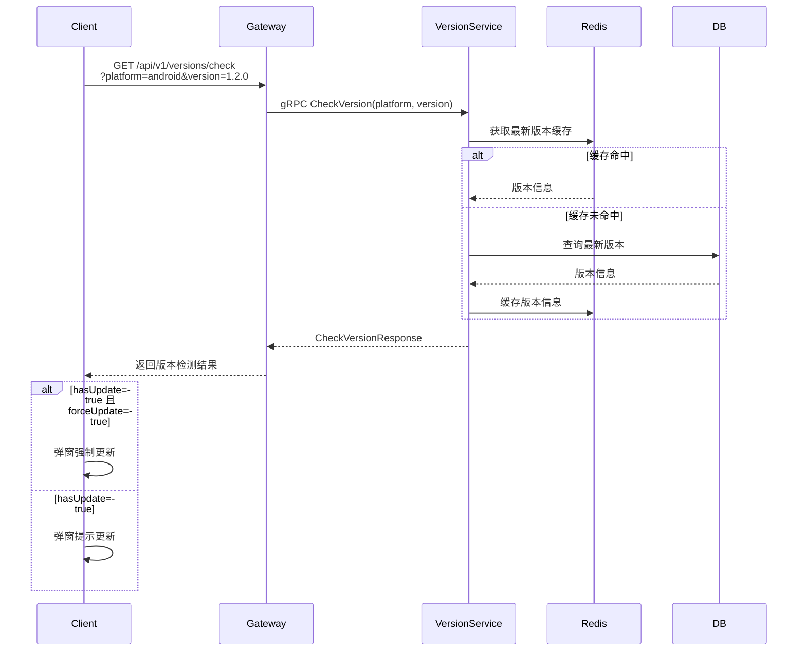

# 客户端版本升级功能设计

## 1. 功能概述

客户端版本升级功能用于管理多平台客户端（PC、Web、H5、Android、iOS）的版本发布、检测和更新提示，确保用户使用最新版本。

### 1.1 支持的平台

| 平台 | 标识 | 说明 |
|------|------|------|
| iOS | ios | iPhone/iPad 应用 |
| Android | android | Android 应用 |
| PC | pc | Windows/Mac/Linux 桌面客户端 |
| Web | web | 浏览器 Web 端 |
| H5 | h5 | 移动端 H5 页面 |

### 1.2 核心功能

- 版本检测：客户端启动时检查是否有新版本
- 版本信息发布：管理后台发布版本信息
- 强制升级：严重问题强制用户升级
- 增量更新：支持差分更新（Android）
- 更新内容展示：展示版本更新日志

---

## 2. 数据模型设计

### 2.1 数据库表设计

```sql
-- 版本信息表
CREATE TABLE app_versions (
    id              BIGSERIAL PRIMARY KEY,
    platform        VARCHAR(20) NOT NULL,      -- 平台: ios/android/pc/web/h5
    version         VARCHAR(50) NOT NULL,     -- 版本号: 1.0.0
    build_number    INTEGER DEFAULT 0,        -- 构建号
    version_code    INTEGER,                  -- Android特有: versionCode
    min_version     VARCHAR(50),               -- 最低支持版本（强制升级判断）
    force_update    BOOLEAN DEFAULT FALSE,    -- 是否强制更新
    release_type    VARCHAR(20) DEFAULT 'stable', -- release_type: stable/beta/alpha
    title           VARCHAR(200),             -- 更新标题
    content         TEXT,                      -- 更新内容（Markdown）
    download_url    VARCHAR(500),              -- 下载链接
    file_size       BIGINT,                    -- 文件大小(字节)
    file_hash       VARCHAR(64),               -- 文件SHA256
    published_at    TIMESTAMP,                 -- 发布时间
    created_at      TIMESTAMP DEFAULT NOW(),
    updated_at      TIMESTAMP DEFAULT NOW(),
    deleted_at      TIMESTAMP,
    
    CONSTRAINT uk_platform_version UNIQUE (platform, version, release_type)
);

-- 版本发布记录表
CREATE TABLE version_releases (
    id              BIGSERIAL PRIMARY KEY,
    version_id      BIGINT NOT NULL REFERENCES app_versions(id),
    release_notes   TEXT,                      -- 发布说明
    rollout_percent INTEGER DEFAULT 100,      -- 灰度发布百分比
    status          VARCHAR(20) DEFAULT 'draft', -- draft/published/archived
    published_by    VARCHAR(100),              -- 发布人
    published_at    TIMESTAMP,
    created_at      TIMESTAMP DEFAULT NOW()
);

-- 客户端版本统计表
CREATE TABLE client_version_stats (
    id              BIGSERIAL PRIMARY KEY,
    platform        VARCHAR(20) NOT NULL,
    version         VARCHAR(50) NOT NULL,
    count           INTEGER DEFAULT 0,         -- 活跃用户数
    report_date     DATE NOT NULL,
    created_at      TIMESTAMP DEFAULT NOW(),
    
    CONSTRAINT uk_platform_version_date UNIQUE (platform, version, report_date)
);

CREATE INDEX idx_app_versions_platform ON app_versions(platform);
CREATE INDEX idx_app_versions_published ON app_versions(published_at DESC);
CREATE INDEX idx_client_version_stats_date ON client_version_stats(report_date);
```

### 2.2 Redis 缓存设计

```
Key: version:{platform}:latest:{release_type}
Value: JSON版本信息
TTL: 300秒

Key: version:{platform}:all
Value: JSON数组，所有版本列表
TTL: 600秒
```

---

## 3. API 接口设计

### 3.1 版本检测接口

**GET /api/v1/versions/check**

客户端启动时调用，检测是否有新版本。

**请求头**:
```
Authorization: Bearer {accessToken}
```

**查询参数**:
| 参数 | 类型 | 必填 | 说明 |
|------|------|------|------|
| platform | string | 是 | 平台标识: ios/android/pc/web/h5 |
| version | string | 是 | 当前版本号，如 1.0.0 |
| buildNumber | int | 否 | 构建号（iOS/Android） |

**请求示例**:
```
GET /api/v1/versions/check?platform=android&version=1.2.0&buildNumber=120
```

**成功响应 (200)**:
```json
{
  "code": 0,
  "message": "success",
  "data": {
    "hasUpdate": true,
    "latestVersion": "1.3.0",
    "latestBuildNumber": 130,
    "forceUpdate": false,
    "minVersion": "1.1.0",
    "minBuildNumber": 110,
    "updateInfo": {
      "title": "版本更新 v1.3.0",
      "content": "## 更新内容\n\n- 新增功能1\n- 修复问题2\n- 优化体验3",
      "downloadUrl": "https://cdn.example.com/app/android/v1.3.0.apk",
      "fileSize": 52428800,
      "fileHash": "sha256:xxxxx"
    }
  }
}
```

**响应说明**:
| 字段 | 类型 | 说明 |
|------|------|------|
| hasUpdate | bool | 是否有新版本 |
| latestVersion | string | 最新版本号 |
| latestBuildNumber | int | 最新构建号 |
| forceUpdate | bool | 是否强制更新 |
| minVersion | string | 最低支持版本（低于此版本强制更新） |
| minBuildNumber | int | 最低支持构建号 |
| updateInfo | object | 更新信息，为空表示无需更新 |

**强制更新判断逻辑**:
```
if (clientVersion < minVersion) {
    forceUpdate = true
} else if (clientBuildNumber < minBuildNumber) {
    forceUpdate = true
} else {
    forceUpdate = latestVersion > clientVersion
}
```

### 3.2 版本列表接口

**GET /api/v1/versions/list**

获取所有已发布版本列表（管理后台使用）。

**查询参数**:
| 参数 | 类型 | 必填 | 说明 |
|------|------|------|------|
| platform | string | 否 | 平台筛选 |
| releaseType | string | 否 | 发布类型: stable/beta/alpha |
| page | int | 否 | 页码，默认1 |
| pageSize | int | 否 | 每页数量，默认20 |

**成功响应 (200)**:
```json
{
  "code": 0,
  "message": "success",
  "data": {
    "total": 50,
    "versions": [
      {
        "id": 1,
        "platform": "android",
        "version": "1.3.0",
        "buildNumber": 130,
        "forceUpdate": false,
        "releaseType": "stable",
        "title": "版本更新 v1.3.0",
        "content": "## 更新内容\n...",
        "downloadUrl": "https://cdn.example.com/...",
        "fileSize": 52428800,
        "publishedAt": "2026-04-01T10:00:00Z"
      }
    ]
  }
}
```

### 3.3 发布新版本接口 (管理后台)

**POST /api/v1/admin/versions**

发布新版本。

**请求头**:
```
Authorization: Bearer {adminToken}
Content-Type: application/json
```

**请求体**:
```json
{
  "platform": "android",
  "version": "1.3.0",
  "buildNumber": 130,
  "versionCode": 130,
  "minVersion": "1.1.0",
  "minBuildNumber": 110,
  "forceUpdate": false,
  "releaseType": "stable",
  "title": "版本更新 v1.3.0",
  "content": "## 更新内容\n- 新增功能1\n- 修复问题2",
  "downloadUrl": "https://cdn.example.com/app/android/v1.3.0.apk",
  "fileSize": 52428800,
  "fileHash": "sha256:xxxxx"
}
```

**成功响应 (200)**:
```json
{
  "code": 0,
  "message": "success",
  "data": {
    "id": 1,
    "platform": "android",
    "version": "1.3.0"
  }
}
```

**错误码**:
| 错误码 | 说明 |
|--------|------|
| 80101 | 版本号格式错误 |
| 80102 | 该版本已存在 |
| 80103 | 下载链接无效 |

### 3.4 版本详情接口

**GET /api/v1/admin/versions/:id**

获取版本详情。

**成功响应 (200)**:
```json
{
  "code": 0,
  "message": "success",
  "data": {
    "id": 1,
    "platform": "android",
    "version": "1.3.0",
    "buildNumber": 130,
    "versionCode": 130,
    "minVersion": "1.1.0",
    "minBuildNumber": 110,
    "forceUpdate": false,
    "releaseType": "stable",
    "title": "版本更新 v1.3.0",
    "content": "## 更新内容\n...",
    "downloadUrl": "https://cdn.example.com/...",
    "fileSize": 52428800,
    "fileHash": "sha256:xxxxx",
    "publishedAt": "2026-04-01T10:00:00Z",
    "createdAt": "2026-04-01T09:00:00Z"
  }
}
```

### 3.5 删除版本接口

**DELETE /api/v1/admin/versions/:id**

删除未发布的版本。

---

## 4. 服务设计

### 4.1 服务职责

新增 **Version Service** 负责版本管理：
- 版本信息 CRUD
- 版本检测
- 统计数据收集

### 4.2 目录结构

```
cmd/version-service/
  main.go

internal/version/
  repository.go      # 数据访问层
  service.go         # 业务逻辑层
  handler.go         # HTTP处理层
  model.go           # 数据模型
```

### 4.3 gRPC 服务定义

```protobuf
// api/proto/version/version.proto
syntax = "proto3";

package version;

option go_package = "github.com/anychat/anychat-server/api/proto/version";

service VersionService {
    rpc CheckVersion(CheckVersionRequest) returns (CheckVersionResponse);
    rpc GetLatestVersion(GetLatestVersionRequest) returns (GetLatestVersionResponse);
    rpc ListVersions(ListVersionsRequest) returns (ListVersionsResponse);
    rpc CreateVersion(CreateVersionRequest) returns (CreateVersionResponse);
    rpc GetVersion(GetVersionRequest) returns (GetVersionResponse);
    rpc DeleteVersion(DeleteVersionRequest) returns (DeleteVersionResponse);
    rpc ReportVersion(ReportVersionRequest) returns (ReportVersionResponse);
}

message CheckVersionRequest {
    string platform = 1;
    string version = 2;
    int32 build_number = 3;
    int32 version_code = 4;
}

message CheckVersionResponse {
    bool has_update = 1;
    string latest_version = 2;
    int32 latest_build_number = 3;
    bool force_update = 4;
    string min_version = 5;
    int32 min_build_number = 6;
    UpdateInfo update_info = 7;
}

message UpdateInfo {
    string title = 1;
    string content = 2;
    string download_url = 3;
    int64 file_size = 4;
    string file_hash = 5;
}

message GetLatestVersionRequest {
    string platform = 1;
    string release_type = 2;
}

message GetLatestVersionResponse {
    VersionInfo version = 1;
}

message VersionInfo {
    int64 id = 1;
    string platform = 2;
    string version = 3;
    int32 build_number = 4;
    int32 version_code = 5;
    string min_version = 6;
    int32 min_build_number = 7;
    bool force_update = 8;
    string release_type = 9;
    string title = 10;
    string content = 11;
    string download_url = 12;
    int64 file_size = 13;
    string file_hash = 14;
    string published_at = 15;
}

message ListVersionsRequest {
    string platform = 1;
    string release_type = 2;
    int32 page = 3;
    int32 page_size = 4;
}

message ListVersionsResponse {
    int32 total = 1;
    repeated VersionInfo versions = 2;
}

message CreateVersionRequest {
    string platform = 1;
    string version = 2;
    int32 build_number = 3;
    int32 version_code = 4;
    string min_version = 5;
    int32 min_build_number = 6;
    bool force_update = 7;
    string release_type = 8;
    string title = 9;
    string content = 10;
    string download_url = 11;
    int64 file_size = 12;
    string file_hash = 13;
}

message CreateVersionResponse {
    int64 id = 1;
    string platform = 2;
    string version = 3;
}

message GetVersionRequest {
    int64 id = 1;
}

message DeleteVersionRequest {
    int64 id = 1;
}

message ReportVersionRequest {
    string platform = 1;
    string version = 2;
}

message ReportVersionResponse {}
```

---

## 5. 客户端集成

### 5.1 版本检测流程



### 5.2 客户端实现建议

**iOS (Swift)**:
```swift
func checkVersion() {
    let version = Bundle.main.infoDictionary?["CFBundleShortVersionString"] as? String ?? ""
    let buildNumber = Bundle.main.infoDictionary?["CFBundleVersion"] as? Int ?? 0
    
    APIClient.shared.get("/versions/check", params: [
        "platform": "ios",
        "version": version,
        "buildNumber": buildNumber
    ]) { result in
        if let updateInfo = result.updateInfo, result.hasUpdate {
            if result.forceUpdate {
                self.showForceUpdateAlert(updateInfo: updateInfo)
            } else {
                self.showUpdateAlert(updateInfo: updateInfo)
            }
        }
    }
}
```

**Android (Kotlin)**:
```kotlin
fun checkVersion() {
    val packageInfo = packageManager.getPackageInfo(packageName, 0)
    val versionName = packageInfo.versionName
    val versionCode = packageInfo.versionCode
    
    api.get("/versions/check", mapOf(
        "platform" to "android",
        "version" to versionName,
        "buildNumber" to versionCode
    )).subscribe { result ->
        if (result.hasUpdate) {
            if (result.forceUpdate) {
                showForceUpdateDialog(result.updateInfo)
            } else {
                showUpdateDialog(result.updateInfo)
            }
        }
    }
}
```

**Web/H5 (JavaScript)**:
```javascript
async function checkVersion() {
    const version = APP_CONFIG.version;
    const platform = isMobile ? 'h5' : 'web';
    
    const result = await api.get('/versions/check', {
        platform,
        version
    });
    
    if (result.hasUpdate) {
        if (result.forceUpdate) {
            showForceUpdateModal(result.updateInfo);
        } else {
            showUpdateModal(result.updateInfo);
        }
    }
}
```

### 5.3 更新弹窗示例

```
┌─────────────────────────────────────────┐
│  发现新版本 v1.3.0                       │
├─────────────────────────────────────────┤
│                                         │
│  更新内容:                               │
│  • 新增聊天记录搜索功能                  │
│  • 优化图片加载速度                      │
│  • 修复若干bug                           │
│                                         │
│  版本: 1.3.0 | 大小: 50MB               │
│                                         │
│  [暂不更新]    [立即更新]                │
│               (forceUpdate=true时隐藏)   │
└─────────────────────────────────────────┘
```

---

## 6. 灰度发布

支持灰度发布，按百分比逐步开放更新：

```sql
-- 更新灰度百分比
UPDATE version_releases 
SET rollout_percent = 50 
WHERE id = 1;
```

客户端检测逻辑：
```go
// 随机数(0-100) <= rollout_percent 时返回更新
func shouldShowUpdate(rolloutPercent int) bool {
    rand.Seed(time.Now().UnixNano())
    return rand.Intn(100) < rolloutPercent
}
```

---

## 7. 版本统计

客户端每次启动上报版本信息，用于统计分析：

**POST /api/v1/versions/report**

```json
{
  "platform": "android",
  "version": "1.2.0",
  "buildNumber": 120,
  "deviceId": "xxx",
  "osVersion": "14",
  "sdkVersion": "30"
}
```

---

## 8. 错误码

| 错误码 | 说明 |
|--------|------|
| 80101 | 版本号格式错误（应符合语义化版本，如1.0.0） |
| 80102 | 该版本已存在 |
| 80103 | 下载链接无效 |
| 80104 | 平台不支持 |
| 80105 | 版本不存在 |

---

## 9. 依赖服务

| 服务 | 依赖说明 |
|------|----------|
| PostgreSQL | 存储版本信息 |
| Redis | 缓存最新版本 |
| Admin Service | 管理后台调用 |
| Gateway | 客户端HTTP入口 |