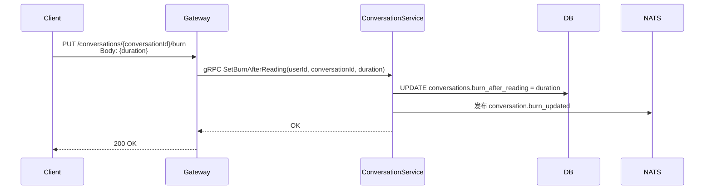
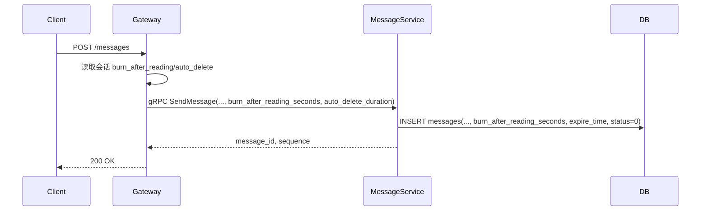
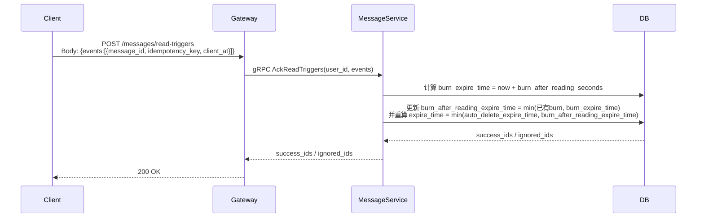
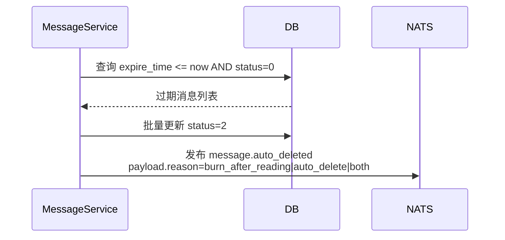

# 阅后即焚（Burn After Reading）

## 1. 功能定义

阅后即焚用于控制消息在“被接收方阅读后”自动销毁：

- 计时起点：首次阅读触发时刻
- 计时长度：会话配置（秒）在消息发送时固化为消息快照
- 销毁方式：到期后统一进入消息删除流程（`status = 2`）

适用消息类型包括文本与媒体，服务端语义保持一致，差异仅在客户端触发阅读回执时机。

## 2. 设计目标

1. 服务端统一：文本与媒体共享同一套阅后即焚链路
2. 模型简化：最少字段表达完整语义
3. 幂等可靠：多端重复上报不产生重复计时
4. 与自动删除兼容：共用过期调度字段且规则明确

## 3. 数据模型

### 3.1 会话表

```go
type Conversation struct {
    // ... existing fields
    BurnAfterReading int32 `gorm:"column:burn_after_reading;default:0"` // 阅后即焚时长(秒),0表示关闭
}
```

### 3.2 消息表

```go
type Message struct {
    // ... existing fields
    BurnAfterReadingSeconds int32      `gorm:"column:burn_after_reading_seconds;default:0"` // 发送时固化快照,0表示该消息不启用阅后即焚
    AutoDeleteExpireTime    *time.Time `gorm:"column:auto_delete_expire_time"`              // 自动删除策略独立过期时间
    BurnAfterReadingExpireTime *time.Time `gorm:"column:burn_after_reading_expire_time"`    // 阅后即焚策略独立过期时间
    ExpireTime              *time.Time `gorm:"column:expire_time"`                            // 统一过期时间（自动删除/阅后即焚共用）
    Status                  int16      `gorm:"column:status;default:0"`                       // 0-正常 1-撤回 2-删除
}
```

### 3.3 数据库字段

| 表名 | 字段名 | 类型 | 说明 |
|------|--------|------|------|
| conversations | burn_after_reading | INT | 会话阅后即焚时长（秒） |
| messages | burn_after_reading_seconds | INT | 消息级快照 |
| messages | auto_delete_expire_time | TIMESTAMPTZ | 自动删除策略过期时间 |
| messages | burn_after_reading_expire_time | TIMESTAMPTZ | 阅后即焚策略过期时间 |
| messages | expire_time | TIMESTAMPTZ | 统一过期时间 |
| messages | status | SMALLINT | 0正常/1撤回/2删除 |

### 3.4 迁移

本项目采用初始化迁移文件直接维护的方式，新增字段不通过 `ALTER` 追加脚本，而是直接修改以下文件：

- `migrations/000011_create_message_tables.up.sql`
  - 在 `messages` 表定义中增加 `burn_after_reading_seconds INT NOT NULL DEFAULT 0`
  - 在 `messages` 表定义中增加 `auto_delete_expire_time TIMESTAMPTZ`
  - 在 `messages` 表定义中增加 `burn_after_reading_expire_time TIMESTAMPTZ`
  - 保持 `idx_messages_expire_time` 索引
- `migrations/000012_create_session_tables.up.sql`
  - 保持 `conversations.burn_after_reading` 字段定义（无需新增）

## 4. 核心规则

### 4.1 发送时固化快照

- 若会话 `burn_after_reading > 0`，消息写入 `burn_after_reading_seconds = burn_after_reading`
- 若自动删除开启，发送时写入 `auto_delete_expire_time`，并同步 `expire_time = auto_delete_expire_time`
- 阅后即焚消息发送时不启动阅后计时（`burn_after_reading_expire_time` 初始为 `NULL`）

### 4.2 阅读触发时启动计时

- 客户端上报“阅读触发”后，服务端计算 `burn_expire_time = now + burn_after_reading_seconds`
- 服务端写入/更新 `burn_after_reading_expire_time`
- 服务端重算 `expire_time = min(auto_delete_expire_time, burn_after_reading_expire_time)`
- 服务端仅按消息是否可触发判断，不依赖消息类型字段
- 仅接收方可触发

### 4.3 与自动删除共用 `expire_time` 的冲突规则

当自动删除与阅后即焚同时启用时，统一采用**更早过期优先**：

`final_expire_time = min(auto_delete_expire_time, burn_expire_time)`

这样保证语义一致：

- 不会因为“阅读触发”把原本更早的自动删除时间延后
- 两个策略同时生效时，最终以更严格（更早）的删除时间执行

### 4.4 幂等规则

- 阅读触发可重复上报
- 每次上报只会把 `expire_time` 更新为“更早时间”；不会被更新为更晚时间
- 因此多端并发、重试、乱序均不会破坏结果

## 5. 服务端流程

### 5.1 设置会话阅后即焚时长



### 5.2 发送消息



### 5.3 阅读触发



### 5.4 到期删除



## 6. API 设计

### 6.1 设置会话阅后即焚

```
PUT /conversations/{conversationId}/burn
Body: {"duration": 30}
Response: {"code": 0}
```

### 6.2 阅读触发接口

```
POST /messages/read-triggers
Body:
{
  "events": [
    {
      "message_id": "msg_001",
      "client_at": 1710000000,
      "idempotency_key": "ios-uuid-1"
    }
  ]
}
```

> `events` 不包含消息类型字段。消息类型由消息本身 `content_type` 决定，服务端阅后即焚逻辑无需按类型分支。

### 6.3 gRPC 草案

```protobuf
message ReadTriggerEvent {
  string message_id = 1;
  optional int64 client_at = 2;
  optional string idempotency_key = 3;
}

message AckReadTriggersRequest {
  string user_id = 1;
  repeated ReadTriggerEvent events = 2;
}

message AckReadTriggersResponse {
  repeated string success_ids = 1;
  repeated string ignored_ids = 2;
}
```

## 7. 客户端规范

### 7.1 触发时机

- 文本：消息进入可见区（满足可见比例和停留阈值）上报触发
- 媒体：用户主动打开预览或开始播放后上报触发

### 7.2 与已读回执分离

- 会话已读（全部已读）使用 `POST /conversations/{conversationId}/read-all`
- 消息批量已读使用 `POST /conversations/{conversationId}/messages/read`
- 阅后即焚触发使用 `POST /messages/read-triggers`

## 8. 状态字段映射

消息“状态”对应统一字段：

- 模型字段：`Message.Status`
- 数据库字段：`messages.status`
- 取值：
  - `0` 正常
  - `1` 撤回
  - `2` 删除

阅后即焚不引入独立状态字段，是否到期仅由 `messages.expire_time` 判定。
