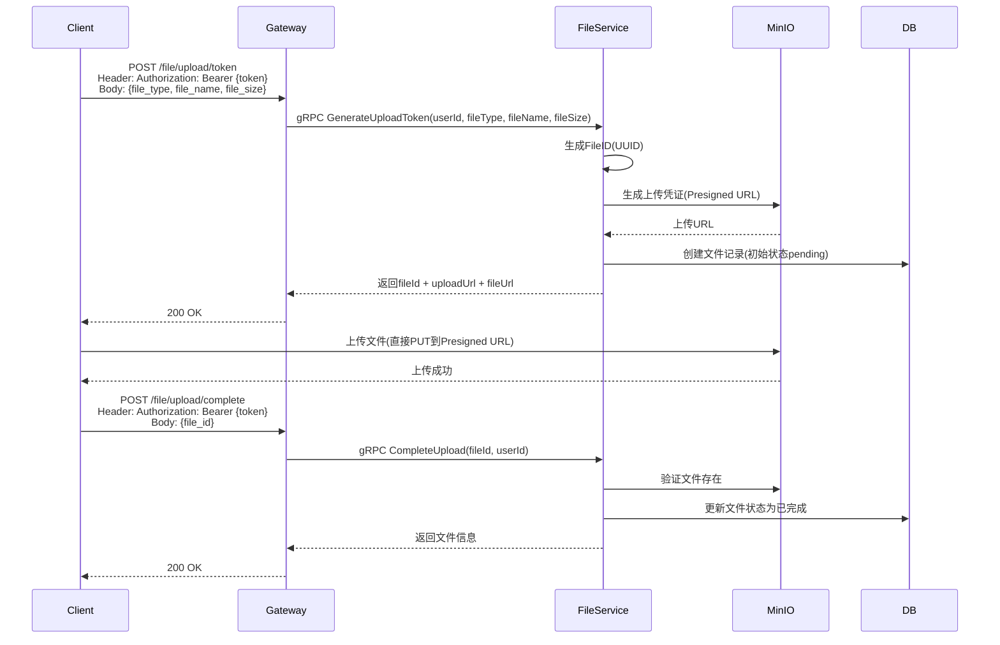
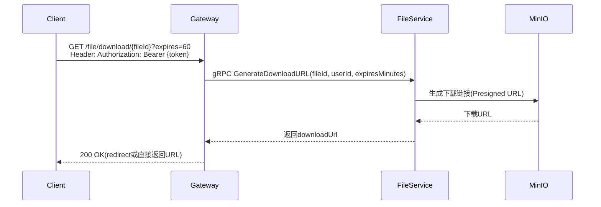
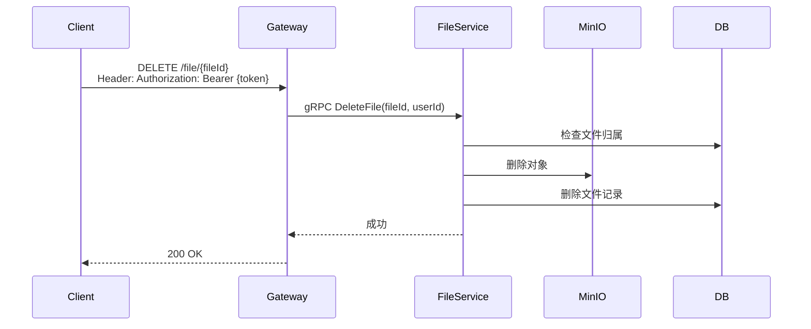

# 文件上传下载设计

## 1. 概述

文件服务负责文件上传、下载、管理，基于MinIO对象存储。

## 2. 功能列表

- [x] 生成上传凭证
- [x] 完成上传确认
- [x] 生成下载链接
- [x] 获取文件信息
- [x] 删除文件
- [x] 批量获取文件信息

## 3. 业务流程

### 3.1 文件上传



### 3.2 文件下载



### 3.3 删除文件



## 4. API设计

### 4.1 生成上传凭证

```protobuf
message GenerateUploadTokenRequest {
    string user_id = 1;
    string file_type = 2; // avatar/image/video/voice/file
    string file_name = 3;
    int64 file_size = 4;
}

message GenerateUploadTokenResponse {
    string file_id = 1;
    string upload_url = 2;
    string file_url = 3;
}
```

### 4.2 生成下载链接

```protobuf
message GenerateDownloadURLRequest {
    string file_id = 1;
    string user_id = 2;
    int32 expires_minutes = 3;
}

message GenerateDownloadURLResponse {
    string download_url = 1;
}
```

## 5. 存储桶设计

| 存储桶 | 用途 | 权限 |
|--------|------|------|
| avatars | 用户头像 | 公开读 |
| group-avatars | 群头像 | 公开读 |
| chat-images | 聊天图片 | 私有 |
| chat-videos | 聊天视频 | 私有 |
| chat-voices | 聊天语音 | 私有 |
| chat-files | 聊天文件 | 私有 |

## 6. 依赖服务

- **MinIO**: 对象存储
- **PostgreSQL**: 文件元信息
