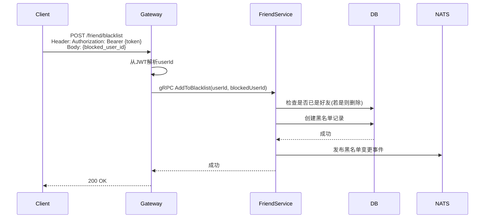
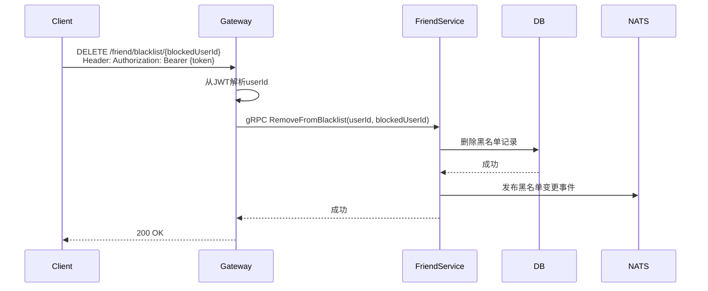
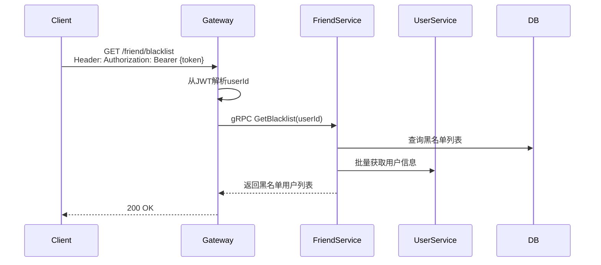

# 黑名单管理设计

## 1. 概述

黑名单管理用于限制特定用户对自己账号的交互能力。

## 2. 功能列表

- [x] 添加到黑名单
- [x] 移出黑名单
- [x] 获取黑名单列表

## 3. 数据模型

### 3.1 Blacklist 表

```go
type Blacklist struct {
    ID          int64     // 主键
    UserID      string    // 用户ID
    BlockedID   string    // 被拉黑用户ID
    CreatedAt   time.Time
}
```

## 4. 业务流程

### 4.1 添加到黑名单



### 4.2 移出黑名单



### 4.3 获取黑名单列表



## 5. API设计

### 5.1 添加黑名单

```protobuf
message AddToBlacklistRequest {
    string user_id = 1;
    string blocked_user_id = 2;
}
```

### 5.2 移除黑名单

```protobuf
message RemoveFromBlacklistRequest {
    string user_id = 1;
    string blocked_user_id = 2;
}
```

### 5.3 获取黑名单

```protobuf
message GetBlacklistRequest {
    string user_id = 1;
}

message BlacklistResponse {
    repeated BlockedUserInfo users = 1;
}

message BlockedUserInfo {
    string user_id = 1;
    string nickname = 2;
    string avatar = 3;
    int64 blocked_at = 4;
}
```

## 6. 黑名单限制

被拉黑用户：
- 无法发送消息
- 无法发起音视频通话
- 无法查看用户资料（可选）
- 无法添加好友

## 7. 通知主题

- `notification.friend.blacklist_changed.{user_id}` - 黑名单变更通知
