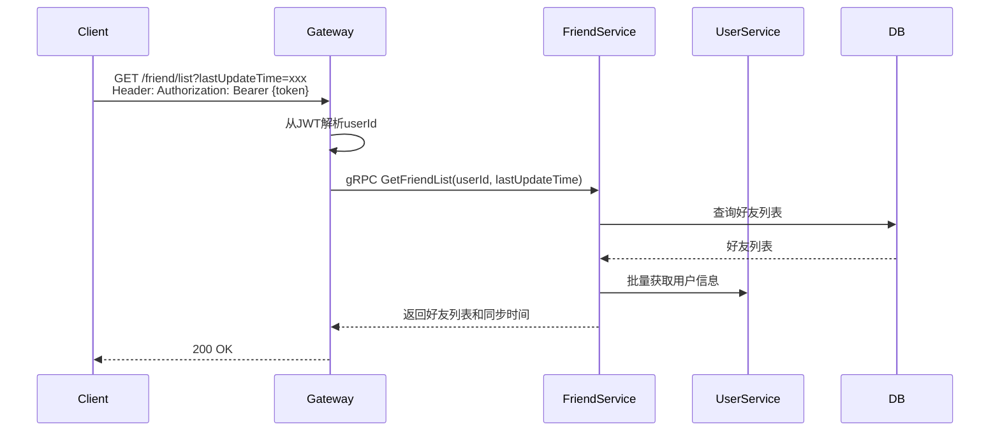
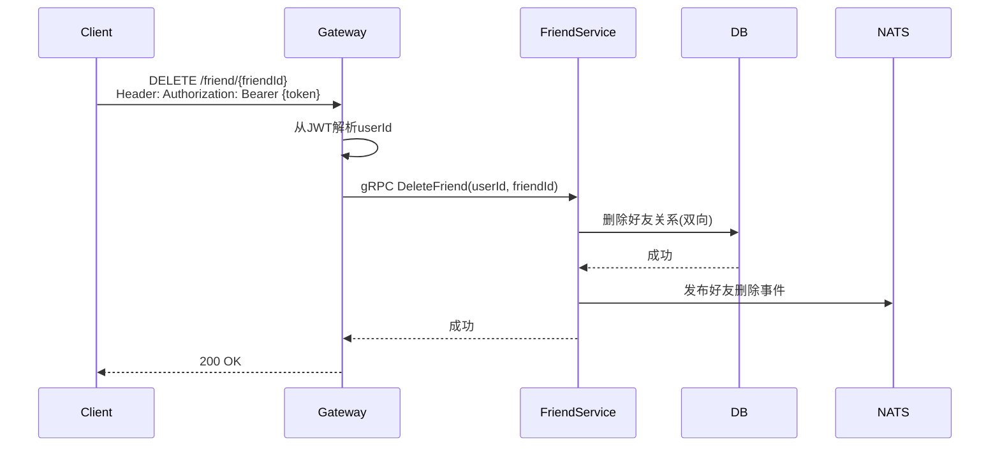
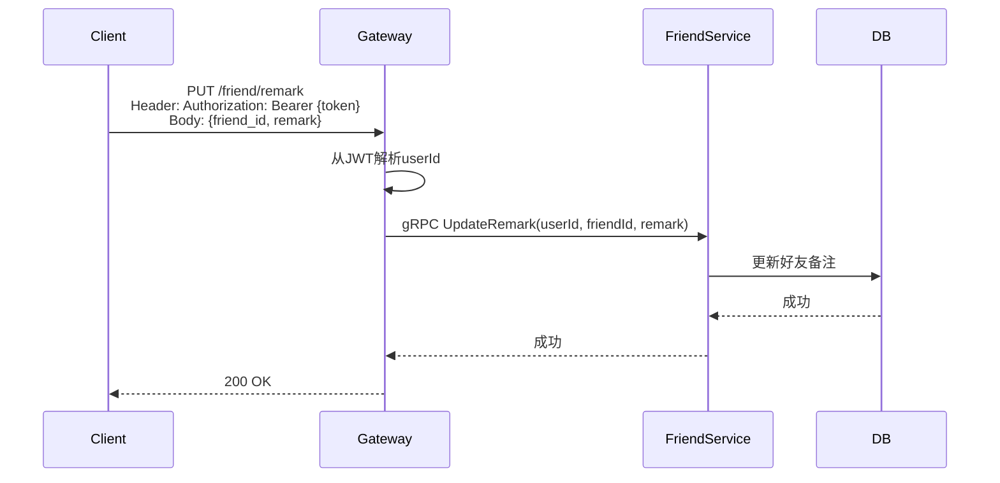

# 好友关系管理设计

## 1. 概述

好友关系管理提供好友列表获取、好友添加、删除、备注等功能。

## 2. 功能列表

- [x] 获取好友列表（支持增量同步）
- [x] 删除好友
- [x] 设置好友备注
- [x] 批量检查好友关系

## 3. 数据模型

### 3.1 Friendship 表

```go
type Friendship struct {
    ID            int64     // 主键
    UserID        string    // 用户ID
    FriendID      string    // 好友ID
    Remark        string    // 好友备注
    IsFavorite    bool      // 是否收藏
    CreatedAt     time.Time // 好友添加时间
    UpdatedAt     time.Time
}
```

## 4. 业务流程

### 4.1 获取好友列表



### 4.2 删除好友



### 4.3 设置好友备注



## 5. API设计

### 5.1 获取好友列表

```protobuf
message GetFriendListRequest {
    string user_id = 1;
    int64 last_update_time = 2; // 增量同步用
}

message GetFriendListResponse {
    repeated FriendInfo friends = 1;
    int64 sync_time = 2;
}

message FriendInfo {
    string friend_id = 1;
    string nickname = 2;
    string avatar = 3;
    string remark = 4;
    bool is_favorite = 5;
    int64 created_at = 6;
}
```

### 5.2 删除好友

```protobuf
message DeleteFriendRequest {
    string user_id = 1;
    string friend_id = 2;
}
```

### 5.3 更新备注

```protobuf
message UpdateRemarkRequest {
    string user_id = 1;
    string friend_id = 2;
    string remark = 3;
}
```

## 6. 通知主题

- `notification.friend.deleted.{user_id}` - 好友删除通知
- `notification.friend.remark_updated.{user_id}` - 好友备注修改通知
