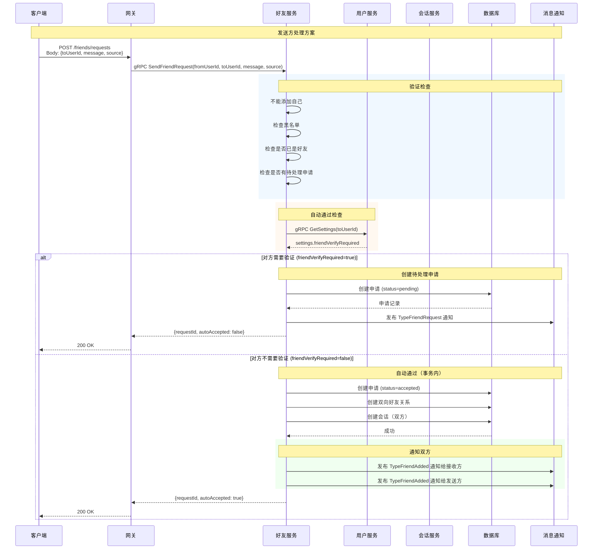
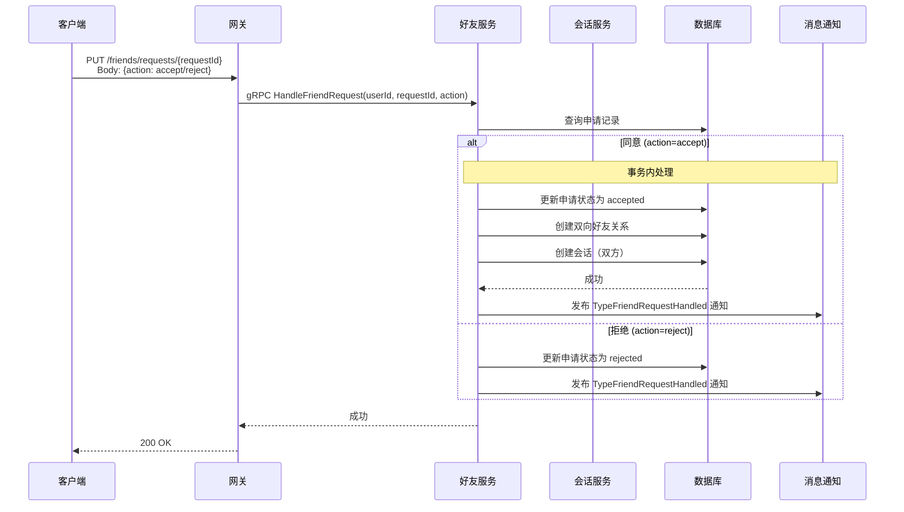
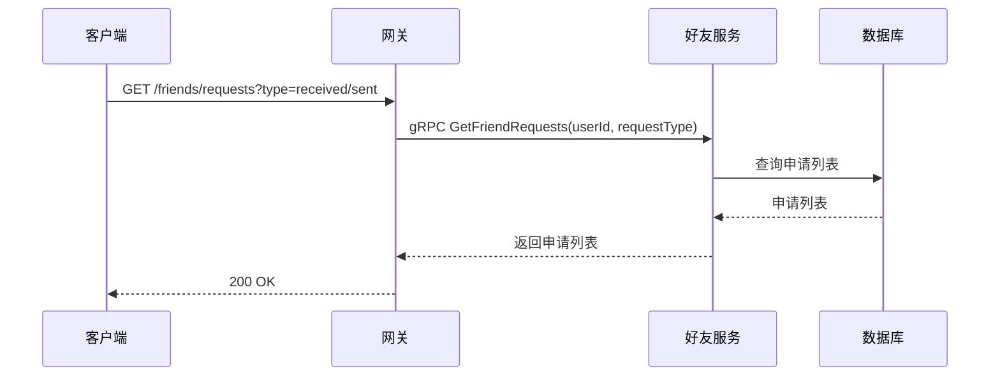

# 好友申请管理设计

## 1. 概述

好友申请管理处理好友请求的发送、接收、处理流程。核心功能包括：
- 发送好友申请
- 处理好友申请（同意/拒绝）
- 获取好友申请列表
- **自动通过功能**：根据对方设置，无需验证时自动成为好友

## 2. 功能列表

- [x] 发送好友申请
- [x] 处理好友申请（同意/拒绝）
- [x] 获取好友申请列表
- [x] 自动通过（对方无需验证时）

## 3. 数据模型

### 3.1 FriendRequest 表

```go
type FriendRequest struct {
    ID          int64     // 主键
    FromUserID  string    // 申请人ID
    ToUserID    string    // 被申请人ID
    Message     string    // 验证消息
    Source      string    // 来源：search/qrcode/group/contacts
    Status      int       // 状态: 0-待处理 1-已同意 2-已拒绝
    CreatedAt   time.Time
    UpdatedAt   time.Time
}
```

### 3.2 状态枚举

```go
const (
    RequestStatusPending  = 0 // 待处理
    RequestStatusAccepted = 1 // 已同意
    RequestStatusRejected = 2 // 已拒绝
)
```

### 3.3 用户设置（FriendVerifyRequired）

用户设置表中的 `friend_verify_required` 字段控制是否需要验证：
- `true`（默认）：对方需要手动同意申请
- `false`：对方会自动通过申请，无需验证

## 4. 方案选择：发送方处理 vs 接收方处理

### 4.1 两种方案对比

| 维度 | 方案一：发送方处理 | 方案二：接收方处理 |
|------|-------------------|-------------------|
| 逻辑直观性 | ✅ 创建时即决定是否通过 | ❌ 需两步：先创建→再自动接受 |
| 用户体验 | ✅ 发送方立即知道结果 | ❌ 需等待异步处理 |
| 代码复杂度 | ✅ 单一服务内完成 | ❌ 需跨服务调用/消息队列 |
| 事务一致性 | ✅ 数据库事务保证 | ❌ 可能出现不一致 |

### 4.2 最终选择：方案一（发送方处理）

理由：
1. TODO 注释已在 `SendFriendRequest` 方法内
2. 发送方发起申请后立即知道结果，用户体验更好
3. 逻辑更直接：创建申请时根据对方设置决定是否自动通过
4. 事务一致性更容易保证

### 4.3 方案一需要解决的影响

| 影响点 | 问题 | 解决方案 |
|--------|------|----------|
| 通知问题 | 接收方未走处理流程，不会收到通知 | 新增 `TypeFriendAdded` 通知类型 |
| 会话创建 | 原来通过消息触发创建会话 | 自动通过后调用 Session Service 创建会话 |
| 响应结构 | 调用方不知道是否自动通过 | `SendFriendRequestResponse` 增加 `auto_accepted` 字段 |
| 边缘情况 | 并发申请、设置变更等 | 事务内处理，以创建时查询的设置为准 |

## 5. 业务流程

### 5.1 发送好友申请（含自动通过）



### 5.2 处理好友申请（手动同意/拒绝）



### 5.3 获取好友申请列表



## 6. API设计

### 6.1 发送好友申请

```protobuf
message SendFriendRequestRequest {
    string from_user_id = 1;  // 申请人ID
    string to_user_id = 2;   // 被申请人ID
    string message = 3;       // 验证消息
    string source = 4;        // 来源：search/qrcode/group/contacts
}

message SendFriendRequestResponse {
    int64 request_id = 1;      // 申请ID
    bool auto_accepted = 2;    // 是否自动通过
}
```

### 6.2 处理好友申请

```protobuf
message HandleFriendRequestRequest {
    string user_id = 1;        // 处理人ID
    int64 request_id = 2;      // 申请ID
    string action = 3;         // 操作：accept/reject
}
```

### 6.3 获取申请列表

```protobuf
message GetFriendRequestsRequest {
    string user_id = 1;
    string request_type = 2;   // received/sent
}

message FriendRequestInfo {
    int64 request_id = 1;
    string from_user_id = 2;
    string from_nickname = 3;
    string from_avatar = 4;
    string message = 5;
    string source = 6;
    int32 status = 7;
    int64 created_at = 8;
}
```

## 7. 通知设计

### 7.1 通知类型

| 通知类型 | 说明 | 接收者 |
|----------|------|--------|
| `TypeFriendRequest` | 好友申请（需要验证） | 接收方 |
| `TypeFriendRequestHandled` | 申请被接受/拒绝 | 发送方 |
| `TypeFriendAdded` | 被自动添加为好友（无需验证） | 双方 |

### 7.2 通知 Payload

**TypeFriendRequest（需要验证）**
```json
{
    "request_id": 12345,
    "from_user_id": "user-001",
    "from_nickname": "张三",
    "message": "你好",
    "source": "search",
    "created_at": 1704067200
}
```

**TypeFriendAdded（自动通过）**
```json
{
    "from_user_id": "user-001",
    "from_nickname": "张三",
    "from_avatar": "https://...",
    "auto_accepted": true,
    "created_at": 1704067200
}
```

### 7.3 通知主题

- `notification.friend.request.{to_user_id}` - 好友申请通知
- `notification.friend.request_handled.{from_user_id}` - 申请处理结果通知
- `notification.friend.added.{user_id}` - 自动添加为好友通知

## 8. 边缘情况处理

| 场景 | 处理方式 |
|------|----------|
| 并发申请 | 数据库唯一约束 (`from_user_id`, `to_user_id`, `status`) 防止重复 |
| 申请过程中对方改设置 | 以创建时查询的设置为准 |
| 对方已是好友 | 已在验证阶段检查，返回 `CodeAlreadyFriend` |
| 对方在黑名单 | 已在验证阶段检查，返回 `CodeUserBlocked` |
| 对方不存在 | UserService 返回错误 |
| 会话创建失败 | 记录日志但不影响好友关系创建成功 |

## 9. 安全考虑

1. **验证开关**: 检查被添加者是否需要验证 (`friend_verify_required`)
2. **黑名单检查**: 检查是否在对方黑名单中
3. **重复申请**: 避免重复发送申请
4. **权限验证**: 只有接收方可以处理申请
5. **事务一致性**: 自动通过时在事务内完成所有操作

## 10. 依赖服务

- **User Service**: 获取用户设置 (`GetSettings`)
- **Session Service**: 创建会话 (`CreateOrUpdateSession`)
- **NATS**: 好友变更事件推送
- **PostgreSQL**: 好友关系持久化
