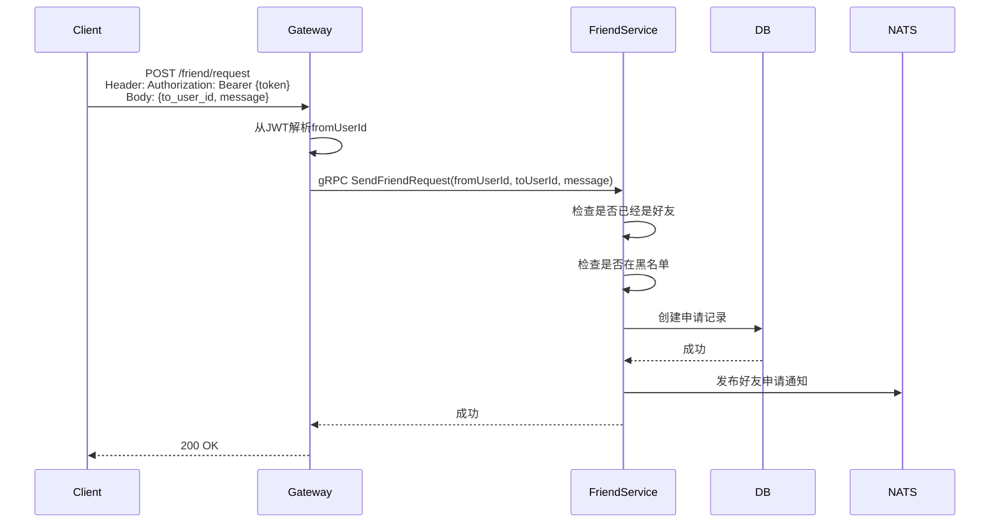
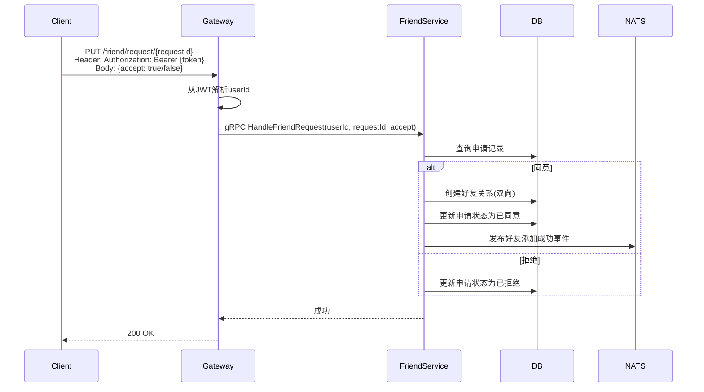
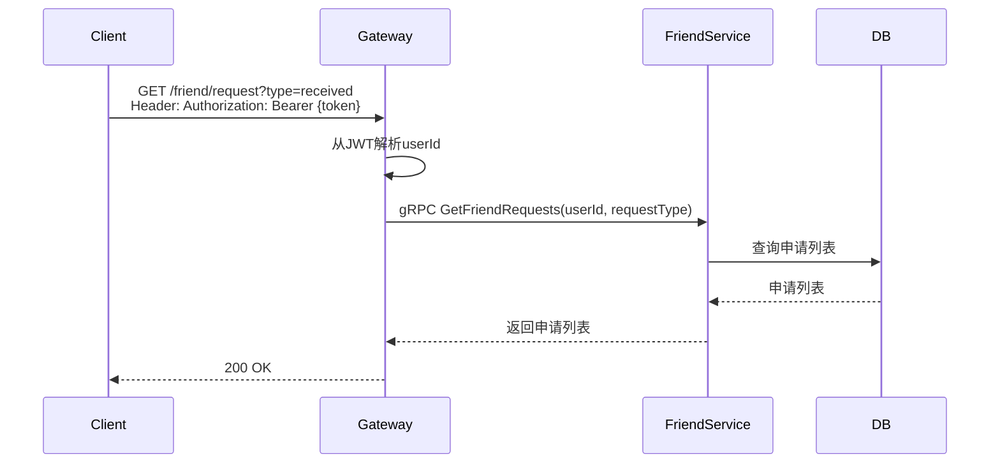

# 好友申请管理设计

## 1. 概述

好友申请管理处理好友请求的发送、接收、处理流程。

## 2. 功能列表

- [x] 发送好友申请
- [x] 处理好友申请（同意/拒绝）
- [x] 获取好友申请列表

## 3. 数据模型

### 3.1 FriendRequest 表

```go
type FriendRequest struct {
    ID          int64     // 主键
    FromUserID  string    // 申请人ID
    ToUserID    string    // 被申请人ID
    Message     string    // 验证消息
    Status      int       // 状态: 0-待处理 1-已同意 2-已拒绝
    CreatedAt   time.Time
    UpdatedAt   time.Time
}
```

### 3.2 状态枚举

```go
const (
    RequestStatusPending  = 0 // 待处理
    RequestStatusAccepted = 1 // 已同意
    RequestStatusRejected = 2 // 已拒绝
)
```

## 4. 业务流程

### 4.1 发送好友申请



### 4.2 处理好友申请



### 4.3 获取好友申请列表



## 5. API设计

### 5.1 发送好友申请

```protobuf
message SendFriendRequestRequest {
    string from_user_id = 1;
    string to_user_id = 2;
    string message = 3;
}

message SendFriendRequestResponse {
    int64 request_id = 1;
}
```

### 5.2 处理好友申请

```protobuf
message HandleFriendRequestRequest {
    int64 request_id = 1;
    bool accept = 2;
}
```

### 5.3 获取申请列表

```protobuf
message GetFriendRequestsRequest {
    string user_id = 1;
    string request_type = 2; // received/sent
}

message FriendRequestInfo {
    int64 request_id = 1;
    string from_user_id = 2;
    string from_nickname = 3;
    string from_avatar = 4;
    string message = 5;
    int32 status = 6;
    int64 created_at = 7;
}
```

## 6. 通知主题

- `notification.friend.request.{to_user_id}` - 好友申请通知
- `notification.friend.request_handled.{from_user_id}` - 申请处理结果通知

## 7. 安全考虑

1. **验证开关**: 检查被添加者是否需要验证
2. **黑名单检查**: 检查是否在对方黑名单中
3. **重复申请**: 避免重复发送申请
