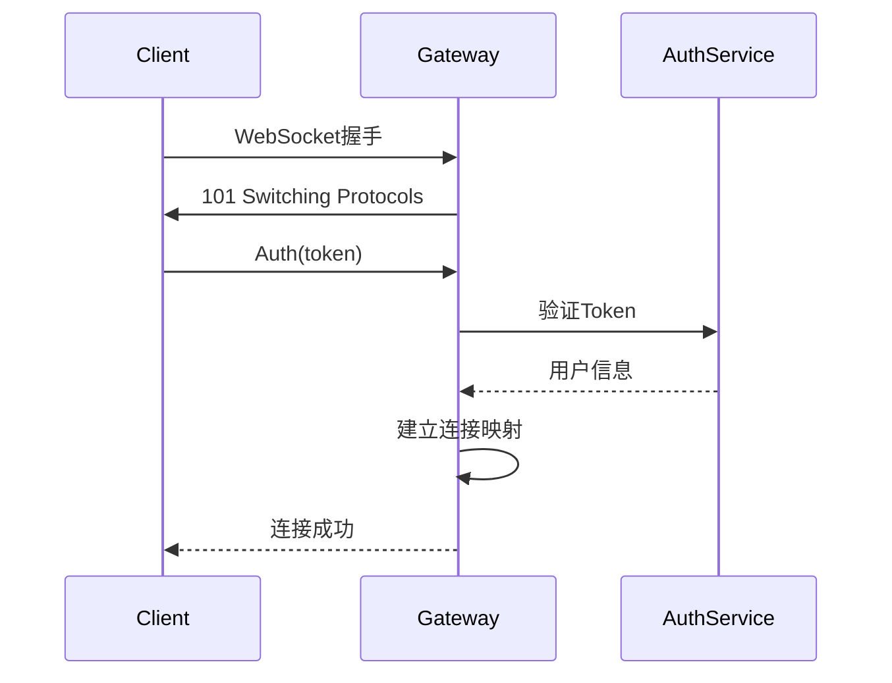
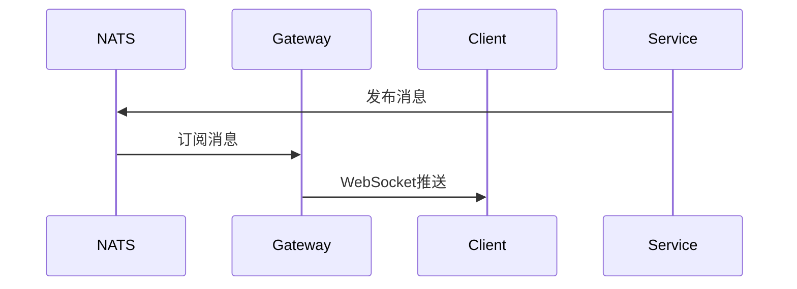

# WebSocket网关设计

## 1. 概述

Gateway服务负责WebSocket连接管理、消息实时推送、在线状态维护。

## 2. 功能列表

- [x] WebSocket连接建立
- [x] 连接认证
- [x] 心跳保活
- [x] 消息推送
- [x] 在线状态管理

## 3. 业务流程

### 3.1 连接建立



### 3.2 消息推送



## 4. 连接管理

```go
type Client struct {
    Conn      *websocket.Conn // WebSocket连接
    UserID    string          // 用户ID
    DeviceID  string          // 设备ID
    Send      chan []byte     // 发送通道
    Heartbeat time.Time       // 最后心跳时间
}
```

## 5. 心跳机制

- 客户端每30秒发送心跳
- 服务端60秒内未收到心跳则断开连接

## 6. 通知订阅

Gateway为每个在线用户订阅：
- `notification.message.new.{user_id}`
- `notification.session.*.{user_id}`
- `notification.user.*.{user_id}`
- `notification.friend.*.{user_id}`
- `notification.group.*.{user_id}`
