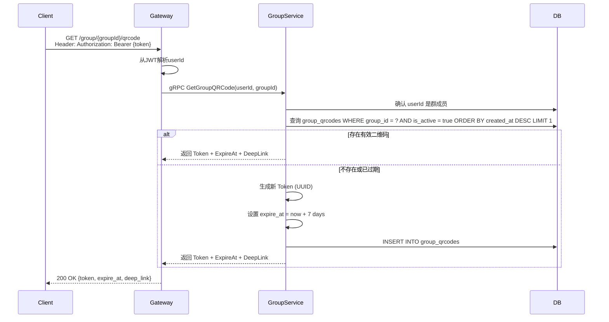
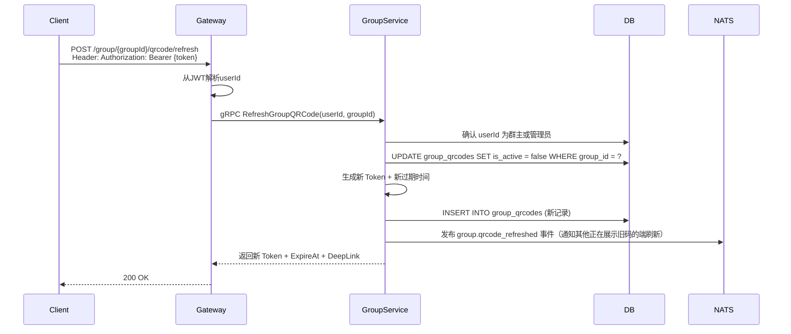
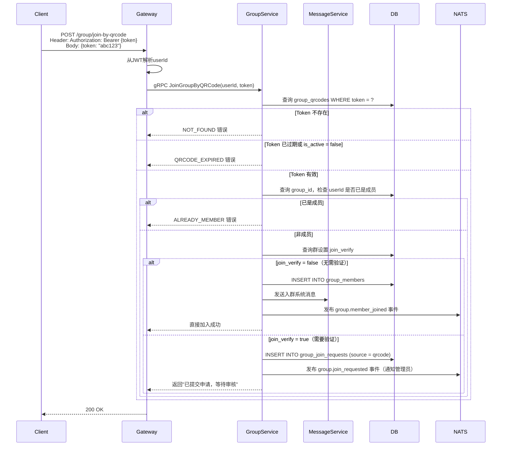

# 群二维码功能设计

## 1. 概述

群二维码允许群成员生成并分享一张专属二维码，其他用户扫码后可发起加入该群的流程。二维码内含一个带有效期的唯一 Token，到期后自动失效，群主/管理员可随时刷新（使旧码失效）。

## 2. 功能说明

- 任意群成员可查看/生成本群二维码并分享给外部用户
- 二维码默认有效期 **7 天**，到期自动失效
- 群主或管理员可随时刷新二维码（旧 Token 立即失效）
- 扫码加入遵循群设置中的 `join_verify` 规则：
  - 无需验证：直接加入
  - 需要验证：创建入群申请，走现有审批流程
- 已是群成员的用户扫码会收到友好提示，不重复加入

## 3. 数据模型

### 3.1 迁移文件

`group_qrcodes` 表已合并至 `migrations/000003_create_group_tables.up.sql`：

```sql
CREATE TABLE IF NOT EXISTS group_qrcodes (
    id         BIGSERIAL    PRIMARY KEY,
    group_id   VARCHAR(36)  NOT NULL,
    token      VARCHAR(64)  NOT NULL UNIQUE,
    created_by VARCHAR(36)  NOT NULL,
    expire_at  TIMESTAMP    NOT NULL,
    is_active  BOOLEAN      NOT NULL DEFAULT TRUE,
    created_at TIMESTAMP    NOT NULL DEFAULT CURRENT_TIMESTAMP,
    updated_at TIMESTAMP    NOT NULL DEFAULT CURRENT_TIMESTAMP
);

CREATE INDEX idx_group_qrcodes_group_id ON group_qrcodes(group_id);
CREATE INDEX idx_group_qrcodes_token    ON group_qrcodes(token);
```

down 脚本同步新增 `DROP TABLE IF EXISTS group_qrcodes;`。

### 3.2 Go 模型

新增 `internal/group/model/group_qrcode.go`：

```go
package model

import "time"

// GroupQRCode 群二维码记录
type GroupQRCode struct {
    ID        int64     `gorm:"column:id;primaryKey;autoIncrement" json:"id"`
    GroupID   string    `gorm:"column:group_id;not null;index"     json:"groupId"`
    Token     string    `gorm:"column:token;not null;uniqueIndex"  json:"token"`
    CreatedBy string    `gorm:"column:created_by;not null"         json:"createdBy"`
    ExpireAt  time.Time `gorm:"column:expire_at;not null"          json:"expireAt"`
    IsActive  bool      `gorm:"column:is_active;default:true"      json:"isActive"`
    CreatedAt time.Time `gorm:"column:created_at;not null;default:CURRENT_TIMESTAMP" json:"createdAt"`
    UpdatedAt time.Time `gorm:"column:updated_at;not null;default:CURRENT_TIMESTAMP" json:"updatedAt"`
}

func (GroupQRCode) TableName() string { return "group_qrcodes" }

// IsValid 当前二维码是否仍有效
func (q *GroupQRCode) IsValid() bool {
    return q.IsActive && q.ExpireAt.After(time.Now())
}

// DefaultQRCodeTTL 二维码默认有效期
const DefaultQRCodeTTL = 7 * 24 * time.Hour
```

## 4. 业务流程

### 4.1 获取群二维码



### 4.2 刷新群二维码（管理员操作）



### 4.3 扫码加入群组



## 5. API 设计

### 5.1 gRPC 接口

```protobuf
// 获取群二维码
message GetGroupQRCodeRequest {
    string user_id  = 1;
    string group_id = 2;
}

message GetGroupQRCodeResponse {
    string token      = 1; // 唯一令牌
    string deep_link  = 2; // 深链，如 anychat://join/group?token=abc123
    int64  expire_at  = 3; // Unix 时间戳（秒）
}

// 刷新群二维码
message RefreshGroupQRCodeRequest {
    string user_id  = 1;
    string group_id = 2;
}

message RefreshGroupQRCodeResponse {
    string token     = 1;
    string deep_link = 2;
    int64  expire_at = 3;
}

// 扫码加入群
message JoinGroupByQRCodeRequest {
    string user_id = 1; // 扫码者ID
    string token   = 2; // 二维码 Token
}

message JoinGroupByQRCodeResponse {
    bool   joined          = 1; // true = 直接加入；false = 已提交申请
    string group_id        = 2;
    bool   need_verify     = 3; // 是否需要审批
    int64  request_id      = 4; // 申请ID（need_verify = true 时有效）
}
```

### 5.2 HTTP 接口（Gateway）

#### 获取群二维码

```
GET /group/{groupId}/qrcode
Authorization: Bearer {token}

Response 200:
{
  "code": 0,
  "data": {
    "token":     "550e8400-e29b-41d4-a716-446655440000",
    "deepLink":  "anychat://join/group?token=550e8400-e29b-41d4-a716-446655440000",
    "expireAt":  1754006400
  }
}

Response 403:
{
  "code": 40301,
  "message": "非群成员，无权获取二维码"
}
```

> 客户端使用 `deepLink` 字段内容生成二维码图片展示给用户。

#### 刷新群二维码

```
POST /group/{groupId}/qrcode/refresh
Authorization: Bearer {token}

Response 200:
{
  "code": 0,
  "data": {
    "token":     "新Token",
    "deepLink":  "anychat://join/group?token=新Token",
    "expireAt":  1754006400
  }
}

Response 403:
{
  "code": 40302,
  "message": "仅群主或管理员可刷新二维码"
}
```

#### 扫码加入群

```
POST /group/join-by-qrcode
Authorization: Bearer {token}

Request Body:
{
  "token": "550e8400-e29b-41d4-a716-446655440000"
}

Response 200（直接加入）:
{
  "code": 0,
  "data": {
    "joined":     true,
    "groupId":    "group-uuid",
    "needVerify": false
  }
}

Response 200（需审批）:
{
  "code": 0,
  "data": {
    "joined":     false,
    "groupId":    "group-uuid",
    "needVerify": true,
    "requestId":  12345
  }
}

Response 400（已是成员）:
{
  "code": 40001,
  "message": "您已是该群成员"
}

Response 400（二维码已过期）:
{
  "code": 40002,
  "message": "二维码已失效，请联系群成员重新获取"
}

Response 404（二维码不存在）:
{
  "code": 40401,
  "message": "二维码无效"
}
```

## 6. 深链处理

客户端解析深链 `anychat://join/group?token={token}` 后：

1. 检查当前用户是否已登录；未登录则先引导登录再处理深链
2. 展示群信息预览页（群名、头像、成员数）
3. 用户确认点击"加入"后，调用 `POST /group/join-by-qrcode`
4. 根据响应结果展示：直接进入群聊 / 提示"申请已提交"

群信息预览页可单独提供一个**不需要鉴权**的接口获取基本信息（仅群名、头像、成员数）：

```
GET /group/preview?token={token}

Response 200:
{
  "code": 0,
  "data": {
    "groupId":     "group-uuid",
    "name":        "产品团队",
    "avatar":      "https://...",
    "memberCount": 42,
    "needVerify":  true
  }
}
```

## 7. 二维码过期策略

| 场景 | 处理方式 |
|------|----------|
| Token 已过期 | 返回 QRCODE_EXPIRED 错误，提示用户向群成员重新获取 |
| `is_active = false`（被手动刷新） | 同上 |
| 获取二维码时发现当前有效码距过期不足 1 天 | 自动续期（延长 7 天），减少用户感知 |

## 8. 错误码设计

| 错误码 | 说明 |
|--------|------|
| 50401 | 二维码 Token 不存在 |
| 50402 | 二维码已过期或已失效 |
| 50403 | 用户已是群成员 |
| 50404 | 群已解散 |
| 50405 | 群人数已满 |

## 9. 权限规则

| 操作 | 群主 | 管理员 | 成员 | 非成员 |
|------|------|--------|------|--------|
| 获取/查看二维码 | ✓ | ✓ | ✓ | ✗ |
| 刷新二维码 | ✓ | ✓ | ✗ | ✗ |
| 通过二维码预览群信息 | ✓ | ✓ | ✓ | ✓ |
| 扫码申请/加入群 | ✓ | ✓ | ✓ | ✓ |

## 10. 通知主题

- `notification.group.qrcode_refreshed.{group_id}` — 二维码被刷新（通知其他正在展示的端更新）
- `notification.group.member_joined.{group_id}` — 扫码成功直接入群（复用现有主题）
- `notification.group.join_requested.{group_id}` — 扫码后提交了入群申请（复用现有主题）
