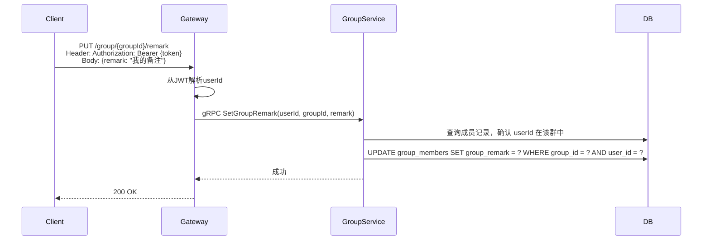
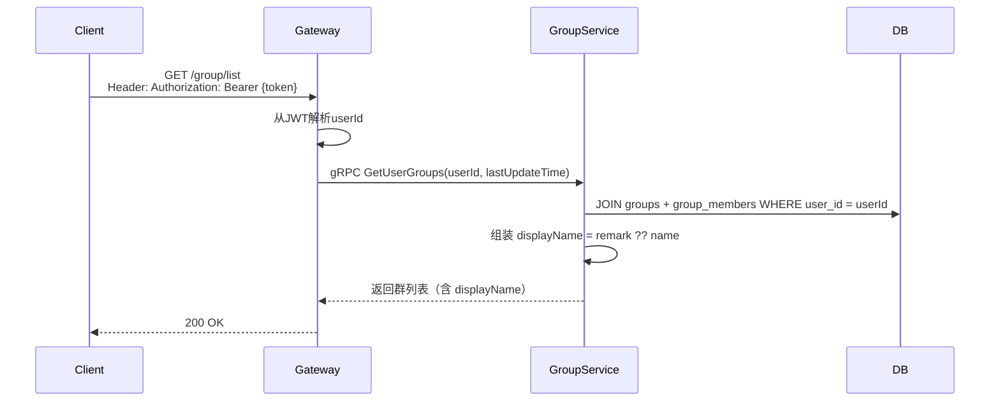
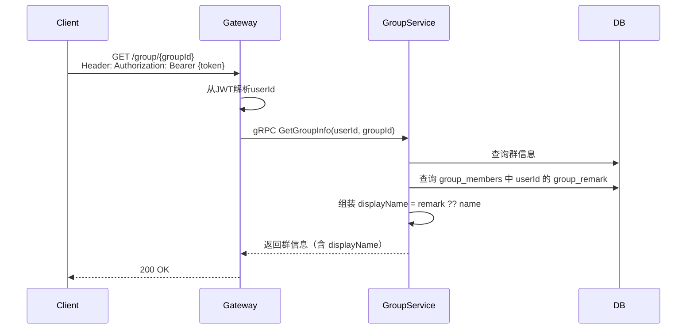

# 群备注功能设计

## 1. 概述

群备注允许用户为已加入的群聊设置一个仅自己可见的别名（备注名）。设置备注后，系统在群列表、聊天窗口等界面会优先展示备注名，而不改变群内对所有人展示的真实名称。消息推送、群资料卡深层逻辑等仍使用真实群名称。

## 2. 功能说明

- 任意群成员均可为自己加入的群设置备注
- 备注仅对设置者本人可见，其他成员不受影响
- 备注名最长 20 个字符
- 清空备注（传空字符串）后，恢复显示群真实名称

> **与群昵称的区别**
>
> | | 群昵称 (`group_nickname`) | 群备注 (`group_remark`) |
> |---|---|---|
> | 含义 | 用户在群内展示给他人的昵称 | 用户对该群起的个人别名 |
> | 可见范围 | 群内所有成员 | 仅设置者本人 |
> | 修改权限 | 自己 | 自己 |

## 3. 数据模型变更

### 3.1 迁移文件

在 `migrations/000003_create_group_tables.up.sql` 的 `group_members` 建表语句中新增 `group_remark` 字段：

```sql
-- group_members 表新增字段（已合并至 000003）
group_remark VARCHAR(20)  -- 用户为该群设置的备注名，NULL 表示未设置，仅对本人可见
```

### 3.2 Go 模型变更

在 `internal/group/model/group_member.go` 的 `GroupMember` 结构体中新增字段：

```go
type GroupMember struct {
    // ... 现有字段 ...
    GroupRemark string `gorm:"column:group_remark;size:20" json:"groupRemark"` // 群备注（仅自己可见）
}
```

## 4. 业务流程

### 4.1 设置/清空群备注



> 传空字符串 `remark: ""` 等同于清空备注，服务端存储 NULL。

### 4.2 获取群列表（含备注）



### 4.3 获取单群信息（含备注）



## 5. API 设计

### 5.1 gRPC 接口

```protobuf
// 设置/清空群备注
message SetGroupRemarkRequest {
    string user_id  = 1; // 操作者ID（由 Gateway 从 JWT 解析）
    string group_id = 2; // 群ID
    string remark   = 3; // 备注名，空字符串表示清空
}

message SetGroupRemarkResponse {}
```

在 `GetUserGroupsResponse` 和 `GetGroupInfoResponse` 中补充展示字段：

```protobuf
message GroupInfo {
    string group_id      = 1;
    string name          = 2;  // 群真实名称
    string display_name  = 3;  // 展示名：备注优先，无备注则等于 name
    string avatar        = 4;
    string owner_id      = 5;
    int32  member_count  = 6;
    // ... 其他字段 ...
}
```

### 5.2 HTTP 接口（Gateway）

#### 设置群备注

```
PUT /group/{groupId}/remark
Authorization: Bearer {token}

Request Body:
{
  "remark": "产品讨论群"   // 空字符串表示清空备注
}

Response 200:
{
  "code": 0,
  "message": "success"
}

Response 403:
{
  "code": 40301,
  "message": "不是群成员，无法设置备注"
}
```

## 6. 客户端展示逻辑

客户端统一使用 `displayName` 进行展示；需要展示真实群名时使用 `name`。

```
// 群名展示规则
显示名称 = displayName（由服务端组装，逻辑等同于：remark 非空 ? remark : name）

// 以下场景使用真实 name，不受备注影响
- 消息推送通知
- 群二维码分享页
- 群搜索结果
- 管理后台
```

## 7. 权限规则

| 操作 | 群主 | 管理员 | 成员 |
|------|------|--------|------|
| 设置/清空群备注 | ✓ | ✓ | ✓ |
| 查看自己的备注 | ✓ | ✓ | ✓ |
| 查看他人的备注 | ✗ | ✗ | ✗ |

## 8. 边界情况

| 场景 | 处理方式 |
|------|----------|
| 用户未加入该群时请求设置备注 | 返回 403，提示不是群成员 |
| 备注超过 20 个字符 | 返回 400，参数校验失败 |
| 群已解散，仍有备注记录 | 备注随群成员记录一同删除（级联删除） |
| 被移出群后重新加入 | 历史备注已随退出记录删除，需重新设置 |
