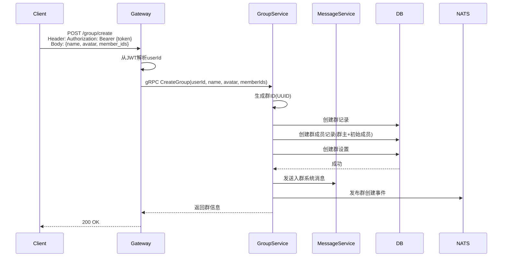
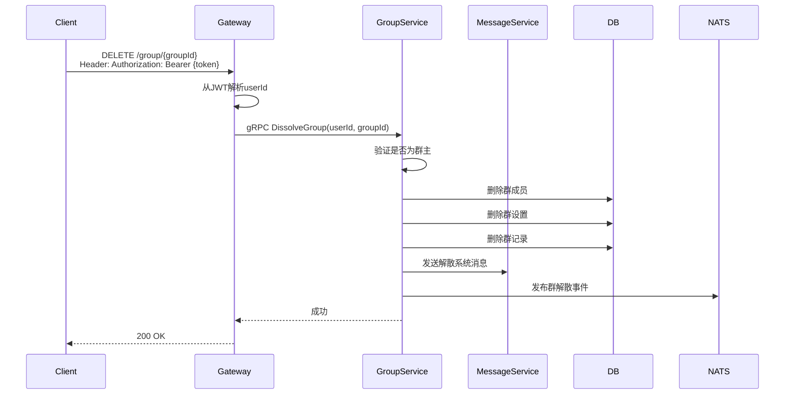
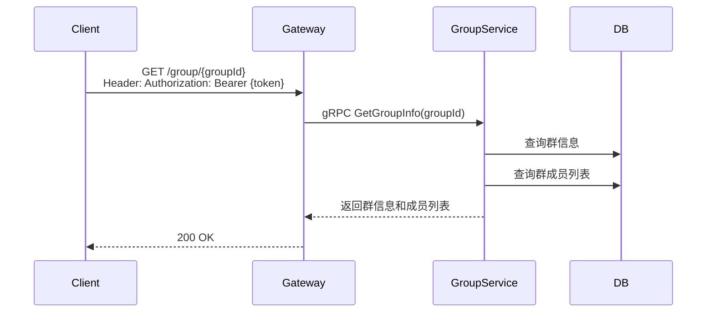
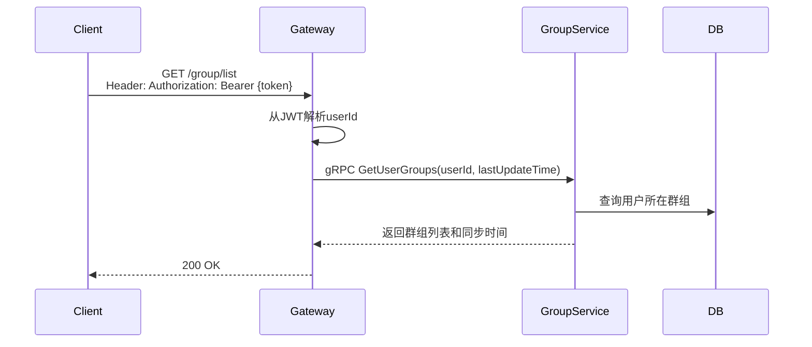

# 群组管理设计

## 1. 概述

群组管理提供群组创建、解散、资料更新、群列表等功能。

## 2. 功能列表

- [x] 创建群组
- [x] 获取群信息
- [x] 更新群资料（名称、头像、公告）
- [x] 解散群组
- [x] 获取用户群组列表

## 3. 数据模型

### 3.1 Group 表

```go
type Group struct {
    ID          string    // 群ID
    OwnerID     string    // 群主ID
    Name        string    // 群名称
    Avatar      string    // 群头像
    Notice      string    // 群公告
    MemberCount int       // 成员数量
    CreatedAt   time.Time
    UpdatedAt   time.Time
}
```

### 3.2 GroupMember 表

```go
type GroupMember struct {
    ID          int64     // 主键
    GroupID     string    // 群ID
    UserID      string    // 用户ID
    Role        int       // 角色: 0-成员 1-管理员 2-群主
    Nickname    string    // 群内昵称
    MutedUntil  *time.Time// 禁言截止时间
    JoinedAt    time.Time // 入群时间
    CreatedAt   time.Time
    UpdatedAt   time.Time
}
```

### 3.3 角色枚举

```go
const (
    RoleMember  = 0 // 成员
    RoleAdmin  = 1 // 管理员
    RoleOwner  = 2 // 群主
)
```

## 4. 业务流程

### 4.1 创建群组



### 4.2 解散群组



### 4.3 获取群信息



### 4.4 获取用户群组列表



## 5. API设计

### 5.1 创建群组

```protobuf
message CreateGroupRequest {
    string name = 1;
    string avatar = 2;
    repeated string member_ids = 3;
}
```

### 5.2 更新群资料

```protobuf
message UpdateGroupRequest {
    string name = 1;
    string avatar = 2;
    string notice = 3;
}
```

### 5.3 获取群列表

```protobuf
message GetUserGroupsRequest {
    string user_id = 1;
    int64 last_update_time = 2;
}

message GroupListResponse {
    repeated GroupInfo groups = 1;
    int64 sync_time = 2;
}
```

## 6. 通知主题

- `notification.group.member_joined.{group_id}` - 成员加入
- `notification.group.member_left.{group_id}` - 成员离开
- `notification.group.info_updated.{group_id}` - 群信息更新
- `notification.group.disbanded.{group_id}` - 群解散
