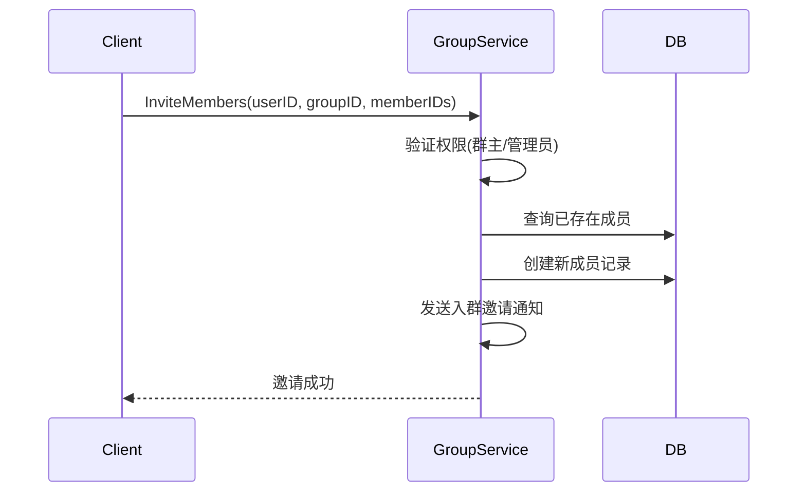
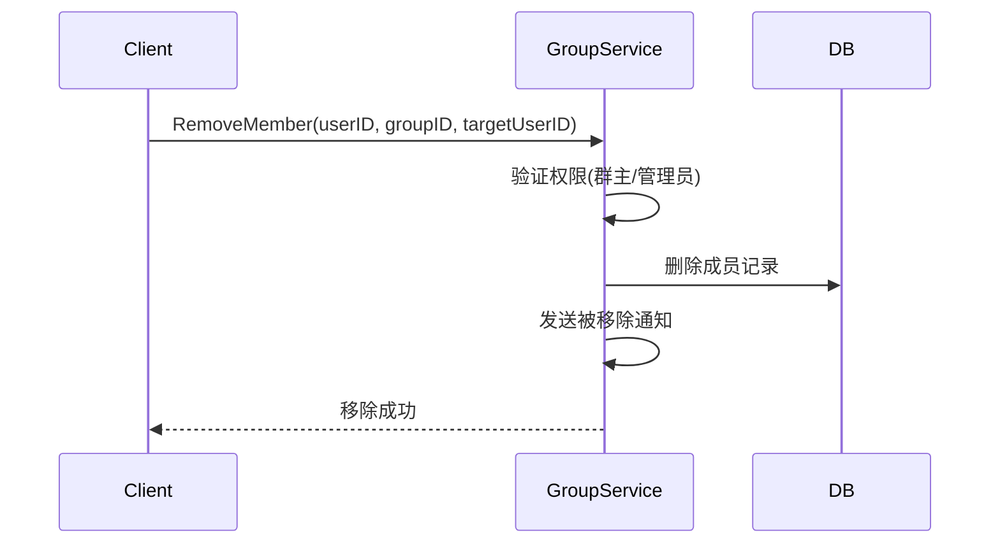
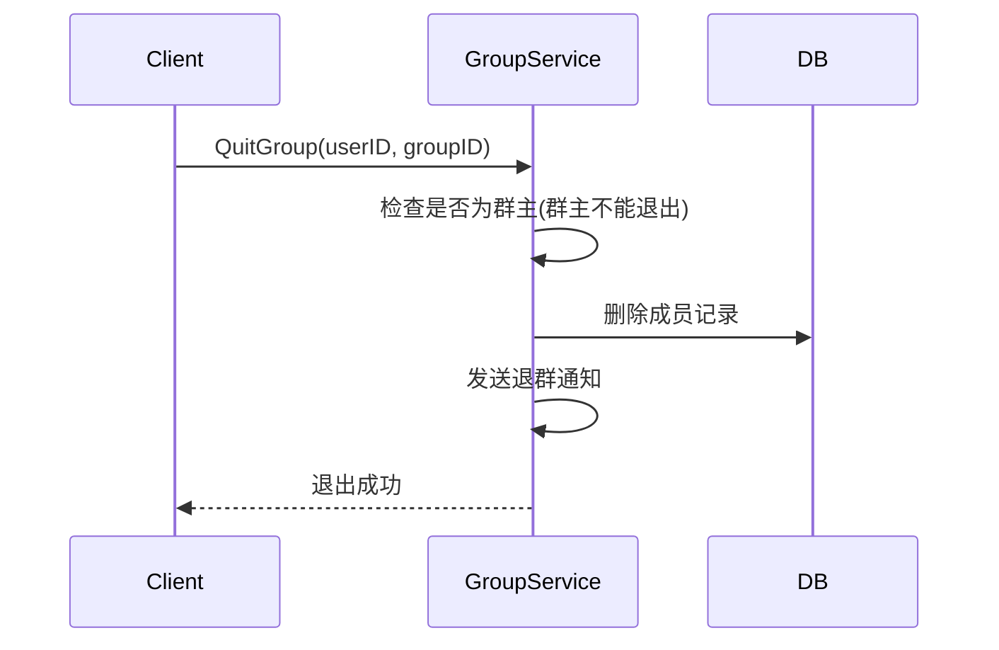

# 群成员管理设计

## 1. 概述

群成员管理处理成员邀请、移除、权限变更等操作。

## 2. 功能列表

- [x] 邀请成员
- [x] 移除成员
- [x] 退出群组
- [x] 设置/取消管理员
- [x] 群主转让
- [x] 更新成员昵称

## 3. 业务流程

### 3.1 邀请成员



### 3.2 移除成员



### 3.3 退出群组



## 4. API设计

### 4.1 邀请成员

```protobuf
message InviteMembersRequest {
    string user_id = 1;
    string group_id = 2;
    repeated string member_ids = 3;
}
```

### 4.2 移除成员

```protobuf
message RemoveMemberRequest {
    string user_id = 1;
    string group_id = 2;
    string target_user_id = 3;
}
```

### 4.3 退出群组

```protobuf
message QuitGroupRequest {
    string user_id = 1;
    string group_id = 2;
}
```

### 4.4 更新成员角色

```protobuf
message UpdateMemberRoleRequest {
    string user_id = 1;
    string group_id = 2;
    string target_user_id = 3;
    int32 role = 4; // 0-成员 1-管理员
}
```

## 5. 权限规则

| 操作 | 群主 | 管理员 | 成员 |
|------|------|--------|------|
| 邀请成员 | ✓ | ✓ | ✗ |
| 移除成员 | ✓ | ✓(仅成员) | ✗ |
| 设置管理员 | ✓ | ✗ | ✗ |
| 转让群主 | ✓ | ✗ | ✗ |
| 修改群信息 | ✓ | ✗ | ✗ |
| 解散群组 | ✓ | ✗ | ✗ |
