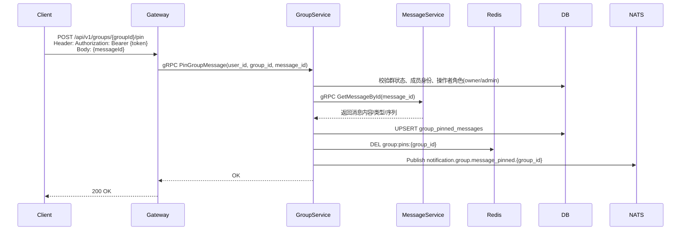
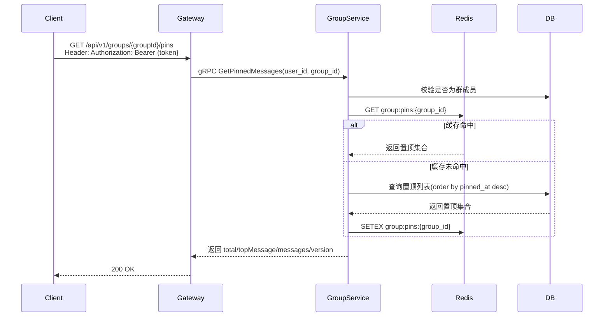

# 群聊消息置顶设计

## 1. 概述

群聊消息置顶用于沉淀群规、长期公告和关键通知。  
目标体验参照行业通用做法：

- 消息操作菜单提供“置顶”
- 聊天窗口顶部常驻一个置顶栏
- 点击置顶栏可折叠/展开完整置顶列表
- 仅群主/管理员可置顶与取消置顶，普通成员仅可查看
- 新成员入群后可通过漫游拉取看到当前置顶内容

## 2. 功能目标与非目标

### 2.1 功能目标

- [x] 支持群消息置顶/取消置顶
- [x] 支持顶部“单条常驻 + 列表展开”展示
- [x] 支持角色权限控制（owner/admin 可操作）
- [x] 支持多端实时同步与离线补偿
- [x] 支持新成员入群后可见

### 2.2 非目标（本期不做）

- [ ] 单聊消息置顶
- [ ] 置顶自动到期/定时下线
- [ ] 置顶分组或标签分类

## 3. 交互与展示设计

### 3.1 交互入口

- 长按消息（或消息更多菜单）展示“置顶”
- 若消息已置顶，展示“取消置顶”
- 普通成员不展示“置顶/取消置顶”操作入口

### 3.2 顶部置顶栏

- 聊天页顶部常驻一条置顶栏（折叠态）
- 折叠态展示：
  - 图标 + 文案：`群置顶（N）`
  - 最新置顶消息摘要（或产品选择的主置顶）
- 点击置顶栏进入展开态，展示完整置顶列表（按 `pinned_at DESC`）
- 点击列表项可跳转到对应消息位置
- 展开态支持收起，回到折叠态

### 3.3 行业常见约束（建议）

- 单群置顶上限：`20` 条
- 超限时返回业务错误，提示“已达置顶上限，请先取消部分置顶”

## 4. 权限与业务规则

### 4.1 权限矩阵

| 操作 | 群主 | 管理员 | 普通成员 |
|------|------|--------|----------|
| 置顶消息 | ✓ | ✓ | ✗ |
| 取消置顶 | ✓ | ✓ | ✗ |
| 查看置顶栏/列表 | ✓ | ✓ | ✓ |

### 4.2 业务规则

- 操作者必须是群成员，且群状态为正常
- 仅允许置顶本群消息（校验 `conversation_type=group` 且 `conversation_id=group_id`）
- 重复置顶同一消息按幂等处理（更新时间/操作者即可）
- 已撤回或不可见消息不允许新增置顶
- 被置顶消息若后续被“全员撤回”，自动取消置顶并广播变更
- 置顶内容不受“新成员历史消息可见范围”影响：作为群规/长期公告，新成员入群后可见当前置顶集合

## 5. 数据设计

当前仓库已存在 `group_pinned_messages` 表，可在其上增强以支持更稳定同步与跳转：

```sql
ALTER TABLE group_pinned_messages
  ADD COLUMN IF NOT EXISTS message_seq BIGINT,
  ADD COLUMN IF NOT EXISTS content_type VARCHAR(32) DEFAULT 'text',
  ADD COLUMN IF NOT EXISTS updated_at TIMESTAMP NOT NULL DEFAULT CURRENT_TIMESTAMP;

CREATE INDEX IF NOT EXISTS idx_group_pinned_messages_group_updated_at
  ON group_pinned_messages(group_id, updated_at DESC);
```

字段说明：

- `message_id`：置顶消息主键
- `message_seq`：用于客户端跳转到历史位置
- `content`：消息摘要（服务端生成，避免依赖客户端上传）
- `updated_at`：用于增量同步版本比较

## 6. 接口设计

### 6.1 HTTP API（Gateway）

- `POST /api/v1/groups/{groupId}/pin`
  - Body: `{ "messageId": "msg_xxx" }`
  - 权限：群主/管理员
- `DELETE /api/v1/groups/{groupId}/pin/{messageId}`
  - 权限：群主/管理员
- `GET /api/v1/groups/{groupId}/pins`
  - 权限：群成员可读
  - 返回示例：

```json
{
  "total": 2,
  "version": 1775700000,
  "topMessage": {
    "messageId": "msg_1002",
    "content": "入群后请先阅读群规",
    "contentType": "text",
    "pinnedBy": "u_admin_1",
    "pinnedAt": 1775699988,
    "messageSeq": 8123
  },
  "messages": [
    {
      "messageId": "msg_1002",
      "content": "入群后请先阅读群规",
      "contentType": "text",
      "pinnedBy": "u_admin_1",
      "pinnedAt": 1775699988,
      "messageSeq": 8123
    },
    {
      "messageId": "msg_0950",
      "content": "周会时间调整为每周三 20:00",
      "contentType": "text",
      "pinnedBy": "u_owner_1",
      "pinnedAt": 1775600000,
      "messageSeq": 7991
    }
  ]
}
```

说明：

- `topMessage` 用于折叠态置顶栏快速渲染
- `version` 建议取该群置顶集合最大 `updated_at` 的 Unix 时间戳

### 6.2 gRPC（GroupService）

```protobuf
message PinnedMessage {
  string message_id = 1;
  string content = 2;
  string pinned_by = 3;
  int64 pinned_at = 4;
  optional string content_type = 5;
  optional int64 message_seq = 6;
}

message GetPinnedMessagesResponse {
  repeated PinnedMessage messages = 1;
  int32 total = 2;
  optional PinnedMessage top_message = 3;
  int64 version = 4;
}
```

## 7. 同步设计

### 7.1 在线实时同步

- 复用现有通知主题：
  - `notification.group.message_pinned.{group_id}`
  - `notification.group.message_unpinned.{group_id}`
- 客户端收到后刷新本地置顶缓存（或触发增量拉取）

### 7.2 漫游与离线补偿

- 会话页打开时调用 `GET /api/v1/groups/{groupId}/pins` 获取最新置顶集合
- 新成员入群后首次进入群聊，走相同接口，直接可见当前置顶集合
- 若客户端保存 `version`，可在后续进入群聊时走“版本相同不更新”的轻量逻辑

### 7.3 缓存策略（可选）

- Redis Key：`group:pins:{group_id}`
- Redis Value：置顶列表 + `topMessage` + `version`
- 写路径（置顶/取消置顶/撤回触发取消）后删除缓存，读路径回源 DB 重建缓存

## 8. 核心时序图

### 8.1 置顶消息



### 8.2 新成员入群后查看置顶（漫游拉取）



## 9. 错误码建议

- `group_not_found`：群不存在
- `group_dissolved`：群已解散
- `not_group_member`：非群成员
- `no_admin_permission`：无权限置顶/取消置顶
- `message_not_found`：消息不存在或不可见
- `message_not_in_group`：消息不属于该群
- `group_pinned_limit_exceeded`：置顶数量超限

## 10. 实施步骤

1. 增强 `GetPinnedMessages` 返回结构（`total/topMessage/version`）
2. 落库字段升级（`message_seq/content_type/updated_at`）与索引
3. 接入 Redis 缓存与失效策略
4. 接入“消息撤回触发自动取消置顶”逻辑
5. 客户端完成顶部栏折叠/展开与跳转能力
6. 联调多端同步与新成员入群可见性

## 11. 测试计划

- 权限测试：owner/admin/member 三角色
- 数据一致性：重复置顶幂等、取消置顶幂等
- 展示一致性：折叠态 `topMessage` 与列表第一条一致
- 同步测试：在线端实时更新、离线端重新进入补偿
- 新成员可见性：入群后首次进入群聊可读取当前置顶
- 异常测试：消息撤回后自动去置顶、超限拦截
