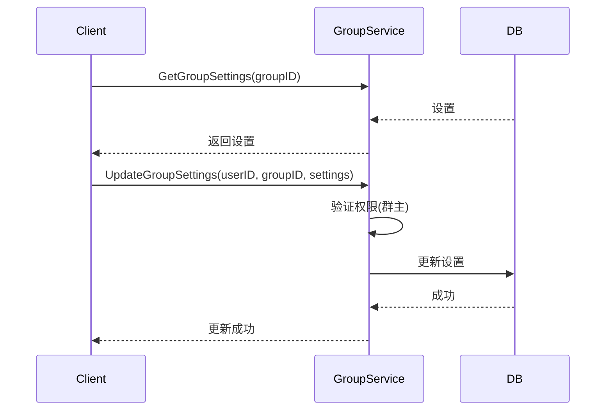

# 群组设置设计

## 1. 概述

群组设置管理群的各种配置选项，包括入群验证、禁言、群成员权限等。

## 2. 功能列表

- [x] 获取群设置
- [x] 更新群设置
- [x] 全体禁言
- [x] 指定成员禁言

## 3. 数据模型

### 3.1 GroupSetting 表

```go
type GroupSetting struct {
    GroupID           string // 群ID
    JoinAuthType     int    // 入群验证: 0-直接加入 1-需要验证 2-不允许加入
    InviteAuthType   int    // 邀请权限: 0-所有人 1-仅管理员
    AddFriendEnabled bool   // 允许加好友
    ShowHistoryEnabled bool// 允许查看历史消息
    AllowMemberModify bool   // 允许成员修改群信息
    MuteAllEnabled   bool   // 全体禁言
    CreatedAt        time.Time
    UpdatedAt        time.Time
}
```

## 4. 业务流程



## 5. API设计

### 5.1 更新设置

```protobuf
message UpdateGroupSettingsRequest {
    string user_id = 1;
    string group_id = 2;
    int32 join_auth_type = 3;
    int32 invite_auth_type = 4;
    bool add_friend_enabled = 5;
    bool show_history_enabled = 6;
    bool allow_member_modify = 7;
    bool mute_all_enabled = 8;
}
```

## 6. 通知主题

- `notification.group.muted.{group_id}` - 禁言通知
