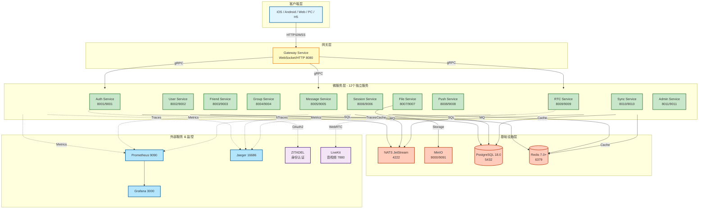

# IM即时通讯后端设计文档

## 1. 背景

本文档旨在为AI编程工具提供清晰的后端设计规范，用于实现一个功能完整、可扩展的即时通讯系统。系统采用微服务架构，基于Go语言开发，集成业界成熟的开源组件，支持私聊、群聊、音视频通话、文件传输等核心功能。

## 2. 技术栈

### 2.1 核心技术
- **开发语言**: Go 1.24+
- **用户认证**: ZITADEL (身份认证与授权管理)
- **消息队列**: NATS (实时消息推送与服务间通信)
- **音视频**: LiveKit (音视频通话与会议)
- **对象存储**: MinIO (文件、图片、视频存储)
- **缓存**: Redis 7.0+ (会话缓存、在线状态)
- **数据库**: PostgreSQL 18.0 (持久化存储)
- **API网关**: Krakend (接口聚合与路由)
- **服务通信**: gRPC (微服务间通信)
- **容器化**: Docker & Docker Compose
- **文档**: Docsify
- **客户端SDK**: OpenAPI Generator

### 2.2 开发框架
- **Web框架**: Gin (HTTP服务)
- **gRPC框架**: grpc-go
- **ORM**: GORM (PostgreSQL操作)
- **配置管理**: Viper
- **日志**: Zap
- **监控**: Prometheus + Grafana
- **链路追踪**: Jaeger

## 3. 系统架构

### 3.1 整体架构图



**架构层次说明：**

1. **客户端层**：多平台客户端通过 HTTPS/WebSocket 连接
2. **网关层**：Gateway Service (8080) 统一接入，负责 WebSocket 长连接和路由
3. **微服务层**：12个独立服务，每个暴露 HTTP (8xxx) 和 gRPC (9xxx) 端口
   - 第一行：Auth、User、Friend、Group Service
   - 第二行：Message、Session、File、Push Service
   - 第三行：LiveKit、Sync、Admin Service
4. **基础设施层**：
   - PostgreSQL 18.0 (持久化) | Redis 7.0+ (缓存/会话)
   - NATS JetStream (消息队列) | MinIO (对象存储)
5. **外部服务 & 监控**：
   - ZITADEL (认证) | LiveKit (音视频)
   - Prometheus + Grafana + Jaeger

**通信方式：**
- 客户端 ↔ 网关：HTTPS/WebSocket
- 网关 ↔ 服务：gRPC
- 服务间通信：gRPC (同步) / NATS (异步)


### 3.2 微服务架构说明

系统采用微服务架构，各服务职责单一、独立部署、通过gRPC通信。主要微服务包括：

1. **Auth Service**: 用户认证服务（基于ZITADEL）
2. **User Service**: 用户信息管理
3. **Friend Service**: 好友关系管理
4. **Group Service**: 群组管理
5. **Message Service**: 消息处理与存储
6. **Session Service**: 会话管理
7. **File Service**: 文件上传下载（基于MinIO）
8. **Push Service**: 离线推送
9. **Gateway Service**: WebSocket长连接网关
10. **RTC Service**: 音视频服务封装
11. **Sync Service**: 数据同步服务
12. **Admin Service**: 管理后台服务

## 4. 核心模块功能设计

### 4.1 Auth Service (认证服务)

**职责**: 用户注册、登录、Token管理、多端登录策略

**核心功能**:

1. **用户注册**
   - 支持手机号注册（需验证码）
   - 支持邮箱注册（需邮箱验证）
   - 密码采用bcrypt加密存储
   - 自动生成唯一UserID
   - 集成ZITADEL进行身份管理

2. **用户登录**
   - 账号密码登录
   - 手机号+验证码登录
   - 邮箱登录
   - 生成JWT Token (AccessToken + RefreshToken)
   - 记录登录设备信息（deviceType, uuid, clientVer）
   - 支持多设备登录管理

3. **Token管理**
   - AccessToken有效期: 2小时
   - RefreshToken有效期: 7天
   - Token刷新机制
   - Token过期自动续期
   - Redis缓存Token映射关系

4. **多端登录策略**
   - 支持多种互踢策略配置
   - 在线状态管理
   - 强制下线通知
   - 设备登录记录查询

5. **密码管理**
   - 修改密码
   - 忘记密码（短信/邮箱验证）
   - 密码强度校验

**数据模型**:
- users: 用户基本信息（与ZITADEL同步）
- user_devices: 用户设备登录记录
- user_sessions: 用户会话信息

**推送通知**:
- `notification.auth.force_logout.{user_id}` - 多端互踢通知
- `notification.auth.unusual_login.{user_id}` - 异常登录提醒
- `notification.auth.password_changed.{user_id}` - 密码修改通知

**依赖服务**:
- ZITADEL: 身份认证
- Redis: Token缓存、在线状态
- PostgreSQL: 设备登录记录
- NATS: 强制下线消息推送

---

### 4.2 User Service (用户管理服务)

**职责**: 用户资料管理、个人设置、二维码

**核心功能**:

1. **用户资料管理**
   - 获取自己的资料
   - 修改个人信息（昵称、头像、签名、性别、地区、生日）
   - 查看其他用户资料
   - 用户搜索（账号、手机号、邮箱）

2. **个人设置**
   - 好友验证开关（是否需要验证即可添加好友）
   - 消息通知设置
   - 隐私设置
   - 多语言设置

3. **二维码功能**
   - 生成个人二维码
   - 刷新二维码
   - 扫码获取用户信息
   - 二维码有效期管理（24小时）

4. **推送Token管理**
   - 绑定推送Token（iOS APNs、Android推送）
   - 更新推送Token
   - 支持多设备推送Token管理

5. **用户状态**
   - 在线状态管理
   - 最后活跃时间
   - 正在输入状态

**数据模型**:
- user_profiles: 用户详细资料
- user_settings: 用户个人设置
- user_qrcodes: 用户二维码记录
- user_push_tokens: 推送Token

**推送通知**:
- `notification.user.profile_updated.{user_id}` - 用户资料更新通知（多端同步）
- `notification.user.friend_profile_changed.{user_id}` - 好友资料变更通知
- `notification.user.status_changed.{user_id}` - 在线状态变更通知

**依赖服务**:
- Auth Service: 用户认证
- File Service: 头像上传
- Redis: 在线状态、二维码缓存
- PostgreSQL: 用户资料持久化

---

### 4.3 Friend Service (好友管理服务)

**职责**: 好友关系、好友申请、黑名单

**核心功能**:

1. **好友搜索与添加**
   - 通过手机号/邮箱/账号搜索用户
   - 发送好友申请（支持验证消息）
   - 同意/拒绝好友申请
   - 自动好友（关闭验证时）

2. **好友管理**
   - 获取好友列表（支持增量同步）
   - 删除好友（双向删除）
   - 好友备注设置
   - 好友分组（可选功能）
   - 好友收藏

3. **黑名单管理**
   - 添加到黑名单
   - 移出黑名单
   - 获取黑名单列表
   - 黑名单用户限制（不能发消息、不能发起音视频）

4. **通讯录同步**
   - 上传手机通讯录
   - 匹配已注册用户
   - 推荐好友列表

5. **好友状态同步**
   - 实时同步好友列表变更
   - 好友资料变更通知
   - 多端好友列表同步

**数据模型**:
- friendships: 好友关系表（双向）
- friend_requests: 好友申请记录
- blacklists: 黑名单
- friend_settings: 好友相关设置（备注、免打扰等）

**推送通知**:
- `notification.friend.request.{to_user_id}` - 好友请求通知
- `notification.friend.request_handled.{from_user_id}` - 好友请求处理结果通知
- `notification.friend.deleted.{user_id}` - 好友删除通知
- `notification.friend.remark_updated.{user_id}` - 好友备注修改同步
- `notification.friend.blacklist_changed.{user_id}` - 黑名单变更通知

**依赖服务**:
- User Service: 用户信息查询
- Message Service: 好友申请消息
- NATS: 好友变更事件推送
- Redis: 好友关系缓存
- PostgreSQL: 好友关系持久化

---

### 4.4 Group Service (群组管理服务)

**职责**: 群组创建、成员管理、群设置

**核心功能**:

1. **群组创建与解散**
   - 创建群组（最少2人）
   - 解散群组（仅群主）
   - 群组信息初始化

2. **成员管理**
   - 邀请成员加入
   - 申请加入群组
   - 同意/拒绝入群申请
   - 移除群成员
   - 退出群组
   - 群成员列表查询
   - 群成员搜索

3. **群主与管理员**
   - 群主转让
   - 设置/取消管理员
   - 管理员权限管理

4. **群组设置**
   - 修改群名称
   - 修改群头像
   - 修改群公告
   - 群二维码生成与刷新
   - 入群验证设置（直接加入/需要验证）
   - 全体禁言
   - 指定成员禁言
   - 群成员资料查看权限
   - 群成员互加好友权限
   - 允许查看历史消息（新成员）

5. **群成员设置**
   - 群内昵称
   - 群消息免打扰
   - 群置顶
   - 群备注

6. **群组信息同步**
   - 群列表增量同步
   - 群成员增量同步
   - 群资料变更通知

**数据模型**:
- groups: 群组基本信息
- group_members: 群成员关系
- group_settings: 群组设置
- group_admins: 群管理员
- group_mutes: 群禁言记录
- group_join_requests: 入群申请

**推送通知**:
- `notification.group.invited.{user_id}` - 群组邀请通知
- `notification.group.member_joined.{group_id}` - 新成员加入通知（推送给所有群成员）
- `notification.group.member_left.{group_id}` - 成员退出/被移除通知（推送给所有群成员）
- `notification.group.info_updated.{group_id}` - 群组信息更新通知（推送给所有群成员）
- `notification.group.role_changed.{group_id}` - 成员角色变更通知（推送给所有群成员）
- `notification.group.muted.{group_id}` - 群组禁言通知
- `notification.group.disbanded.{group_id}` - 群组解散通知（推送给所有群成员）

**依赖服务**:
- User Service: 用户信息
- Message Service: 群系统消息
- File Service: 群头像
- NATS: 群变更事件
- Redis: 群信息缓存、成员缓存
- PostgreSQL: 群数据持久化

---

### 4.5 Message Service (消息服务)

**职责**: 消息存储、消息路由、消息状态管理

**核心功能**:

1. **消息发送**
   - 单聊消息发送
   - 群聊消息发送
   - 消息序列号生成（全局唯一）
   - 消息持久化存储

2. **消息类型支持**
   - 文本消息
   - 图片消息（支持缩略图）
   - 视频消息
   - 语音消息
   - 文件消息
   - 表情消息
   - 名片消息
   - 地理位置消息
   - 合并转发消息
   - 群公告消息
   - 音视频通话消息记录

3. **消息状态管理**
   - 消息发送状态（发送中、已送达、已读）
   - 单聊消息已读回执
   - 群聊消息已读回执（显示已读人数和列表）
   - 消息撤回（2分钟内）
   - 撤回后重新编辑

4. **消息操作**
   - 消息删除（仅本地）
   - 消息清空/清空聊天记录
   - 消息复制
   - 消息转发（单选/多选合并转发）
   - 消息引用回复
   - 根据引用消息定位到原消息

5. **消息搜索**
   - 本地消息搜索
   - 按发送者过滤
   - 按消息类型过滤
   - 按时间范围搜索
   - 全文搜索

6. **特殊消息功能**
   - 阅后即焚
   - 定时删除消息
   - 消息置顶（群聊）
   - @功能（群聊）
   - 正在输入提示（单聊）

7. **离线消息**
   - 离线消息存储
   - 离线消息拉取（增量同步）
   - 历史消息获取
   - 消息补齐机制

8. **消息同步**
   - 多端消息同步
   - 消息状态多端同步
   - 消息删除多端同步

**数据模型**:
- messages: 消息主表（分表策略：按月分表）
- message_status: 消息状态表
- message_reads: 消息已读记录（群聊）
- message_references: 消息引用关系
- message_edits: 消息编辑记录

**推送通知**:
- `notification.message.new.{to_user_id}` - 新消息通知（单聊和群聊）
- `notification.message.read_receipt.{from_user_id}` - 消息已读回执通知
- `notification.message.recalled.{conversation_id}` - 消息撤回通知（推送给会话所有成员）
- `notification.message.typing.{to_user_id}` - 正在输入提示（单聊）
- `notification.message.mentioned.{user_id}` - @提及通知（群聊）

**依赖服务**:
- User Service: 发送者信息
- Friend Service: 好友关系校验
- Group Service: 群成员校验
- File Service: 媒体文件
- Gateway Service: 实时推送
- NATS: 消息分发
- Redis: 消息缓存、序列号生成
- PostgreSQL: 消息持久化

---

### 4.6 Session Service (会话管理服务)

**职责**: 会话列表、会话状态、未读数管理

**核心功能**:

1. **会话管理**
   - 创建会话（首次发消息时）
   - 获取会话列表
   - 删除会话
   - 会话增量同步

2. **会话状态**
   - 置顶会话
   - 取消置顶
   - 置顶时间排序
   - 会话免打扰
   - 会话最后消息显示

3. **未读数管理**
   - 单个会话未读数
   - 总未读数统计
   - 未读数清零
   - @我的消息未读数（群聊）

4. **会话类型**
   - 单聊会话
   - 群聊会话
   - 系统消息会话

5. **会话同步**
   - 多端会话列表同步
   - 会话已读状态同步
   - 会话设置同步

**数据模型**:
- sessions: 会话表
- session_settings: 会话设置
- session_unread: 未读数记录

**推送通知**:
- `notification.session.unread_updated.{user_id}` - 会话未读数更新通知
- `notification.session.pin_updated.{user_id}` - 会话置顶状态同步（多端）
- `notification.session.deleted.{user_id}` - 会话删除同步（多端）
- `notification.session.mute_updated.{user_id}` - 会话免打扰设置同步（多端）

**依赖服务**:
- Message Service: 最后消息
- User Service: 会话对方信息
- Group Service: 群信息
- Redis: 会话缓存、未读数缓存
- PostgreSQL: 会话持久化

---

### 4.7 File Service (文件服务)

**职责**: 文件上传、下载、管理（基于MinIO）

**核心功能**:

1. **文件上传**
   - 用户头像上传
   - 群头像上传
   - 聊天图片上传（支持压缩、缩略图）
   - 聊天视频上传（支持转码）
   - 聊天语音上传
   - 聊天文件上传
   - 断点续传
   - 分片上传（大文件）

2. **文件下载**
   - 文件URL生成（带签名）
   - 临时访问链接（有效期）
   - 下载限速
   - 断点续传下载

3. **文件管理**
   - 文件元信息存储
   - 文件去重（相同文件复用）
   - 文件清理（过期文件）
   - 存储空间统计

4. **图片处理**
   - 图片压缩
   - 缩略图生成
   - 图片格式转换
   - 图片水印

5. **视频处理**
   - 视频压缩
   - 视频封面生成
   - 视频格式转换

6. **存储桶管理**
   - 用户头像桶
   - 群头像桶
   - 聊天文件桶
   - 临时文件桶

**数据模型**:
- files: 文件元信息
- file_uploads: 上传记录

**推送通知**:
- `notification.file.upload_completed.{user_id}` - 文件上传完成通知（多端同步）
- `notification.file.processing.{user_id}` - 文件处理进度通知（大文件压缩/转码）
- `notification.file.expiring.{user_id}` - 文件过期提醒（临时文件）

**依赖服务**:
- MinIO: 对象存储
- Redis: 上传进度缓存
- PostgreSQL: 文件元信息

---

### 4.8 Push Service (推送服务)

**职责**: 离线推送、通知管理（基于极光推送）

**核心功能**:

1. **离线推送**
   - iOS APNs推送
   - Android推送（FCM、个推）
   - Web推送
   - 推送失败重试

2. **推送类型**
   - 新消息推送
   - 好友申请推送
   - 入群邀请推送
   - @消息推送
   - 音视频通话推送

3. **推送策略**
   - 免打扰时段不推送
   - 已读消息不推送
   - 推送折叠（同一会话多条消息）
   - 推送优先级

4. **推送内容**
   - 推送标题
   - 推送内容（支持脱敏）
   - 推送角标
   - 推送声音

5. **推送统计**
   - 推送成功率
   - 推送到达率
   - 推送点击率

**数据模型**:
- push_logs: 推送日志
- push_failures: 推送失败记录

**推送通知**:
- `notification.push.delivery_status.{user_id}` - 离线推送发送结果通知（内部监控用）
- `notification.push.token_invalid.{user_id}` - 推送Token失效通知

**依赖服务**:
- User Service: 推送Token
- Message Service: 消息内容
- Session Service: 免打扰设置
- APNs: iOS推送
- FCM: Android推送
- Redis: 推送队列
- NATS: 推送事件订阅

---

### 4.9 Gateway Service (网关服务)

**职责**: WebSocket长连接管理、消息实时推送

**核心功能**:

1. **连接管理**
   - WebSocket连接建立
   - 连接认证（Token验证）
   - 连接保活（心跳机制）
   - 连接断线重连
   - 连接限流

2. **消息推送**
   - 实时消息推送
   - 消息送达确认
   - 消息重传机制
   - 推送优先级队列

3. **在线状态**
   - 用户在线状态维护
   - 多端在线检测
   - 在线状态变更通知

4. **连接分布**
   - 多网关节点部署
   - 连接负载均衡
   - 网关节点注册发现

5. **协议处理**
   - 接入协议（握手）
   - 退出协议
   - 强制下线协议
   - 心跳保活协议
   - 消息发送协议
   - 消息状态协议

**数据模型**:
- gateway_connections: 连接信息（存Redis）
- gateway_nodes: 网关节点

**推送通知**:
Gateway Service作为推送通知的核心枢纽，负责：
- **NATS订阅**: 为每个用户订阅 `notification.*.*.{user_id}`
- **WebSocket推送**: 将NATS消息转发到客户端WebSocket连接
- **推送失败处理**: 用户不在线时触发Push Service发送离线推送
- **连接管理**: 维护user_id到WebSocket连接的映射关系
- **群组推送优化**: 维护group_id到成员列表的映射，支持批量推送

**依赖服务**:
- Auth Service: Token验证
- Message Service: 消息处理
- Redis: 连接信息、在线状态
- NATS: 跨网关消息路由

---

### 4.10 RTC Service (音视频服务)

**职责**: 音视频通话、视频会议（基于LiveKit）

**核心功能**:

1. **一对一音视频**
   - 发起音视频通话
   - 接听/拒绝通话
   - 挂断通话
   - 切换音视频模式
   - 通话中操作（静音、关闭摄像头）
   - 通话记录

2. **群组音视频**
   - 多人音视频通话
   - 成员邀请
   - 成员列表显示
   - 主持人权限

3. **视频会议**
   - 创建会议
   - 加入会议
   - 预约会议
   - 会议邀请
   - 会议密码
   - 会议设置
     - 成员入会静音
     - 允许成员自我解除静音
     - 允许成员开启视频
     - 仅主持人共享屏幕
     - 仅主持人邀请成员

4. **会议功能**
   - 屏幕共享
   - 全员静音/解除静音
   - 单独静音某成员
   - 小窗口悬浮
   - 会议录制
   - 会议记录

5. **LiveKit集成**
   - Room管理
   - Token生成
   - 参与者管理
   - 录制管理

**数据模型**:
- call_sessions: 通话会话
- call_logs: 通话记录
- meeting_rooms: 会议室
- meeting_participants: 会议参与者
- meeting_recordings: 会议录制

**推送通知**:
- `notification.livekit.call_invite.{user_id}` - 音视频通话邀请（最高优先级）
- `notification.livekit.call_status.{call_id}` - 通话状态变更通知（推送给所有参与者）
- `notification.livekit.call_rejected.{from_user_id}` - 通话拒绝通知

**依赖服务**:
- RTC Service: 音视频引擎
- User Service: 用户信息
- Group Service: 群信息
- Message Service: 通话消息记录
- Push Service: 通话推送
- PostgreSQL: 通话记录

---

### 4.11 Sync Service (数据同步服务)

**职责**: 跨端数据同步、增量同步

**核心功能**:

1. **好友数据同步**
   - 好友列表增量同步
   - 好友信息变更同步
   - 最后更新时间戳

2. **群组数据同步**
   - 群列表增量同步
   - 群成员增量同步
   - 群信息变更同步

3. **会话数据同步**
   - 会话列表增量同步
   - 会话设置同步
   - 未读数同步

4. **消息同步**
   - 离线消息拉取
   - 历史消息获取
   - 消息补齐
   - 多端消息同步

5. **设置同步**
   - 用户设置同步
   - 黑名单同步
   - 免打扰设置同步

**推送通知**:
- `notification.sync.request.{user_id}` - 数据同步请求通知（其他端触发同步）
- `notification.sync.completed.{user_id}` - 数据同步完成通知

**依赖服务**:
- Friend Service
- Group Service
- Session Service
- Message Service
- Redis: 同步状态缓存
- PostgreSQL: 数据版本

---

### 4.12 Admin Service (管理后台服务)

**职责**: 系统管理、用户管理、数据统计

**核心功能**:

1. **用户管理**
   - 用户列表查询
   - 用户详情查看
   - 用户禁用/启用
   - 用户删除
   - 强制下线

2. **群组管理**
   - 群组列表查询
   - 群组详情查看
   - 群组解散
   - 群成员管理

3. **消息管理**
   - 敏感消息监控
   - 消息撤回（管理员）
   - 聊天记录查询

4. **系统配置**
   - 基础配置
   - 客服配置
   - 存储配置
   - 推送配置

5. **数据统计**
   - 用户统计（新增、活跃）
   - 消息统计（发送量、消息类型分布）
   - 群组统计
   - 音视频统计

6. **日志审计**
   - 用户操作日志
   - 系统操作日志
   - 登录日志
   - 敏感操作记录

7. **推广统计**
   - 邀请码统计
   - 渠道统计
   - 单渠道统计

**数据模型**:
- admin_users: 管理员用户
- admin_roles: 管理员角色
- admin_permissions: 权限
- audit_logs: 审计日志
- system_configs: 系统配置

**推送通知**:
- `notification.admin.announcement.broadcast` - 系统公告通知（广播给所有在线用户）
- `notification.admin.user_banned.{user_id}` - 用户封禁通知（强制断开所有连接）
- `notification.admin.maintenance.broadcast` - 系统维护通知（广播）

**依赖服务**:
- 所有其他服务（通过gRPC调用）
- PostgreSQL: 配置存储
- Redis: 配置缓存

---

### 4.13 推送通知架构设计

**架构选择**: WebSocket Gateway + NATS JetStream

基于业界最佳实践和系统需求分析，本系统采用 **客户端 <--WebSocket--> Gateway <--NATS--> 微服务** 架构实现实时推送通知。

**架构优势**:
1. **性能**: Gateway统一管理WebSocket长连接，单实例支持10万+并发
2. **解耦**: 微服务通过NATS发布事件，不直接依赖Gateway
3. **可靠性**: NATS JetStream提供消息持久化和重试机制
4. **扩展性**: Gateway和NATS都支持水平扩展
5. **低延迟**: NATS消息延迟<1ms，推送总延迟<100ms(P95)

**通知类型**:

系统包含两类推送通知：

1. **IM用户消息** (Message Service)
   - 单聊消息、群聊消息
   - 消息已读回执、撤回通知
   - @提及通知、正在输入提示

2. **系统通知** (各服务)
   - **Auth**: 多端互踢、异常登录、密码修改
   - **User**: 资料更新、好友资料变更、在线状态
   - **Friend**: 好友请求、请求处理结果、好友删除、黑名单变更
   - **Group**: 群组邀请、成员加入/退出、信息更新、角色变更、禁言、解散
   - **Session**: 未读数更新、置顶状态、免打扰设置
   - **File**: 上传完成、处理进度、过期提醒
   - **RTC**: 通话邀请、状态变更、拒绝通知
   - **Admin**: 系统公告、用户封禁、维护通知

**NATS主题命名规范**:
- 格式: `notification.{service}.{event_type}.{target_id}`
- 示例: `notification.friend.request.user-123`
- Gateway订阅: `notification.*.*.{user_id}` (用户所有通知)

**通知消息格式**:
```json
{
  "notification_id": "uuid",
  "type": "friend.request",
  "timestamp": 1234567890,
  "from_user_id": "user-456",
  "to_user_id": "user-123",
  "priority": "high|normal|low",
  "payload": {
    // 业务数据
  },
  "metadata": {
    "ttl": 3600,
    "require_ack": true
  }
}
```

**推送流程**:

1. **服务发布事件**:
   ```go
   natsConn.Publish("notification.friend.request.user-123", notificationJSON)
   ```

2. **Gateway订阅并转发**:
   ```go
   // Gateway为每个用户订阅: notification.*.*.{user_id}
   sub, _ := natsConn.Subscribe("notification.*.*.user-123", func(msg *nats.Msg) {
       // 推送到WebSocket
       wsConn.WriteJSON(notification)
   })
   ```

3. **推送失败处理**:
   - 用户不在线 → 触发Push Service发送离线推送
   - 推送失败 → 重试3次（指数退避）
   - 记录失败日志供监控

**优先级策略**:
- **高优先级**: 音视频邀请、好友请求、账号封禁、强制下线
- **普通优先级**: 新消息、群组通知、资料变更
- **低优先级**: 正在输入、在线状态、文件处理进度

**性能指标**:
- 推送延迟: P95 < 100ms, P99 < 500ms
- 推送成功率: > 99.9%
- 单Gateway实例: 10万+ 并发连接
- NATS吞吐: > 100万 msg/s

**详细设计文档**:
请参阅 `docs/design/push-notification-interfaces.md` 查看各服务的完整推送通知接口定义、NATS配置示例和实现代码示例。

**架构对比分析**:
关于消息队列选型和架构方案对比，请参阅：
- `docs/design/message-service-architecture.md` - 消息服务架构设计（WebSocket Gateway vs NATS直连对比）
- `docs/design/message-queue-comparison.md` - 消息队列技术选型对比（NATS vs Kafka vs RabbitMQ等）

---

## 5. API接口设计

### 5.1 RESTful API (通过API Gateway暴露)

#### 5.1.1 认证相关

- POST   /api/v1/auth/register          # 用户注册
- POST   /api/v1/auth/login             # 用户登录
- POST   /api/v1/auth/logout            # 用户登出
- POST   /api/v1/auth/refresh           # 刷新Token
- POST   /api/v1/auth/password/change   # 修改密码
- POST   /api/v1/auth/password/reset    # 重置密码


#### 5.1.2 用户相关

- GET    /api/v1/users/me               # 获取个人信息
- PUT    /api/v1/users/me               # 修改个人信息
- GET    /api/v1/users/:id              # 获取用户信息
- GET    /api/v1/users/search           # 搜索用户
- POST   /api/v1/users/qrcode/refresh   # 刷新二维码
- GET    /api/v1/users/qrcode/:code     # 根据二维码获取用户信息
- PUT    /api/v1/users/settings         # 修改个人设置
- GET    /api/v1/users/settings         # 获取个人设置
- POST   /api/v1/users/push-token       # 更新推送Token


#### 5.1.3 好友相关

- GET    /api/v1/friends                # 获取好友列表
- POST   /api/v1/friends/requests       # 发送好友申请
- PUT    /api/v1/friends/requests/:id   # 处理好友申请
- DELETE /api/v1/friends/:id            # 删除好友
- PUT    /api/v1/friends/:id/remark     # 设置好友备注
- POST   /api/v1/friends/blacklist      # 添加黑名单
- DELETE /api/v1/friends/blacklist/:id  # 移出黑名单
- GET    /api/v1/friends/blacklist      # 获取黑名单列表
- POST   /api/v1/friends/contacts       # 上传通讯录


#### 5.1.4 群组相关

- GET    /api/v1/groups                 # 获取群列表
- POST   /api/v1/groups                 # 创建群组
- GET    /api/v1/groups/:id             # 获取群信息
- PUT    /api/v1/groups/:id             # 修改群信息
- DELETE /api/v1/groups/:id             # 解散群组
- GET    /api/v1/groups/:id/members     # 获取群成员
- POST   /api/v1/groups/:id/members     # 邀请成员
- DELETE /api/v1/groups/:id/members/:userId  # 移除成员
- POST   /api/v1/groups/:id/join        # 申请加入
- PUT    /api/v1/groups/:id/join/:reqId # 处理入群申请
- POST   /api/v1/groups/:id/exit        # 退出群组
- POST   /api/v1/groups/:id/transfer    # 转让群主
- POST   /api/v1/groups/:id/admins      # 设置管理员
- DELETE /api/v1/groups/:id/admins/:userId  # 取消管理员
- GET    /api/v1/groups/:id/qrcode      # 获取群二维码


#### 5.1.5 消息相关

- GET    /api/v1/messages/offline       # 获取离线消息
- POST   /api/v1/messages/ack           # 消息已读确认
- GET    /api/v1/messages/history       # 获取历史消息
- GET    /api/v1/messages/search        # 搜索消息
- GET    /api/v1/groups/:id/messages/:msgId/reads  # 获取群消息已读状态


#### 5.1.6 会话相关

- GET    /api/v1/sessions               # 获取会话列表
- POST   /api/v1/sessions               # 创建会话
- DELETE /api/v1/sessions/:id           # 删除会话
- PUT    /api/v1/sessions/:id/pin       # 置顶会话
- PUT    /api/v1/sessions/:id/mute      # 会话免打扰


#### 5.1.7 文件相关

- POST   /api/v1/files/upload           # 文件上传
- GET    /api/v1/files/:id              # 文件下载
- POST   /api/v1/files/upload/init      # 初始化分片上传
- POST   /api/v1/files/upload/part      # 上传分片
- POST   /api/v1/files/upload/complete  # 完成分片上传


#### 5.1.8 音视频相关

- POST   /api/v1/calls/invite           # 发起音视频通话
- PUT    /api/v1/calls/:id/accept       # 接听通话
- PUT    /api/v1/calls/:id/reject       # 拒绝通话
- PUT    /api/v1/calls/:id/hangup       # 挂断通话
- GET    /api/v1/calls/token            # 获取音视频Token

- POST   /api/v1/meetings               # 创建会议
- GET    /api/v1/meetings/:id           # 获取会议信息
- POST   /api/v1/meetings/:id/join      # 加入会议
- GET    /api/v1/meetings/:id/token     # 获取会议Token


### 5.2 API详细定义

本节为每个RESTful API提供完整的请求/响应定义，包括请求参数、响应格式、示例和错误码。

#### 5.2.1 认证相关API详细定义

**POST /api/v1/auth/register - 用户注册**

请求头:
```
Content-Type: application/json
```

请求体:
```json
{
  "phoneNumber": "string",    // 手机号（phoneNumber和email二选一）
  "email": "string",          // 邮箱
  "password": "string",       // 密码（8-32位，包含数字和字母）
  "verifyCode": "string",     // 验证码
  "nickname": "string",       // 昵称（可选）
  "deviceType": "string",     // 设备类型: iOS/Android/Web/PC
  "deviceId": "string"        // 设备唯一标识
}
```

成功响应 (200):
```json
{
  "code": 0,
  "message": "success",
  "data": {
    "userId": "string",
    "accessToken": "string",
    "refreshToken": "string",
    "expiresIn": 7200
  }
}
```

错误响应 (400):
```json
{
  "code": 10101,
  "message": "用户已存在",
  "data": null
}
```

业务错误码:
- 10101: 用户已存在
- 10102: 验证码错误
- 10103: 密码强度不足
- 00001: 参数错误

---

**POST /api/v1/auth/login - 用户登录**

请求体:
```json
{
  "account": "string",        // 账号（手机号/邮箱/用户名）
  "password": "string",       // 密码
  "deviceType": "string",     // 设备类型
  "deviceId": "string"        // 设备ID
}
```

成功响应 (200):
```json
{
  "code": 0,
  "message": "success",
  "data": {
    "userId": "string",
    "accessToken": "string",
    "refreshToken": "string",
    "expiresIn": 7200,
    "user": {
      "userId": "string",
      "nickname": "string",
      "avatar": "string",
      "phone": "string",
      "email": "string"
    }
  }
}
```

业务错误码:
- 10104: 用户不存在
- 10105: 密码错误
- 10106: 账号已被禁用

---

**POST /api/v1/auth/refresh - 刷新Token**

请求头:
```
Authorization: Bearer {refreshToken}
```

成功响应 (200):
```json
{
  "code": 0,
  "message": "success",
  "data": {
    "accessToken": "string",
    "refreshToken": "string",
    "expiresIn": 7200
  }
}
```

业务错误码:
- 10107: RefreshToken无效
- 10108: RefreshToken已过期

---

#### 5.2.2 用户相关API详细定义

**GET /api/v1/users/me - 获取个人信息**

请求头:
```
Authorization: Bearer {accessToken}
```

成功响应 (200):
```json
{
  "code": 0,
  "message": "success",
  "data": {
    "userId": "string",
    "nickname": "string",
    "avatar": "string",
    "signature": "string",
    "gender": "int",          // 0-未知 1-男 2-女
    "birthday": "string",
    "region": "string",
    "phone": "string",
    "email": "string",
    "qrcodeUrl": "string",
    "createdAt": "timestamp"
  }
}
```

---

**PUT /api/v1/users/me - 修改个人信息**

请求体:
```json
{
  "nickname": "string",       // 可选
  "avatar": "string",         // 可选（文件URL）
  "signature": "string",      // 可选
  "gender": "int",            // 可选
  "birthday": "string",       // 可选
  "region": "string"          // 可选
}
```

成功响应 (200):
```json
{
  "code": 0,
  "message": "success",
  "data": {
    "userId": "string",
    "nickname": "string",
    "avatar": "string",
    "signature": "string",
    "gender": "int",
    "birthday": "string",
    "region": "string"
  }
}
```

业务错误码:
- 20101: 昵称已被使用
- 20102: 昵称包含敏感词

---

**GET /api/v1/users/:id - 获取用户信息**

路径参数:
- id: 用户ID

成功响应 (200):
```json
{
  "code": 0,
  "message": "success",
  "data": {
    "userId": "string",
    "nickname": "string",
    "avatar": "string",
    "signature": "string",
    "gender": "int",
    "region": "string",
    "isFriend": "boolean",      // 是否为好友
    "isBlocked": "boolean"      // 是否被拉黑
  }
}
```

业务错误码:
- 20103: 用户不存在

---

**GET /api/v1/users/search - 搜索用户**

查询参数:
- keyword: 搜索关键词（手机号/邮箱/账号）
- page: 页码（默认1）
- pageSize: 每页数量（默认20）

成功响应 (200):
```json
{
  "code": 0,
  "message": "success",
  "data": {
    "total": 100,
    "users": [
      {
        "userId": "string",
        "nickname": "string",
        "avatar": "string",
        "signature": "string"
      }
    ]
  }
}
```

---

#### 5.2.3 好友相关API详细定义

**GET /api/v1/friends - 获取好友列表**

查询参数:
- lastUpdateTime: 最后更新时间（增量同步，可选）

成功响应 (200):
```json
{
  "code": 0,
  "message": "success",
  "data": {
    "friends": [
      {
        "userId": "string",
        "nickname": "string",
        "avatar": "string",
        "remark": "string",       // 备注名
        "status": "int",          // 0-离线 1-在线
        "lastActiveTime": "timestamp"
      }
    ],
    "updateTime": "timestamp"
  }
}
```

---

**POST /api/v1/friends/requests - 发送好友申请**

请求体:
```json
{
  "userId": "string",
  "message": "string",          // 验证消息（可选）
  "source": "string"            // 来源: search/qrcode/group/contacts
}
```

成功响应 (200):
```json
{
  "code": 0,
  "message": "success",
  "data": {
    "requestId": "string",
    "status": "string"          // pending（需要验证）或 accepted（自动通过）
  }
}
```

业务错误码:
- 30101: 已经是好友
- 30102: 对方已拉黑你
- 30103: 重复发送申请

---

**PUT /api/v1/friends/requests/:id - 处理好友申请**

路径参数:
- id: 申请ID

请求体:
```json
{
  "action": "string"            // accept 或 reject
}
```

成功响应 (200):
```json
{
  "code": 0,
  "message": "success",
  "data": {
    "requestId": "string",
    "status": "string"          // accepted 或 rejected
  }
}
```

---

**DELETE /api/v1/friends/:id - 删除好友**

路径参数:
- id: 好友用户ID

成功响应 (200):
```json
{
  "code": 0,
  "message": "success",
  "data": null
}
```

---

**POST /api/v1/friends/blacklist - 添加黑名单**

请求体:
```json
{
  "userId": "string"
}
```

成功响应 (200):
```json
{
  "code": 0,
  "message": "success",
  "data": {
    "userId": "string",
    "blockedAt": "timestamp"
  }
}
```

---

#### 5.2.4 群组相关API详细定义

**POST /api/v1/groups - 创建群组**

请求体:
```json
{
  "name": "string",             // 群名称
  "avatar": "string",           // 群头像（可选）
  "memberIds": ["string"]       // 初始成员ID列表（至少2人）
}
```

成功响应 (200):
```json
{
  "code": 0,
  "message": "success",
  "data": {
    "groupId": "string",
    "name": "string",
    "avatar": "string",
    "ownerId": "string",
    "memberCount": "int",
    "createdAt": "timestamp"
  }
}
```

业务错误码:
- 40101: 成员数量不足
- 40102: 部分成员不存在
- 40103: 部分成员已拉黑你

---

**GET /api/v1/groups/:id - 获取群信息**

路径参数:
- id: 群组ID

成功响应 (200):
```json
{
  "code": 0,
  "message": "success",
  "data": {
    "groupId": "string",
    "name": "string",
    "avatar": "string",
    "announcement": "string",
    "ownerId": "string",
    "memberCount": "int",
    "maxMembers": "int",
    "joinVerify": "boolean",    // 是否需要验证
    "isMuted": "boolean",       // 是否全员禁言
    "createdAt": "timestamp"
  }
}
```

---

**GET /api/v1/groups/:id/members - 获取群成员**

路径参数:
- id: 群组ID

查询参数:
- page: 页码
- pageSize: 每页数量

成功响应 (200):
```json
{
  "code": 0,
  "message": "success",
  "data": {
    "total": 100,
    "members": [
      {
        "userId": "string",
        "nickname": "string",
        "groupNickname": "string",  // 群昵称
        "avatar": "string",
        "role": "string",            // owner/admin/member
        "joinedAt": "timestamp",
        "isMuted": "boolean"
      }
    ]
  }
}
```

---

**POST /api/v1/groups/:id/members - 邀请成员**

路径参数:
- id: 群组ID

请求体:
```json
{
  "memberIds": ["string"]
}
```

成功响应 (200):
```json
{
  "code": 0,
  "message": "success",
  "data": {
    "successIds": ["string"],
    "failedIds": ["string"],
    "memberCount": "int"
  }
}
```

业务错误码:
- 40104: 群已满
- 40105: 无邀请权限
- 40106: 部分成员已在群内

---

#### 5.2.5 消息相关API详细定义

**GET /api/v1/messages/offline - 获取离线消息**

查询参数:
- lastSeq: 最后接收的消息序列号
- limit: 拉取数量（默认100）

成功响应 (200):
```json
{
  "code": 0,
  "message": "success",
  "data": {
    "messages": [
      {
        "messageId": "string",
        "sessionId": "string",
        "sessionType": "string",    // single/group
        "senderId": "string",
        "senderName": "string",
        "contentType": "string",    // text/image/video/voice/file
        "content": "string",
        "timestamp": "timestamp",
        "seq": "int64"
      }
    ],
    "hasMore": "boolean",
    "nextSeq": "int64"
  }
}
```

---

**GET /api/v1/messages/history - 获取历史消息**

查询参数:
- sessionId: 会话ID
- sessionType: 会话类型（single/group）
- startSeq: 起始序列号
- limit: 拉取数量（默认20）
- direction: 方向（forward/backward，默认backward）

成功响应 (200):
```json
{
  "code": 0,
  "message": "success",
  "data": {
    "messages": [
      {
        "messageId": "string",
        "senderId": "string",
        "senderName": "string",
        "senderAvatar": "string",
        "contentType": "string",
        "content": "string",
        "timestamp": "timestamp",
        "seq": "int64",
        "status": "string"          // sent/delivered/read
      }
    ],
    "hasMore": "boolean"
  }
}
```

---

**POST /api/v1/messages/ack - 消息已读确认**

请求体:
```json
{
  "sessionId": "string",
  "sessionType": "string",
  "messageIds": ["string"]         // 已读的消息ID列表
}
```

成功响应 (200):
```json
{
  "code": 0,
  "message": "success",
  "data": null
}
```

---

**GET /api/v1/groups/:id/messages/:msgId/reads - 获取群消息已读状态**

路径参数:
- id: 群组ID
- msgId: 消息ID

成功响应 (200):
```json
{
  "code": 0,
  "message": "success",
  "data": {
    "readCount": 10,
    "unreadCount": 5,
    "readMembers": [
      {
        "userId": "string",
        "nickname": "string",
        "readAt": "timestamp"
      }
    ]
  }
}
```

---

#### 5.2.6 会话相关API详细定义

**GET /api/v1/sessions - 获取会话列表**

查询参数:
- lastUpdateTime: 最后更新时间（增量同步，可选）

成功响应 (200):
```json
{
  "code": 0,
  "message": "success",
  "data": {
    "sessions": [
      {
        "sessionId": "string",
        "sessionType": "string",      // single/group/system
        "name": "string",
        "avatar": "string",
        "lastMessage": {
          "content": "string",
          "contentType": "string",
          "timestamp": "timestamp"
        },
        "unreadCount": "int",
        "isPinned": "boolean",
        "isMuted": "boolean",
        "updatedAt": "timestamp"
      }
    ],
    "updateTime": "timestamp"
  }
}
```

---

**PUT /api/v1/sessions/:id/pin - 置顶会话**

路径参数:
- id: 会话ID

请求体:
```json
{
  "pinned": "boolean"               // true-置顶 false-取消置顶
}
```

成功响应 (200):
```json
{
  "code": 0,
  "message": "success",
  "data": null
}
```

---

#### 5.2.7 文件相关API详细定义

**POST /api/v1/files/upload - 文件上传**

请求头:
```
Content-Type: multipart/form-data
Authorization: Bearer {accessToken}
```

请求体:
```
file: binary              // 文件二进制数据
type: string              // 文件类型: avatar/group_avatar/chat_image/chat_video/chat_file
```

成功响应 (200):
```json
{
  "code": 0,
  "message": "success",
  "data": {
    "fileId": "string",
    "url": "string",
    "size": "int64",
    "mimeType": "string",
    "thumbnail": "string"     // 缩略图URL（图片/视频）
  }
}
```

业务错误码:
- 70101: 文件过大
- 70102: 文件类型不支持
- 70103: 存储空间不足

---

**POST /api/v1/files/upload/init - 初始化分片上传**

请求体:
```json
{
  "fileName": "string",
  "fileSize": "int64",
  "mimeType": "string",
  "type": "string"
}
```

成功响应 (200):
```json
{
  "code": 0,
  "message": "success",
  "data": {
    "uploadId": "string",
    "chunkSize": "int",       // 分片大小
    "totalChunks": "int"      // 总分片数
  }
}
```

---

**POST /api/v1/files/upload/part - 上传分片**

请求体:
```
uploadId: string
chunkIndex: int
file: binary
```

成功响应 (200):
```json
{
  "code": 0,
  "message": "success",
  "data": {
    "chunkIndex": "int",
    "uploaded": "boolean"
  }
}
```

---

**POST /api/v1/files/upload/complete - 完成分片上传**

请求体:
```json
{
  "uploadId": "string"
}
```

成功响应 (200):
```json
{
  "code": 0,
  "message": "success",
  "data": {
    "fileId": "string",
    "url": "string",
    "size": "int64"
  }
}
```

---

#### 5.2.8 音视频相关API详细定义

**POST /api/v1/calls/invite - 发起音视频通话**

请求体:
```json
{
  "userId": "string",           // 对方用户ID（单人）
  "groupId": "string",          // 群组ID（群通话）
  "callType": "string"          // audio/video
}
```

成功响应 (200):
```json
{
  "code": 0,
  "message": "success",
  "data": {
    "callId": "string",
    "roomName": "string",
    "token": "string",          // LiveKit Token
    "expiresIn": 3600
  }
}
```

业务错误码:
- 100101: 对方不是好友
- 100102: 对方已拉黑你
- 100103: 对方正在通话中

---

**PUT /api/v1/calls/:id/accept - 接听通话**

路径参数:
- id: 通话ID

成功响应 (200):
```json
{
  "code": 0,
  "message": "success",
  "data": {
    "callId": "string",
    "roomName": "string",
    "token": "string"
  }
}
```

---

**PUT /api/v1/calls/:id/reject - 拒绝通话**

路径参数:
- id: 通话ID

请求体:
```json
{
  "reason": "string"            // busy/reject
}
```

成功响应 (200):
```json
{
  "code": 0,
  "message": "success",
  "data": null
}
```

---

**PUT /api/v1/calls/:id/hangup - 挂断通话**

路径参数:
- id: 通话ID

成功响应 (200):
```json
{
  "code": 0,
  "message": "success",
  "data": {
    "duration": "int"           // 通话时长（秒）
  }
}
```

---

**POST /api/v1/meetings - 创建会议**

请求体:
```json
{
  "title": "string",
  "startTime": "timestamp",     // 可选（预约会议）
  "duration": "int",            // 可选，预计时长（分钟）
  "password": "string",         // 可选，会议密码
  "settings": {
    "muteOnJoin": "boolean",
    "allowUnmute": "boolean",
    "allowVideo": "boolean"
  }
}
```

成功响应 (200):
```json
{
  "code": 0,
  "message": "success",
  "data": {
    "meetingId": "string",
    "title": "string",
    "roomName": "string",
    "password": "string",
    "startTime": "timestamp",
    "createdAt": "timestamp"
  }
}
```

---


### 5.3 gRPC服务定义

本节定义微服务间通信的gRPC接口。所有gRPC服务定义使用Protocol Buffers（proto3）格式。

#### 5.3.1 通用定义 (common.proto)

```protobuf
syntax = "proto3";
package common;
option go_package = "github.com/anychat/api/proto/common";

// 空响应
message Empty {}

// 通用响应
message Response {
  int32 code = 1;
  string message = 2;
}

// 分页请求
message PageRequest {
  int32 page = 1;
  int32 page_size = 2;
}

// 分页响应
message PageResponse {
  int64 total = 1;
  int32 page = 2;
  int32 page_size = 3;
}

// 用户基本信息
message UserInfo {
  string user_id = 1;
  string nickname = 2;
  string avatar = 3;
}

// 时间戳
message Timestamp {
  int64 seconds = 1;
  int32 nanos = 2;
}
```

---

#### 5.3.2 Auth Service (auth.proto)

```protobuf
syntax = "proto3";
package auth;
option go_package = "github.com/anychat/api/proto/auth";

import "common/common.proto";

service AuthService {
  // 验证Token
  rpc VerifyToken(VerifyTokenRequest) returns (VerifyTokenResponse);

  // 根据ID获取用户
  rpc GetUserByID(GetUserByIDRequest) returns (GetUserByIDResponse);

  // 批量获取用户
  rpc GetUsersByIDs(GetUsersByIDsRequest) returns (GetUsersByIDsResponse);

  // 强制下线
  rpc ForceLogout(ForceLogoutRequest) returns (common.Empty);

  // 检查用户是否在线
  rpc IsUserOnline(IsUserOnlineRequest) returns (IsUserOnlineResponse);
}

message VerifyTokenRequest {
  string token = 1;
}

message VerifyTokenResponse {
  bool valid = 1;
  string user_id = 2;
  string device_id = 3;
}

message GetUserByIDRequest {
  string user_id = 1;
}

message GetUserByIDResponse {
  common.UserInfo user = 1;
}

message GetUsersByIDsRequest {
  repeated string user_ids = 1;
}

message GetUsersByIDsResponse {
  repeated common.UserInfo users = 1;
}

message ForceLogoutRequest {
  string user_id = 1;
  string device_id = 2;
}

message IsUserOnlineRequest {
  string user_id = 1;
}

message IsUserOnlineResponse {
  bool online = 1;
  repeated string device_ids = 2;
}
```

---

#### 5.3.3 User Service (user.proto)

```protobuf
syntax = "proto3";
package user;
option go_package = "github.com/anychat/api/proto/user";

import "common/common.proto";

service UserService {
  // 获取用户资料
  rpc GetProfile(GetProfileRequest) returns (GetProfileResponse);

  // 更新用户资料
  rpc UpdateProfile(UpdateProfileRequest) returns (common.Response);

  // 获取用户设置
  rpc GetSettings(GetSettingsRequest) returns (GetSettingsResponse);

  // 更新用户设置
  rpc UpdateSettings(UpdateSettingsRequest) returns (common.Response);

  // 搜索用户
  rpc SearchUsers(SearchUsersRequest) returns (SearchUsersResponse);
}

message GetProfileRequest {
  string user_id = 1;
}

message GetProfileResponse {
  string user_id = 1;
  string nickname = 2;
  string avatar = 3;
  string signature = 4;
  int32 gender = 5;
  string birthday = 6;
  string region = 7;
}

message UpdateProfileRequest {
  string user_id = 1;
  string nickname = 2;
  string avatar = 3;
  string signature = 4;
  int32 gender = 5;
  string birthday = 6;
  string region = 7;
}

message GetSettingsRequest {
  string user_id = 1;
}

message GetSettingsResponse {
  bool friend_verify = 1;
  bool notification_enabled = 2;
  string language = 3;
}

message UpdateSettingsRequest {
  string user_id = 1;
  bool friend_verify = 2;
  bool notification_enabled = 3;
  string language = 4;
}

message SearchUsersRequest {
  string keyword = 1;
  common.PageRequest page = 2;
}

message SearchUsersResponse {
  repeated common.UserInfo users = 1;
  common.PageResponse page = 2;
}
```

---

#### 5.3.4 Friend Service (friend.proto)

```protobuf
syntax = "proto3";
package friend;
option go_package = "github.com/anychat/api/proto/friend";

import "common/common.proto";

service FriendService {
  // 获取好友列表
  rpc GetFriendList(GetFriendListRequest) returns (GetFriendListResponse);

  // 检查是否为好友
  rpc IsFriend(IsFriendRequest) returns (IsFriendResponse);

  // 检查是否被拉黑
  rpc IsBlocked(IsBlockedRequest) returns (IsBlockedResponse);

  // 获取好友申请列表
  rpc GetFriendRequests(GetFriendRequestsRequest) returns (GetFriendRequestsResponse);
}

message GetFriendListRequest {
  string user_id = 1;
  int64 last_update_time = 2; // 增量同步
}

message GetFriendListResponse {
  repeated FriendInfo friends = 1;
  int64 update_time = 2;
}

message FriendInfo {
  string user_id = 1;
  string nickname = 2;
  string avatar = 3;
  string remark = 4;
  int32 status = 5;
  int64 last_active_time = 6;
}

message IsFriendRequest {
  string user_id = 1;
  string friend_id = 2;
}

message IsFriendResponse {
  bool is_friend = 1;
}

message IsBlockedRequest {
  string user_id = 1;
  string target_id = 2;
}

message IsBlockedResponse {
  bool is_blocked = 1;
}

message GetFriendRequestsRequest {
  string user_id = 1;
}

message GetFriendRequestsResponse {
  repeated FriendRequest requests = 1;
}

message FriendRequest {
  string request_id = 1;
  string from_user_id = 2;
  string message = 3;
  int64 created_at = 4;
  string status = 5;
}
```

---

#### 5.3.5 Group Service (group.proto)

```protobuf
syntax = "proto3";
package group;
option go_package = "github.com/anychat/api/proto/group";

import "common/common.proto";

service GroupService {
  // 获取群信息
  rpc GetGroupInfo(GetGroupInfoRequest) returns (GetGroupInfoResponse);

  // 获取群成员
  rpc GetGroupMembers(GetGroupMembersRequest) returns (GetGroupMembersResponse);

  // 检查是否为群成员
  rpc IsMember(IsMemberRequest) returns (IsMemberResponse);

  // 获取用户加入的群列表
  rpc GetUserGroups(GetUserGroupsRequest) returns (GetUserGroupsResponse);
}

message GetGroupInfoRequest {
  string group_id = 1;
}

message GetGroupInfoResponse {
  string group_id = 1;
  string name = 2;
  string avatar = 3;
  string announcement = 4;
  string owner_id = 5;
  int32 member_count = 6;
}

message GetGroupMembersRequest {
  string group_id = 1;
  common.PageRequest page = 2;
}

message GetGroupMembersResponse {
  repeated GroupMember members = 1;
  common.PageResponse page = 2;
}

message GroupMember {
  string user_id = 1;
  string nickname = 2;
  string group_nickname = 3;
  string avatar = 4;
  string role = 5; // owner/admin/member
  int64 joined_at = 6;
}

message IsMemberRequest {
  string group_id = 1;
  string user_id = 2;
}

message IsMemberResponse {
  bool is_member = 1;
  string role = 2;
}

message GetUserGroupsRequest {
  string user_id = 1;
  int64 last_update_time = 2;
}

message GetUserGroupsResponse {
  repeated GroupInfo groups = 1;
  int64 update_time = 2;
}

message GroupInfo {
  string group_id = 1;
  string name = 2;
  string avatar = 3;
  int32 member_count = 4;
  int64 updated_at = 5;
}
```

---

#### 5.3.6 Message Service (message.proto)

```protobuf
syntax = "proto3";
package message;
option go_package = "github.com/anychat/api/proto/message";

import "common/common.proto";

service MessageService {
  // 发送消息
  rpc SendMessage(SendMessageRequest) returns (SendMessageResponse);

  // 撤回消息
  rpc RecallMessage(RecallMessageRequest) returns (common.Response);

  // 获取历史消息
  rpc GetHistory(GetHistoryRequest) returns (GetHistoryResponse);

  // 标记已读
  rpc MarkRead(MarkReadRequest) returns (common.Response);
}

message SendMessageRequest {
  string session_id = 1;
  string session_type = 2; // single/group
  string sender_id = 3;
  string content_type = 4; // text/image/video/voice/file
  string content = 5;
  string client_msg_id = 6;
}

message SendMessageResponse {
  string message_id = 1;
  int64 seq = 2;
  int64 timestamp = 3;
}

message RecallMessageRequest {
  string message_id = 1;
  string user_id = 2;
}

message GetHistoryRequest {
  string session_id = 1;
  string session_type = 2;
  int64 start_seq = 3;
  int32 limit = 4;
}

message GetHistoryResponse {
  repeated Message messages = 1;
  bool has_more = 2;
}

message Message {
  string message_id = 1;
  string sender_id = 2;
  string sender_name = 3;
  string content_type = 4;
  string content = 5;
  int64 timestamp = 6;
  int64 seq = 7;
}

message MarkReadRequest {
  string session_id = 1;
  string session_type = 2;
  string user_id = 3;
  repeated string message_ids = 4;
}
```

---

#### 5.3.7 Push Service (push.proto)

```protobuf
syntax = "proto3";
package push;
option go_package = "github.com/anychat/api/proto/push";

service PushService {
  // 推送消息
  rpc PushMessage(PushMessageRequest) returns (PushMessageResponse);

  // 推送通知
  rpc PushNotification(PushNotificationRequest) returns (PushNotificationResponse);
}

message PushMessageRequest {
  string user_id = 1;
  string title = 2;
  string content = 3;
  map<string, string> data = 4;
}

message PushMessageResponse {
  bool success = 1;
  string error = 2;
}

message PushNotificationRequest {
  string user_id = 1;
  string notification_type = 2;
  map<string, string> data = 3;
}

message PushNotificationResponse {
  bool success = 1;
}
```

---

#### 5.3.8 Gateway Service (gateway.proto)

```protobuf
syntax = "proto3";
package gateway;
option go_package = "github.com/anychat/api/proto/gateway";

service GatewayService {
  // 推送消息到用户
  rpc PushToUser(PushToUserRequest) returns (PushToUserResponse);

  // 推送消息到群组
  rpc PushToGroup(PushToGroupRequest) returns (PushToGroupResponse);

  // 强制用户下线
  rpc KickUser(KickUserRequest) returns (KickUserResponse);
}

message PushToUserRequest {
  string user_id = 1;
  string message_type = 2;
  bytes payload = 3;
  repeated string device_ids = 4; // 可选，指定设备
}

message PushToUserResponse {
  bool success = 1;
  int32 delivered_count = 2;
}

message PushToGroupRequest {
  string group_id = 1;
  string message_type = 2;
  bytes payload = 3;
  repeated string exclude_user_ids = 4;
}

message PushToGroupResponse {
  bool success = 1;
  int32 delivered_count = 2;
}

message KickUserRequest {
  string user_id = 1;
  string device_id = 2;
  string reason = 3;
}

message KickUserResponse {
  bool success = 1;
}
```

---


### 5.4 WebSocket协议定义

本节定义客户端与Gateway服务之间的WebSocket实时通信协议。

#### 5.4.1 连接建立与认证

**握手协议**

客户端连接WebSocket时需要传递认证信息：

```
ws://gateway.example.com/ws?token={accessToken}&deviceId={deviceId}&platform={platform}
```

参数说明：
- token: 用户AccessToken
- deviceId: 设备唯一标识
- platform: 平台类型（iOS/Android/Web/PC）

**连接成功响应**

服务器验证Token成功后，返回连接成功消息：

```json
{
  "type": "CONNECT_ACK",
  "data": {
    "userId": "string",
    "deviceId": "string",
    "serverTime": 1234567890,
    "heartbeatInterval": 30
  }
}
```

**连接失败响应**

Token验证失败时,服务器关闭连接并返回错误：

```json
{
  "type": "CONNECT_ERROR",
  "code": 401,
  "message": "Invalid token"
}
```

---

#### 5.4.2 心跳保活机制

**心跳间隔**: 30秒（可配置）

**客户端心跳包**

```json
{
  "type": "PING",
  "timestamp": 1234567890
}
```

**服务器响应**

```json
{
  "type": "PONG",
  "timestamp": 1234567890
}
```

**超时处理**
- 客户端超过90秒未收到PONG，主动断开重连
- 服务器超过90秒未收到PING，关闭连接

**断线重连策略**
1. 第1次重连：立即重连
2. 第2次重连：等待2秒
3. 第3次重连：等待4秒
4. 第4次及以后：等待8秒（最大间隔）
5. 最多重连10次，超过后提示用户

---

#### 5.4.3 消息推送协议

**统一消息包结构**

所有消息使用以下JSON格式：

```json
{
  "type": "string",           // 消息类型
  "msgId": "string",          // 消息ID（客户端生成，用于去重）
  "timestamp": "int64",       // 时间戳
  "data": {}                  // 消息体（根据type不同而不同）
}
```

---

**消息类型定义**

1. **文本消息 (NEW_MESSAGE)**

```json
{
  "type": "NEW_MESSAGE",
  "msgId": "msg_123456",
  "timestamp": 1234567890,
  "data": {
    "messageId": "string",
    "sessionId": "string",
    "sessionType": "single",  // single/group
    "senderId": "string",
    "senderName": "string",
    "senderAvatar": "string",
    "contentType": "text",
    "content": "Hello",
    "seq": 12345
  }
}
```

2. **图片消息**

```json
{
  "type": "NEW_MESSAGE",
  "data": {
    "contentType": "image",
    "content": {
      "url": "string",
      "thumbnail": "string",
      "width": 1024,
      "height": 768,
      "size": 102400
    }
  }
}
```

3. **视频消息**

```json
{
  "type": "NEW_MESSAGE",
  "data": {
    "contentType": "video",
    "content": {
      "url": "string",
      "thumbnail": "string",
      "duration": 60,
      "size": 1024000
    }
  }
}
```

4. **语音消息**

```json
{
  "type": "NEW_MESSAGE",
  "data": {
    "contentType": "voice",
    "content": {
      "url": "string",
      "duration": 10,
      "size": 51200
    }
  }
}
```

5. **文件消息**

```json
{
  "type": "NEW_MESSAGE",
  "data": {
    "contentType": "file",
    "content": {
      "url": "string",
      "fileName": "document.pdf",
      "fileSize": 204800,
      "mimeType": "application/pdf"
    }
  }
}
```

---

**消息ACK机制**

客户端收到消息后需要发送ACK确认：

```json
{
  "type": "MESSAGE_ACK",
  "msgId": "msg_123456",
  "messageIds": ["string"]
}
```

服务器收到ACK后确认消息已送达。

---

**消息重传策略**

1. 服务器发送消息后，等待客户端ACK
2. 如果5秒内未收到ACK，重发一次
3. 如果再等5秒仍未收到ACK，将消息标记为未送达
4. 客户端重连时，服务器推送未送达的离线消息

---

#### 5.4.4 状态同步协议

**在线状态推送**

好友上线时推送：

```json
{
  "type": "USER_ONLINE",
  "data": {
    "userId": "string",
    "platform": "iOS",
    "timestamp": 1234567890
  }
}
```

好友下线时推送：

```json
{
  "type": "USER_OFFLINE",
  "data": {
    "userId": "string",
    "timestamp": 1234567890
  }
}
```

---

**正在输入提示**

客户端发送：

```json
{
  "type": "TYPING",
  "data": {
    "sessionId": "string",
    "sessionType": "single"
  }
}
```

服务器转发给对方：

```json
{
  "type": "USER_TYPING",
  "data": {
    "userId": "string",
    "sessionId": "string",
    "timestamp": 1234567890
  }
}
```

输入状态持续3秒，3秒内无新输入自动取消。

---

**消息已读回执**

单聊已读回执：

```json
{
  "type": "MESSAGE_READ",
  "data": {
    "sessionId": "string",
    "userId": "string",
    "messageIds": ["string"],
    "timestamp": 1234567890
  }
}
```

群聊已读回执：

```json
{
  "type": "GROUP_MESSAGE_READ",
  "data": {
    "sessionId": "string",
    "groupId": "string",
    "userId": "string",
    "messageId": "string",
    "readCount": 10,
    "timestamp": 1234567890
  }
}
```

---

#### 5.4.5 强制下线协议

服务器发送强制下线通知：

```json
{
  "type": "FORCE_LOGOUT",
  "data": {
    "reason": "string",       // multi_login/admin_kick/account_banned
    "message": "string",
    "timestamp": 1234567890
  }
}
```

客户端收到后应立即断开连接，清除本地Token，跳转到登录页。

---

#### 5.4.6 数据格式与压缩

**数据格式选择**

- 默认使用JSON格式，便于调试和兼容
- 可选二进制格式（Protocol Buffers），减少流量

**压缩策略**

- 消息内容超过1KB时，使用gzip压缩
- WebSocket消息头添加compression标识

**错误处理**

所有错误使用统一格式：

```json
{
  "type": "ERROR",
  "code": 500,
  "message": "Internal server error",
  "timestamp": 1234567890
}
```

---


## 6. 数据库设计

### 6.1 数据库架构

**数据库划分策略**: 按服务划分，每个服务使用独立的数据库schema

**读写分离**: 支持主从复制，读写分离提升性能

**分表分库策略**:
- messages表按月分表: messages_202401, messages_202402...
- 大表（如messages）采用范围分表
- 支持数据归档（历史数据迁移到归档库）

---

### 6.2 Auth服务数据库

#### 6.2.1 users表

```sql
CREATE TABLE users (
  user_id BIGINT PRIMARY KEY,
  phone_number VARCHAR(20) UNIQUE,
  email VARCHAR(100) UNIQUE,
  password_hash VARCHAR(255) NOT NULL,
  account VARCHAR(50) UNIQUE,
  status INT NOT NULL DEFAULT 1,          -- 0-禁用 1-正常 2-冻结
  created_at TIMESTAMP NOT NULL DEFAULT CURRENT_TIMESTAMP,
  updated_at TIMESTAMP NOT NULL DEFAULT CURRENT_TIMESTAMP ON UPDATE CURRENT_TIMESTAMP,
  deleted_at TIMESTAMP NULL,

  INDEX idx_phone (phone_number),
  INDEX idx_email (email),
  INDEX idx_account (account),
  INDEX idx_status (status),
  INDEX idx_created_at (created_at)
) ENGINE=InnoDB DEFAULT CHARSET=utf8mb4 COMMENT='用户基本信息表';
```

**字段说明**:
- user_id: 用户ID（雪花算法生成）
- phone_number: 手机号
- email: 邮箱
- password_hash: 密码哈希（bcrypt）
- account: 账号（用户名）
- status: 账号状态
- created_at: 创建时间
- updated_at: 更新时间
- deleted_at: 软删除时间

---

#### 6.2.2 user_devices表

```sql
CREATE TABLE user_devices (
  id BIGINT PRIMARY KEY AUTO_INCREMENT,
  user_id BIGINT NOT NULL,
  device_id VARCHAR(100) NOT NULL,
  device_type VARCHAR(20) NOT NULL,       -- iOS/Android/Web/PC
  device_name VARCHAR(100),
  client_version VARCHAR(50),
  last_login_time TIMESTAMP NOT NULL,
  last_login_ip VARCHAR(50),
  created_at TIMESTAMP NOT NULL DEFAULT CURRENT_TIMESTAMP,
  updated_at TIMESTAMP NOT NULL DEFAULT CURRENT_TIMESTAMP ON UPDATE CURRENT_TIMESTAMP,

  UNIQUE KEY uk_user_device (user_id, device_id),
  INDEX idx_user_id (user_id),
  INDEX idx_device_id (device_id),
  INDEX idx_last_login_time (last_login_time)
) ENGINE=InnoDB DEFAULT CHARSET=utf8mb4 COMMENT='用户设备登录记录';
```

---

#### 6.2.3 user_sessions表

```sql
CREATE TABLE user_sessions (
  id BIGINT PRIMARY KEY AUTO_INCREMENT,
  user_id BIGINT NOT NULL,
  device_id VARCHAR(100) NOT NULL,
  access_token VARCHAR(500) NOT NULL,
  refresh_token VARCHAR(500) NOT NULL,
  expires_at TIMESTAMP NOT NULL,
  created_at TIMESTAMP NOT NULL DEFAULT CURRENT_TIMESTAMP,
  updated_at TIMESTAMP NOT NULL DEFAULT CURRENT_TIMESTAMP ON UPDATE CURRENT_TIMESTAMP,

  UNIQUE KEY uk_access_token (access_token(255)),
  UNIQUE KEY uk_refresh_token (refresh_token(255)),
  INDEX idx_user_device (user_id, device_id),
  INDEX idx_expires_at (expires_at)
) ENGINE=InnoDB DEFAULT CHARSET=utf8mb4 COMMENT='用户会话表';
```

---

### 6.3 User服务数据库

#### 6.3.1 user_profiles表

```sql
CREATE TABLE user_profiles (
  user_id BIGINT PRIMARY KEY,
  nickname VARCHAR(50) NOT NULL,
  avatar VARCHAR(255),
  signature VARCHAR(200),
  gender TINYINT DEFAULT 0,                -- 0-未知 1-男 2-女
  birthday DATE,
  region VARCHAR(100),
  created_at TIMESTAMP NOT NULL DEFAULT CURRENT_TIMESTAMP,
  updated_at TIMESTAMP NOT NULL DEFAULT CURRENT_TIMESTAMP ON UPDATE CURRENT_TIMESTAMP,

  INDEX idx_nickname (nickname),
  INDEX idx_created_at (created_at)
) ENGINE=InnoDB DEFAULT CHARSET=utf8mb4 COMMENT='用户资料表';
```

---

#### 6.3.2 user_settings表

```sql
CREATE TABLE user_settings (
  user_id BIGINT PRIMARY KEY,
  friend_verify BOOLEAN DEFAULT TRUE,      -- 是否需要好友验证
  notification_enabled BOOLEAN DEFAULT TRUE,
  language VARCHAR(10) DEFAULT 'zh-CN',
  privacy_settings JSON,                    -- 隐私设置（JSON格式）
  created_at TIMESTAMP NOT NULL DEFAULT CURRENT_TIMESTAMP,
  updated_at TIMESTAMP NOT NULL DEFAULT CURRENT_TIMESTAMP ON UPDATE CURRENT_TIMESTAMP
) ENGINE=InnoDB DEFAULT CHARSET=utf8mb4 COMMENT='用户设置表';
```

---

#### 6.3.3 user_qrcodes表

```sql
CREATE TABLE user_qrcodes (
  id BIGINT PRIMARY KEY AUTO_INCREMENT,
  user_id BIGINT NOT NULL,
  qrcode VARCHAR(100) UNIQUE NOT NULL,
  qrcode_url VARCHAR(255),
  expires_at TIMESTAMP NOT NULL,
  created_at TIMESTAMP NOT NULL DEFAULT CURRENT_TIMESTAMP,

  INDEX idx_user_id (user_id),
  INDEX idx_qrcode (qrcode),
  INDEX idx_expires_at (expires_at)
) ENGINE=InnoDB DEFAULT CHARSET=utf8mb4 COMMENT='用户二维码表';
```

---

#### 6.3.4 user_push_tokens表

```sql
CREATE TABLE user_push_tokens (
  id BIGINT PRIMARY KEY AUTO_INCREMENT,
  user_id BIGINT NOT NULL,
  device_id VARCHAR(100) NOT NULL,
  push_token VARCHAR(255) NOT NULL,
  platform VARCHAR(20) NOT NULL,            -- iOS/Android/Web
  created_at TIMESTAMP NOT NULL DEFAULT CURRENT_TIMESTAMP,
  updated_at TIMESTAMP NOT NULL DEFAULT CURRENT_TIMESTAMP ON UPDATE CURRENT_TIMESTAMP,

  UNIQUE KEY uk_user_device (user_id, device_id),
  INDEX idx_push_token (push_token)
) ENGINE=InnoDB DEFAULT CHARSET=utf8mb4 COMMENT='推送Token表';
```

---

### 6.4 Friend服务数据库

#### 6.4.1 friendships表

```sql
CREATE TABLE friendships (
  id BIGINT PRIMARY KEY AUTO_INCREMENT,
  user_id BIGINT NOT NULL,
  friend_id BIGINT NOT NULL,
  remark VARCHAR(50),                       -- 备注名
  status TINYINT DEFAULT 1,                 -- 0-已删除 1-正常
  created_at TIMESTAMP NOT NULL DEFAULT CURRENT_TIMESTAMP,
  updated_at TIMESTAMP NOT NULL DEFAULT CURRENT_TIMESTAMP ON UPDATE CURRENT_TIMESTAMP,

  UNIQUE KEY uk_user_friend (user_id, friend_id),
  INDEX idx_friend_id (friend_id),
  INDEX idx_created_at (created_at),
  INDEX idx_updated_at (updated_at)
) ENGINE=InnoDB DEFAULT CHARSET=utf8mb4 COMMENT='好友关系表（双向存储）';
```

---

#### 6.4.2 friend_requests表

```sql
CREATE TABLE friend_requests (
  id BIGINT PRIMARY KEY AUTO_INCREMENT,
  from_user_id BIGINT NOT NULL,
  to_user_id BIGINT NOT NULL,
  message VARCHAR(200),
  source VARCHAR(20),                       -- search/qrcode/group/contacts
  status VARCHAR(20) DEFAULT 'pending',     -- pending/accepted/rejected/expired
  created_at TIMESTAMP NOT NULL DEFAULT CURRENT_TIMESTAMP,
  updated_at TIMESTAMP NOT NULL DEFAULT CURRENT_TIMESTAMP ON UPDATE CURRENT_TIMESTAMP,

  INDEX idx_from_user (from_user_id),
  INDEX idx_to_user (to_user_id),
  INDEX idx_status (status),
  INDEX idx_created_at (created_at)
) ENGINE=InnoDB DEFAULT CHARSET=utf8mb4 COMMENT='好友申请表';
```

---

#### 6.4.3 blacklists表

```sql
CREATE TABLE blacklists (
  id BIGINT PRIMARY KEY AUTO_INCREMENT,
  user_id BIGINT NOT NULL,
  blocked_user_id BIGINT NOT NULL,
  created_at TIMESTAMP NOT NULL DEFAULT CURRENT_TIMESTAMP,

  UNIQUE KEY uk_user_blocked (user_id, blocked_user_id),
  INDEX idx_blocked_user (blocked_user_id)
) ENGINE=InnoDB DEFAULT CHARSET=utf8mb4 COMMENT='黑名单表';
```

---

#### 6.4.4 friend_settings表

```sql
CREATE TABLE friend_settings (
  id BIGINT PRIMARY KEY AUTO_INCREMENT,
  user_id BIGINT NOT NULL,
  friend_id BIGINT NOT NULL,
  is_muted BOOLEAN DEFAULT FALSE,           -- 是否免打扰
  is_pinned BOOLEAN DEFAULT FALSE,          -- 是否置顶
  is_starred BOOLEAN DEFAULT FALSE,         -- 是否收藏
  created_at TIMESTAMP NOT NULL DEFAULT CURRENT_TIMESTAMP,
  updated_at TIMESTAMP NOT NULL DEFAULT CURRENT_TIMESTAMP ON UPDATE CURRENT_TIMESTAMP,

  UNIQUE KEY uk_user_friend (user_id, friend_id)
) ENGINE=InnoDB DEFAULT CHARSET=utf8mb4 COMMENT='好友设置表';
```

---

### 6.5 Group服务数据库

#### 6.5.1 groups表

```sql
CREATE TABLE groups (
  group_id BIGINT PRIMARY KEY,
  name VARCHAR(100) NOT NULL,
  avatar VARCHAR(255),
  announcement TEXT,
  owner_id BIGINT NOT NULL,
  member_count INT DEFAULT 0,
  max_members INT DEFAULT 500,
  join_verify BOOLEAN DEFAULT TRUE,
  is_muted BOOLEAN DEFAULT FALSE,           -- 全员禁言
  status TINYINT DEFAULT 1,                 -- 0-已解散 1-正常
  created_at TIMESTAMP NOT NULL DEFAULT CURRENT_TIMESTAMP,
  updated_at TIMESTAMP NOT NULL DEFAULT CURRENT_TIMESTAMP ON UPDATE CURRENT_TIMESTAMP,

  INDEX idx_owner_id (owner_id),
  INDEX idx_status (status),
  INDEX idx_created_at (created_at)
) ENGINE=InnoDB DEFAULT CHARSET=utf8mb4 COMMENT='群组表';
```

---

#### 6.5.2 group_members表

```sql
CREATE TABLE group_members (
  id BIGINT PRIMARY KEY AUTO_INCREMENT,
  group_id BIGINT NOT NULL,
  user_id BIGINT NOT NULL,
  group_nickname VARCHAR(50),
  role VARCHAR(20) DEFAULT 'member',        -- owner/admin/member
  is_muted BOOLEAN DEFAULT FALSE,
  joined_at TIMESTAMP NOT NULL DEFAULT CURRENT_TIMESTAMP,
  updated_at TIMESTAMP NOT NULL DEFAULT CURRENT_TIMESTAMP ON UPDATE CURRENT_TIMESTAMP,

  UNIQUE KEY uk_group_user (group_id, user_id),
  INDEX idx_user_id (user_id),
  INDEX idx_role (role),
  INDEX idx_joined_at (joined_at)
) ENGINE=InnoDB DEFAULT CHARSET=utf8mb4 COMMENT='群成员表';
```

---

#### 6.5.3 group_settings表

```sql
CREATE TABLE group_settings (
  group_id BIGINT PRIMARY KEY,
  allow_member_invite BOOLEAN DEFAULT TRUE,
  allow_view_history BOOLEAN DEFAULT TRUE,
  allow_add_friend BOOLEAN DEFAULT TRUE,
  show_member_nickname BOOLEAN DEFAULT TRUE,
  created_at TIMESTAMP NOT NULL DEFAULT CURRENT_TIMESTAMP,
  updated_at TIMESTAMP NOT NULL DEFAULT CURRENT_TIMESTAMP ON UPDATE CURRENT_TIMESTAMP
) ENGINE=InnoDB DEFAULT CHARSET=utf8mb4 COMMENT='群设置表';
```

---

#### 6.5.4 group_join_requests表

```sql
CREATE TABLE group_join_requests (
  id BIGINT PRIMARY KEY AUTO_INCREMENT,
  group_id BIGINT NOT NULL,
  user_id BIGINT NOT NULL,
  inviter_id BIGINT,                        -- 邀请人ID
  message VARCHAR(200),
  status VARCHAR(20) DEFAULT 'pending',     -- pending/accepted/rejected
  created_at TIMESTAMP NOT NULL DEFAULT CURRENT_TIMESTAMP,
  updated_at TIMESTAMP NOT NULL DEFAULT CURRENT_TIMESTAMP ON UPDATE CURRENT_TIMESTAMP,

  INDEX idx_group_id (group_id),
  INDEX idx_user_id (user_id),
  INDEX idx_status (status)
) ENGINE=InnoDB DEFAULT CHARSET=utf8mb4 COMMENT='入群申请表';
```

---

### 6.6 Message服务数据库

#### 6.6.1 messages表（按月分表）

```sql
CREATE TABLE messages_202401 (
  message_id BIGINT PRIMARY KEY,
  session_id VARCHAR(100) NOT NULL,
  session_type VARCHAR(20) NOT NULL,        -- single/group
  sender_id BIGINT NOT NULL,
  content_type VARCHAR(20) NOT NULL,        -- text/image/video/voice/file
  content TEXT NOT NULL,
  seq BIGINT NOT NULL,                      -- 消息序列号
  status TINYINT DEFAULT 1,                 -- 0-已删除 1-正常 2-已撤回
  created_at TIMESTAMP NOT NULL DEFAULT CURRENT_TIMESTAMP,
  updated_at TIMESTAMP NOT NULL DEFAULT CURRENT_TIMESTAMP ON UPDATE CURRENT_TIMESTAMP,

  INDEX idx_session_seq (session_id, seq),
  INDEX idx_sender_id (sender_id),
  INDEX idx_created_at (created_at)
) ENGINE=InnoDB DEFAULT CHARSET=utf8mb4 COMMENT='消息表（按月分表）';
```

**分表策略说明**:
- 表名格式: messages_YYYYMM
- 按发送时间的月份分表
- 新消息写入当月表
- 查询时根据时间范围路由到相应分表

---

#### 6.6.2 message_status表

```sql
CREATE TABLE message_status (
  id BIGINT PRIMARY KEY AUTO_INCREMENT,
  message_id BIGINT NOT NULL,
  user_id BIGINT NOT NULL,
  status VARCHAR(20) NOT NULL,              -- sent/delivered/read
  timestamp TIMESTAMP NOT NULL DEFAULT CURRENT_TIMESTAMP,

  UNIQUE KEY uk_message_user (message_id, user_id),
  INDEX idx_user_id (user_id),
  INDEX idx_status (status)
) ENGINE=InnoDB DEFAULT CHARSET=utf8mb4 COMMENT='消息状态表';
```

---

#### 6.6.3 message_reads表

```sql
CREATE TABLE message_reads (
  id BIGINT PRIMARY KEY AUTO_INCREMENT,
  message_id BIGINT NOT NULL,
  group_id BIGINT NOT NULL,
  user_id BIGINT NOT NULL,
  read_at TIMESTAMP NOT NULL DEFAULT CURRENT_TIMESTAMP,

  UNIQUE KEY uk_message_user (message_id, user_id),
  INDEX idx_message_id (message_id),
  INDEX idx_group_id (group_id)
) ENGINE=InnoDB DEFAULT CHARSET=utf8mb4 COMMENT='群消息已读记录表';
```

---

### 6.7 Session服务数据库

#### 6.7.1 sessions表

```sql
CREATE TABLE sessions (
  session_id VARCHAR(100) PRIMARY KEY,
  session_type VARCHAR(20) NOT NULL,        -- single/group/system
  user_id BIGINT NOT NULL,
  target_id BIGINT NOT NULL,                -- 对方用户ID或群ID
  last_message_id BIGINT,
  last_message_content TEXT,
  last_message_time TIMESTAMP,
  unread_count INT DEFAULT 0,
  is_pinned BOOLEAN DEFAULT FALSE,
  is_muted BOOLEAN DEFAULT FALSE,
  created_at TIMESTAMP NOT NULL DEFAULT CURRENT_TIMESTAMP,
  updated_at TIMESTAMP NOT NULL DEFAULT CURRENT_TIMESTAMP ON UPDATE CURRENT_TIMESTAMP,

  INDEX idx_user_id (user_id),
  INDEX idx_updated_at (updated_at),
  INDEX idx_target_id (target_id)
) ENGINE=InnoDB DEFAULT CHARSET=utf8mb4 COMMENT='会话表';
```

---

### 6.8 File服务数据库

#### 6.8.1 files表

```sql
CREATE TABLE files (
  file_id VARCHAR(100) PRIMARY KEY,
  user_id BIGINT NOT NULL,
  file_name VARCHAR(255) NOT NULL,
  file_size BIGINT NOT NULL,
  mime_type VARCHAR(100),
  file_type VARCHAR(20) NOT NULL,           -- avatar/group_avatar/chat_image/chat_video/chat_file
  storage_path VARCHAR(500) NOT NULL,
  url VARCHAR(500) NOT NULL,
  thumbnail_url VARCHAR(500),
  md5 VARCHAR(32),
  created_at TIMESTAMP NOT NULL DEFAULT CURRENT_TIMESTAMP,

  INDEX idx_user_id (user_id),
  INDEX idx_file_type (file_type),
  INDEX idx_md5 (md5),
  INDEX idx_created_at (created_at)
) ENGINE=InnoDB DEFAULT CHARSET=utf8mb4 COMMENT='文件表';
```

---

### 6.9 Push服务数据库

#### 6.9.1 push_logs表

```sql
CREATE TABLE push_logs (
  id BIGINT PRIMARY KEY AUTO_INCREMENT,
  user_id BIGINT NOT NULL,
  device_id VARCHAR(100),
  push_type VARCHAR(50) NOT NULL,
  title VARCHAR(200),
  content VARCHAR(500),
  status VARCHAR(20) NOT NULL,              -- success/failed
  error_message TEXT,
  created_at TIMESTAMP NOT NULL DEFAULT CURRENT_TIMESTAMP,

  INDEX idx_user_id (user_id),
  INDEX idx_status (status),
  INDEX idx_created_at (created_at)
) ENGINE=InnoDB DEFAULT CHARSET=utf8mb4 COMMENT='推送日志表';
```

---

### 6.10 LiveKit服务数据库

#### 6.10.1 call_sessions表

```sql
CREATE TABLE call_sessions (
  call_id VARCHAR(100) PRIMARY KEY,
  call_type VARCHAR(20) NOT NULL,           -- audio/video
  caller_id BIGINT NOT NULL,
  callee_id BIGINT,
  group_id BIGINT,
  room_name VARCHAR(100) NOT NULL,
  status VARCHAR(20) NOT NULL,              -- calling/connected/ended/rejected
  start_time TIMESTAMP,
  end_time TIMESTAMP,
  duration INT,                             -- 通话时长（秒）
  created_at TIMESTAMP NOT NULL DEFAULT CURRENT_TIMESTAMP,

  INDEX idx_caller_id (caller_id),
  INDEX idx_callee_id (callee_id),
  INDEX idx_group_id (group_id),
  INDEX idx_created_at (created_at)
) ENGINE=InnoDB DEFAULT CHARSET=utf8mb4 COMMENT='通话会话表';
```

---

#### 6.10.2 meeting_rooms表

```sql
CREATE TABLE meeting_rooms (
  meeting_id VARCHAR(100) PRIMARY KEY,
  title VARCHAR(200) NOT NULL,
  room_name VARCHAR(100) NOT NULL,
  password VARCHAR(50),
  owner_id BIGINT NOT NULL,
  max_participants INT DEFAULT 100,
  start_time TIMESTAMP,
  end_time TIMESTAMP,
  status VARCHAR(20) DEFAULT 'scheduled',   -- scheduled/active/ended
  created_at TIMESTAMP NOT NULL DEFAULT CURRENT_TIMESTAMP,

  INDEX idx_owner_id (owner_id),
  INDEX idx_status (status),
  INDEX idx_start_time (start_time)
) ENGINE=InnoDB DEFAULT CHARSET=utf8mb4 COMMENT='会议室表';
```

---

### 6.11 Admin服务数据库

#### 6.11.1 admin_users表

```sql
CREATE TABLE admin_users (
  admin_id BIGINT PRIMARY KEY AUTO_INCREMENT,
  username VARCHAR(50) UNIQUE NOT NULL,
  password_hash VARCHAR(255) NOT NULL,
  email VARCHAR(100),
  role_id BIGINT NOT NULL,
  status TINYINT DEFAULT 1,
  created_at TIMESTAMP NOT NULL DEFAULT CURRENT_TIMESTAMP,
  updated_at TIMESTAMP NOT NULL DEFAULT CURRENT_TIMESTAMP ON UPDATE CURRENT_TIMESTAMP,

  INDEX idx_role_id (role_id),
  INDEX idx_status (status)
) ENGINE=InnoDB DEFAULT CHARSET=utf8mb4 COMMENT='管理员表';
```

---

#### 6.11.2 audit_logs表

```sql
CREATE TABLE audit_logs (
  id BIGINT PRIMARY KEY AUTO_INCREMENT,
  admin_id BIGINT,
  user_id BIGINT,
  action VARCHAR(100) NOT NULL,
  resource_type VARCHAR(50),
  resource_id VARCHAR(100),
  details JSON,
  ip_address VARCHAR(50),
  created_at TIMESTAMP NOT NULL DEFAULT CURRENT_TIMESTAMP,

  INDEX idx_admin_id (admin_id),
  INDEX idx_user_id (user_id),
  INDEX idx_action (action),
  INDEX idx_created_at (created_at)
) ENGINE=InnoDB DEFAULT CHARSET=utf8mb4 COMMENT='审计日志表';
```

---

### 6.12 索引设计原则

1. **主键索引**: 所有表必须有主键，优先使用自增ID或雪花算法ID
2. **唯一索引**: 业务唯一字段建立唯一索引（如phone_number、email）
3. **复合索引**: 常用组合查询建立复合索引，遵循最左前缀原则
4. **外键**: 不使用物理外键，通过应用层保证数据一致性
5. **时间索引**: created_at、updated_at字段建立索引，用于范围查询

---

### 6.13 分表策略详解

**messages表按月分表实现**:

1. **路由规则**: 根据消息创建时间路由到相应月份的表
2. **表创建**: 自动创建下月分表（每月1日凌晨执行）
3. **查询优化**: 跨月查询时并行查询多个分表，合并结果
4. **归档策略**: 6个月前的历史消息归档到历史库

---


## 7. 错误码体系

### 7.1 错误码设计原则

**错误码格式**: 6位数字，格式为 [服务码2位][模块码2位][错误码2位]

**服务码分配**:
- 00: 通用错误
- 01: Auth Service
- 02: User Service
- 03: Friend Service
- 04: Group Service
- 05: Message Service
- 06: Session Service
- 07: File Service
- 08: Push Service
- 09: Gateway Service
- 10: RTC Service
- 11: Sync Service
- 12: Admin Service

---

### 7.2 HTTP状态码使用规范

- **200 OK**: 请求成功
- **400 Bad Request**: 请求参数错误
- **401 Unauthorized**: 未认证（Token无效或过期）
- **403 Forbidden**: 无权限访问
- **404 Not Found**: 资源不存在
- **500 Internal Server Error**: 服务器内部错误
- **503 Service Unavailable**: 服务不可用

---

### 7.3 通用错误码 (00xxxx)

```
000000  成功
000001  参数错误
000002  数据库错误
000003  缓存错误
000004  网络错误
000005  未知错误
000006  服务不可用
000007  请求超时
000008  并发冲突
000009  操作频繁，请稍后重试
000010  系统维护中
```

---

### 7.4 Auth服务错误码 (01xxxx)

```
010101  用户已存在
010102  用户不存在
010103  密码错误
010104  Token无效
010105  Token已过期
010106  RefreshToken无效
010107  RefreshToken已过期
010108  验证码错误
010109  验证码已过期
010110  密码强度不足
010111  账号已被禁用
010112  账号已被冻结
010113  手机号格式错误
010114  邮箱格式错误
010115  登录设备数超限
010116  异地登录需验证
010117  账号异常，请联系客服
```

---

### 7.5 User服务错误码 (02xxxx)

```
020101  昵称已被使用
020102  昵称包含敏感词
020103  头像上传失败
020104  二维码已过期
020105  二维码无效
020106  用户资料不存在
020107  设置项不存在
020108  推送Token无效
020109  手机号已被绑定
020110  邮箱已被绑定
```

---

### 7.6 Friend服务错误码 (03xxxx)

```
030101  已经是好友
030102  对方已拉黑你
030103  重复发送好友申请
030104  好友申请不存在
030105  好友申请已过期
030106  好友申请已处理
030107  好友不存在
030108  不能添加自己为好友
030109  好友数量已达上限
030110  对方好友数量已达上限
030111  黑名单数量已达上限
030112  已在黑名单中
030113  不在黑名单中
```

---

### 7.7 Group服务错误码 (04xxxx)

```
040101  群组不存在
040102  群组已解散
040103  群成员数量不足
040104  群成员已达上限
040105  不是群成员
040106  已经是群成员
040107  无群主权限
040108  无管理员权限
040109  不能移除群主
040110  不能移除管理员
040111  群名称包含敏感词
040112  群公告包含敏感词
040113  入群申请不存在
040114  入群申请已处理
040115  群内已被禁言
040116  不能退出自己的群
040117  群二维码已过期
```

---

### 7.8 Message服务错误码 (05xxxx)

```
050101  消息不存在
050102  消息已被撤回
050103  消息撤回超时（超过2分钟）
050104  无权撤回此消息
050105  消息内容包含敏感词
050106  消息发送失败
050107  对方不是好友，无法发送消息
050108  对方已拉黑你，无法发送消息
050109  消息内容为空
050110  消息内容过长
050111  文件消息URL无效
050112  不支持的消息类型
```

---

### 7.9 Session服务错误码 (06xxxx)

```
060101  会话不存在
060102  会话已删除
060103  会话创建失败
060104  未读数统计错误
```

---

### 7.10 File服务错误码 (07xxxx)

```
070101  文件过大
070102  文件类型不支持
070103  存储空间不足
070104  文件上传失败
070105  文件不存在
070106  文件已删除
070107  文件URL已过期
070108  分片上传ID无效
070109  分片索引错误
070110  文件MD5校验失败
```

---

### 7.11 Push服务错误码 (08xxxx)

```
080101  推送Token无效
080102  推送失败
080103  推送服务不可用
080104  推送配置错误
```

---

### 7.12 Gateway服务错误码 (09xxxx)

```
090101  连接已断开
090102  心跳超时
090103  消息格式错误
090104  连接数超限
090105  重复连接
```

---

### 7.13 LiveKit服务错误码 (10xxxx)

```
100101  通话不存在
100102  通话已结束
100103  对方正在通话中
100104  对方拒绝通话
100105  对方无应答
100106  会议不存在
100107  会议已结束
100108  会议密码错误
100109  会议人数已满
100110  LiveKit服务不可用
```

---

### 7.14 Sync服务错误码 (11xxxx)

```
110101  同步数据不存在
110102  同步版本冲突
110103  同步失败
```

---

### 7.15 Admin服务错误码 (12xxxx)

```
120101  管理员不存在
120102  管理员密码错误
120103  无管理员权限
120104  角色不存在
120105  权限不存在
```

---

### 7.16 错误响应格式

所有接口的错误响应使用统一格式：

```json
{
  "code": 10101,
  "message": "用户已存在",
  "data": null,
  "trace_id": "abc123xyz"
}
```

**字段说明**:
- code: 业务错误码（6位数字）
- message: 错误消息（可本地化）
- data: 错误详情（可选）
- trace_id: 链路追踪ID（用于问题排查）

---


## 8. 项目目录结构

### 8.1 仓库布局选择

采用 **Monorepo** (单一仓库) 架构：

**优势**:
- 代码复用: 公共库和工具函数在多个服务间共享
- 统一管理: 统一的依赖管理、构建流程、测试流程
- 原子提交: 跨服务的修改可以在一个PR中完成
- 简化开发: 本地开发只需一个仓库

**劣势**:
- 仓库体积较大（可通过Git LFS管理大文件缓解）

---

### 8.2 根目录结构

```
anychat_server/
├── api/                    # API定义
│   └── proto/             # gRPC Protocol Buffers定义
├── cmd/                    # 应用入口（12个微服务的main.go）
├── internal/               # 私有应用代码（不可被外部导入）
├── pkg/                    # 公共库（可被外部导入）
├── scripts/                # 脚本工具
├── deployments/            # 部署配置
├── configs/                # 配置文件
├── migrations/             # 数据库迁移文件
├── docs/                   # 文档
│   └── api/swagger/       # OpenAPI规范（swag自动生成）
├── tests/                  # 集成测试
├── tools/                  # 开发工具
├── go.mod                  # Go模块定义
├── go.sum                  # 依赖版本锁定
├── magefile.go            # Mage构建脚本
└── README.md              # 项目说明
```

---

### 8.3 微服务目录结构标准

以 **auth** 服务为例：

```
internal/auth/
├── handler/               # HTTP请求处理器
│   ├── auth_handler.go
│   └── auth_handler_test.go
├── service/               # 业务逻辑层
│   ├── auth_service.go
│   ├── token_service.go
│   └── service_test.go
├── repository/            # 数据访问层
│   ├── user_repo.go
│   ├── session_repo.go
│   └── repo_test.go
├── model/                 # 数据模型
│   ├── user.go
│   ├── session.go
│   └── device.go
├── grpc/                  # gRPC服务实现
│   └── auth_grpc_server.go
├── dto/                   # 数据传输对象
│   ├── request.go
│   └── response.go
└── client/                # gRPC客户端（调用其他服务）
    └── user_client.go
```

**分层说明**:
- **handler**: 处理HTTP请求，参数验证，调用service层
- **service**: 业务逻辑处理，事务控制
- **repository**: 数据访问，数据库操作
- **model**: 数据模型定义（GORM模型）
- **grpc**: gRPC服务端实现
- **dto**: 请求/响应数据传输对象
- **client**: 调用其他服务的gRPC客户端

---

### 8.4 公共库说明

```
pkg/
├── config/                # 配置管理（Viper封装）
├── logger/                # 日志（Zap封装）
├── database/              # 数据库连接（GORM、Redis）
├── middleware/            # HTTP中间件（认证、日志、限流等）
├── errors/                # 统一错误定义
├── utils/                 # 工具函数（JWT、加密、ID生成等）
├── nats/                  # NATS客户端封装
├── minio/                 # MinIO客户端封装
├── zitadel/               # ZITADEL客户端封装
├── livekit/               # LiveKit客户端封装
├── monitoring/            # 监控（Prometheus、Jaeger）
└── constants/             # 常量定义
```

---

### 8.5 配置文件组织

```
configs/
├── config.yaml            # 默认配置（所有配置项）
├── config.dev.yaml        # 开发环境（覆盖部分配置）
├── config.test.yaml       # 测试环境
└── config.prod.yaml       # 生产环境
```

配置加载优先级: 环境变量 > 环境特定配置 > 默认配置

---


## 9. 部署配置方案

### 9.1 环境划分

- **本地开发环境**: 开发人员本地机器
- **测试环境**: 内部测试使用
- **预发布环境**: 生产前验证环境
- **生产环境**: 正式对外服务

---

### 9.2 Docker部署

**Dockerfile示例** (以auth-service为例):

```dockerfile
# 第一阶段：构建
FROM golang:1.21-alpine AS builder

WORKDIR /app

# 复制依赖文件
COPY go.mod go.sum ./
RUN go mod download

# 复制源代码
COPY . .

# 构建二进制文件
RUN CGO_ENABLED=0 GOOS=linux go build -o auth-service ./cmd/auth-service

# 第二阶段：运行
FROM alpine:latest

RUN apk --no-cache add ca-certificates tzdata

WORKDIR /root/

# 从构建阶段复制二进制文件
COPY --from=builder /app/auth-service .
COPY configs/ ./configs/

# 健康检查
HEALTHCHECK --interval=30s --timeout=3s --start-period=5s --retries=3 \
  CMD wget --quiet --tries=1 --spider http://localhost:8001/health || exit 1

EXPOSE 8001 9001

CMD ["./auth-service"]
```

---

### 9.3 Docker Compose配置

**docker-compose.yml** (本地开发环境):

```yaml
version: '3.8'

services:
  # ===== 基础设施服务 =====
  postgres:
    image: postgres:18.0-alpine
    environment:
      POSTGRES_USER: anychat
      POSTGRES_PASSWORD: anychat123
      POSTGRES_DB: anychat
    ports:
      - "5432:5432"
    volumes:
      - postgres_data:/var/lib/postgresql/data
    healthcheck:
      test: ["CMD-SHELL", "pg_isready -U anychat"]
      interval: 10s
      timeout: 5s
      retries: 5

  redis:
    image: redis:7-alpine
    command: redis-server --appendonly yes
    ports:
      - "6379:6379"
    volumes:
      - redis_data:/data
    healthcheck:
      test: ["CMD", "redis-cli", "ping"]
      interval: 10s
      timeout: 3s
      retries: 5

  nats:
    image: nats:2.10-alpine
    ports:
      - "4222:4222"
      - "8222:8222"
    command: "-js -m 8222"

  minio:
    image: minio/minio:latest
    environment:
      MINIO_ROOT_USER: minioadmin
      MINIO_ROOT_PASSWORD: minioadmin
    ports:
      - "9000:9000"
      - "9091:9091"
    volumes:
      - minio_data:/data
    command: server /data --console-address ":9091"
    healthcheck:
      test: ["CMD", "curl", "-f", "http://localhost:9000/minio/health/live"]
      interval: 30s
      timeout: 20s
      retries: 3

  # ===== 监控服务 =====
  prometheus:
    image: prom/prometheus:latest
    ports:
      - "9090:9090"
    volumes:
      - ./deployments/prometheus/prometheus.yml:/etc/prometheus/prometheus.yml
      - prometheus_data:/prometheus

  grafana:
    image: grafana/grafana:latest
    ports:
      - "3000:3000"
    environment:
      GF_SECURITY_ADMIN_PASSWORD: admin
    volumes:
      - grafana_data:/var/lib/grafana

  jaeger:
    image: jaegertracing/all-in-one:latest
    ports:
      - "16686:16686"
      - "14268:14268"

  # ===== 微服务 =====
  auth-service:
    build:
      context: .
      dockerfile: deployments/docker/auth-service/Dockerfile
    ports:
      - "8001:8001"
      - "9001:9001"
    environment:
      - CONFIG_FILE=/app/configs/config.dev.yaml
    depends_on:
      postgres:
        condition: service_healthy
      redis:
        condition: service_healthy
      nats:
        condition: service_started
    restart: unless-stopped

volumes:
  postgres_data:
  redis_data:
  minio_data:
  prometheus_data:
  grafana_data:
```

---

### 9.4 服务配置管理

**config.yaml示例**:

```yaml
server:
  name: auth-service
  mode: development
  http_port: 8001
  grpc_port: 9001

database:
  postgres:
    host: ${DB_HOST:localhost}
    port: ${DB_PORT:5432}
    user: ${DB_USER:anychat}
    password: ${DB_PASSWORD:anychat123}
    database: ${DB_NAME:anychat}
    max_open_conns: 100
    max_idle_conns: 10
    conn_max_lifetime: 3600

  redis:
    host: ${REDIS_HOST:localhost}
    port: ${REDIS_PORT:6379}
    password: ${REDIS_PASSWORD:}
    db: 0
    pool_size: 10

nats:
  url: ${NATS_URL:nats://localhost:4222}

jwt:
  secret: ${JWT_SECRET:your-secret-key}
  access_token_expire: 7200
  refresh_token_expire: 604800

log:
  level: ${LOG_LEVEL:debug}
  output: ${LOG_OUTPUT:stdout}
  file_path: ./logs/app.log

monitoring:
  prometheus:
    enabled: true
    port: 2112
  jaeger:
    enabled: true
    endpoint: ${JAEGER_ENDPOINT:http://localhost:14268/api/traces}
```

---

### 9.5 中间件部署配置

**PostgreSQL集群**: 使用主从复制，读写分离

**Redis集群**: 使用Redis Sentinel实现高可用

**NATS集群**: 3节点集群部署

**MinIO集群**: 4节点分布式部署

---


## 10. 开发规范与约定

### 10.1 代码风格

- 遵循 [Effective Go](https://golang.org/doc/effective_go) 官方规范
- 使用 `golangci-lint` 进行代码检查
- 函数命名: 驼峰命名法，首字母大写为public，小写为private
- 常量命名: 全大写，下划线分隔
- 文件命名: 小写，下划线分隔

---

### 10.2 Git工作流

**分支策略**:
- `main`: 生产分支，保护分支
- `develop`: 开发分支
- `feature/*`: 功能分支
- `bugfix/*`: 修复分支
- `release/*`: 发布分支

**提交信息规范**:
```
<type>(<scope>): <subject>

<body>

<footer>
```

类型:
- feat: 新功能
- fix: 修复bug
- docs: 文档更新
- style: 代码格式调整
- refactor: 重构
- test: 测试
- chore: 构建/工具变动

---

### 10.3 测试规范

- 单元测试覆盖率要求 > 70%
- 每个service层函数必须有单元测试
- 使用 `testify` 进行断言
- 使用 `gomock` 生成Mock对象

---

### 10.4 API版本管理

- URL版本: `/api/v1/`, `/api/v2/`
- 向后兼容: 不删除已有字段，使用deprecated标记
- 废弃接口: 提前3个月通知，并在响应头添加Deprecation警告

---

### 10.5 数据库变更管理

- 使用 `golang-migrate` 进行数据库迁移
- 迁移文件命名: `{version}_{description}.up.sql` 和 `{version}_{description}.down.sql`
- 每个迁移文件必须可回滚
- 禁止直接修改已发布的迁移文件

---

### 10.6 性能优化指南

- 数据库查询: 避免N+1查询，使用JOIN或批量查询
- 缓存策略: 热点数据缓存，设置合理的TTL
- 并发控制: 使用goroutine池，避免无限制创建goroutine
- 连接池: 合理配置数据库和Redis连接池参数

---

### 10.7 安全规范

- 敏感数据加密: 密码使用bcrypt，敏感字段使用AES加密
- SQL注入防护: 使用参数化查询，禁止拼接SQL
- XSS防护: 输出转义，Content-Security-Policy
- CSRF防护: 使用CSRF Token
- 限流: API接口配置限流规则

---


## 11. 开发指引

### 11.1 环境搭建

**安装Go环境**: Go 1.24+

```bash
# 下载并安装Go
wget https://go.dev/dl/go1.21.linux-amd64.tar.gz
sudo tar -C /usr/local -xzf go1.21.linux-amd64.tar.gz
export PATH=$PATH:/usr/local/go/bin
```

**安装Docker和Docker Compose**:

```bash
# Docker
curl -fsSL https://get.docker.com | sh

# Docker Compose
sudo curl -L "https://github.com/docker/compose/releases/latest/download/docker-compose-$(uname -s)-$(uname -m)" -o /usr/local/bin/docker-compose
sudo chmod +x /usr/local/bin/docker-compose
```

**推荐开发工具**:
- VSCode + Go扩展
- GoLand

---

### 11.2 本地运行

```bash
# 1. 克隆代码
git clone https://github.com/yzhgit/anchat-server
cd server

# 2. 安装依赖
mage deps

# 3. 启动基础设施
mage docker:up

# 4. 运行数据库迁移
mage db:up

# 5. 启动服务
mage dev:auth

# 或使用 go run 直接运行
go run cmd/auth-service/main.go
```

---

### 11.3 新增服务指南

1. 在 `cmd/` 下创建服务入口
2. 在 `internal/` 下创建服务目录
3. 在 `api/proto/` 下创建proto定义
4. 实现handler、service、repository层
5. 编写单元测试
6. 创建Dockerfile
7. 更新docker-compose.yml

---
