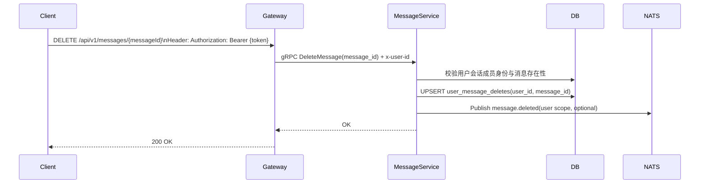

# 消息删除设计

## 1. 概述

消息删除是用户侧消息管理能力，用于将指定消息从自己的视图中隐藏。删除不改变消息发送事实，不等同于撤回。

推荐语义：删除仅影响操作者本人，不影响其他会话成员的可见性。

## 2. 功能范围

- [x] 删除单条消息（仅自己不可见）
- [x] 删除后查询、搜索对操作者隐藏
- [x] 跨端同步操作者自己的删除状态

## 3. 核心规则

### 3.1 删除语义

- 删除仅影响当前用户视图
- 其他会话成员仍可见该消息
- 删除后消息不再出现在操作者的历史列表和搜索结果中

### 3.2 权限规则

- 仅会话成员可删除消息
- 可删除自己发送或他人发送的消息（仅删除自己的可见性）
- 已删除消息重复删除应幂等成功

### 3.3 状态规则

- 删除不修改 `messages.sequence`
- 删除不影响其他用户未读计数
- 删除不触发“对全体成员”的状态广播

## 4. 数据模型

为支持“仅自己删除”，建议使用独立删除标记表：

```sql
CREATE TABLE IF NOT EXISTS user_message_deletes (
    id BIGSERIAL PRIMARY KEY,
    user_id VARCHAR(36) NOT NULL,
    conversation_id VARCHAR(64) NOT NULL,
    message_id VARCHAR(64) NOT NULL,
    deleted_at TIMESTAMPTZ NOT NULL DEFAULT CURRENT_TIMESTAMP,
    CONSTRAINT uk_user_message_delete UNIQUE (user_id, message_id)
);

CREATE INDEX idx_user_message_deletes_conv ON user_message_deletes(user_id, conversation_id, deleted_at DESC);
```

说明：

- 删除标记与消息主表解耦，避免把“仅自己删除”错误落到全局消息状态
- 可按 `user_id + conversation_id` 高效过滤查询结果

## 5. API 设计

### 5.1 HTTP

- `DELETE /api/v1/messages/{messageId}`

### 5.2 gRPC

```protobuf
message DeleteMessageRequest {
  string message_id = 1;
}
```

说明：操作用户通过调用链路 `x-user-id` 元数据透传。

## 6. 查询与搜索行为

- `GetMessages`：返回消息时排除当前用户已删除消息
- `GetMessageById`：若当前用户已删除该消息，返回 not found
- `SearchMessages`：排除当前用户已删除消息
- `GetUnreadCount`：删除不影响他人未读；当前用户未读可按产品策略选择是否扣减

## 7. 业务流程

### 7.1 删除消息



## 8. 同步与通知

### 8.1 同步

- 删除状态需同步到用户其他设备
- 同步粒度为用户维度，不对会话其他成员广播

### 8.2 通知

建议新增用户作用域通知：`message.deleted`

示例 payload：

```json
{
  "message_id": "msg_xxx",
  "conversation_id": "conv_xxx",
  "operator_user_id": "u1",
  "deleted_at": 1775700000
}
```

## 9. 测试计划

### 9.1 集成测试

- A 删除一条消息后，A 本端和 A 其他设备不可见
- B 端仍可见同一消息
- A 删除后重新拉取历史，消息仍被过滤

## 10. 实施顺序

1. 落库 `user_message_deletes` 与索引
2. 改造删除接口为用户维度标记
3. 改造历史、详情、搜索查询过滤逻辑
4. 接入用户维度同步通知
