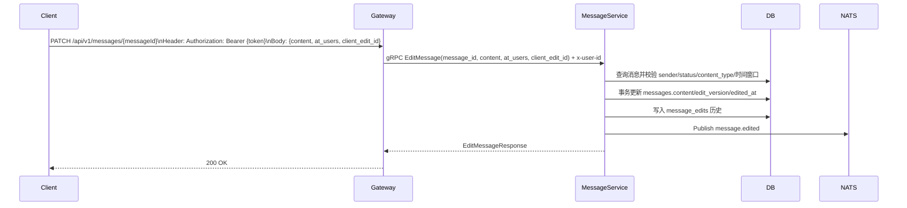

# 消息编辑设计

## 1. 概述

消息编辑指在不改变消息身份的前提下更新已发送消息内容，保留原 `message_id` 与 `sequence`，并向会话参与者广播“消息已编辑”结果。

本能力与“撤回后重新编辑”不同：

- 消息编辑：更新同一条消息
- 撤回后重新编辑：发送一条新消息（见 `docs/design/message/recall.md`）

## 2. 功能范围

- [x] 发送者编辑自己已发送消息
- [x] 仅更新原消息内容，不变更消息 ID 与序列号
- [x] 提供 `edited_at`、`edit_version` 元信息
- [x] 保留编辑历史用于审计与幂等
- [x] 通过实时通知同步在线端

不在本设计范围：

- [ ] 撤回/删除能力（见 `recall.md`、`delete.md`）
- [ ] 非文本消息编辑（图片/视频/文件等）
- [ ] 历史版本对客户端开放查询接口

## 3. 与现有实现的关系

当前代码基线（2026-04）对设计有以下约束：

1. `MessageService` 仅定义发送/查询/撤回/删除/已读/搜索/输入态，无 `EditMessage` 接口；
2. `api/proto/message/message.proto` 未定义编辑 RPC 与编辑字段；
3. `Message` 模型无 `edit_version` / `edited_at` 字段；
4. 通知类型中无 `message.edited`；
5. 查询层按 `status=normal` 读取消息，编辑能力应沿用“仅正常消息可编辑”约束；
6. 消息同步主要基于 `sequence`，编辑不生成新 `sequence`，需通过通知+重拉窗口保证一致性。

本设计在上述约束下增量扩展，不改变现有发送、撤回、删除链路语义。

## 4. 核心规则

### 4.1 可编辑条件

- 仅发送者本人可编辑
- 仅 `status=normal` 消息可编辑
- 仅 `content_type=text` 可编辑
- 已撤回、已删除、已过期、已自动清理消息不可编辑
- 默认编辑窗口：消息发送后 15 分钟（可配置）

### 4.2 编辑行为规则

- 编辑不改变 `message_id`、`conversation_id`、`sequence`
- 允许更新字段：`content`、`at_users`
- 不允许更新字段：`sender_id`、`reply_to`、`content_type`
- 若编辑前后内容与 `at_users` 完全一致，按 no-op 成功返回，不写编辑历史
- 每次成功编辑 `edit_version + 1`

### 4.3 展示规则

- 消息位置不变
- `edit_version > 0` 或 `edited_at != nil` 时显示“已编辑”标记
- 引用该消息时默认展示最新版本内容
- 若消息后续被撤回，则按撤回状态展示（撤回优先）

## 5. 与其它功能关系

### 5.1 与发送

- 编辑不走 `SendMessage`，不分配新 `sequence`
- 发送幂等 `local_id` 与编辑幂等分离，编辑使用 `client_edit_id`

### 5.2 与撤回

- 已撤回消息不可编辑
- 已编辑消息可在撤回规则内被撤回
- 同一消息并发编辑与撤回时，最终以状态机校验结果为准（建议事务内状态检查）

### 5.3 与删除

- 当前代码中的 `DeleteMessage` 会将消息置为 `status=deleted`，此状态不可编辑
- 若后续落地“仅自己删除”（`delete.md`），仍应保持：对操作者不可见消息不可编辑

### 5.4 与已读/未读

- 编辑不推进或回退已读游标
- 编辑不改变未读数统计
- 已读回执通知链路不因编辑触发

### 5.5 与搜索

- 搜索基于 `messages.content` 最新值
- 编辑后搜索命中新内容
- 历史版本不进入搜索结果

### 5.6 与自动删除/阅后即焚

- 编辑不改变 `expire_time`、`burn_after_reading_seconds`、`auto_delete_expire_time`
- 过期/已焚消息不可编辑

### 5.7 与群 @ 通知

- 编辑后若新增 `at_users`，仅对新增集合补发 `message.mentioned`
- 已存在的 @ 不重复通知

### 5.8 与同步

- 在线端依赖 `message.edited` 实时更新
- 离线端在重进会话时重拉可见窗口，获取最新内容
- 若后续需要严格离线增量编辑回放，可追加“消息变更游标”机制

## 6. 数据模型

### 6.1 migration 策略

按你的要求，迁移脚本采用“直接修改原始消息建表脚本”方式，不新增单独 `ALTER` 脚本：

- 修改 `migrations/000005_create_message_tables.up.sql`
- 同步修改 `migrations/000005_create_message_tables.down.sql`

### 6.2 messages 表字段（写入 000005 up 脚本）

在 `CREATE TABLE messages` 中直接补充：

```sql
edit_version INT NOT NULL DEFAULT 0,         -- 编辑版本号
edited_at TIMESTAMPTZ,                       -- 最后编辑时间
last_editor_id VARCHAR(36),                  -- 最后编辑操作者
```

字段说明：

- `edit_version`：编辑版本号，初始 0
- `edited_at`：最后编辑时间
- `last_editor_id`：最后编辑操作者 ID

### 6.3 编辑历史表（写入 000005 up 脚本）

```sql
CREATE TABLE IF NOT EXISTS message_edits (
    id BIGSERIAL PRIMARY KEY,
    message_id VARCHAR(64) NOT NULL,
    version INT NOT NULL,
    editor_user_id VARCHAR(36) NOT NULL,
    before_content JSONB NOT NULL,
    after_content JSONB NOT NULL,
    before_at_users TEXT[],
    after_at_users TEXT[],
    client_edit_id VARCHAR(64),
    edited_at TIMESTAMPTZ NOT NULL DEFAULT CURRENT_TIMESTAMP,
    CONSTRAINT uk_message_edit_version UNIQUE (message_id, version),
    CONSTRAINT uk_message_edit_client UNIQUE (message_id, editor_user_id, client_edit_id)
);

CREATE INDEX idx_message_edits_message_id ON message_edits(message_id, version DESC);
CREATE INDEX idx_message_edits_edited_at ON message_edits(edited_at DESC);
```

在 `000005_create_message_tables.down.sql` 中补充：

```sql
DROP TABLE IF EXISTS message_edits;
```

## 7. API 设计

### 7.1 HTTP

- `PATCH /api/v1/messages/{messageId}`

请求体：

```json
{
  "content": "{\"text\":\"hello codex\"}",
  "at_users": ["u2", "u3"],
  "client_edit_id": "edit-001"
}
```

响应体（data）：

```json
{
  "message": {
    "message_id": "msg_xxx",
    "conversation_id": "conv_xxx",
    "content_type": "text",
    "content": "{\"text\":\"hello codex\"}",
    "sequence": 1024,
    "status": 0,
    "edit_version": 1,
    "edited_at": "2026-04-09T10:30:00Z"
  }
}
```

### 7.2 gRPC

```protobuf
rpc EditMessage(EditMessageRequest) returns (EditMessageResponse);

message EditMessageRequest {
  string message_id = 1;      // 操作用户由 x-user-id 元数据透传
  string content = 2;         // JSON string
  repeated string at_users = 3;
  optional string client_edit_id = 4;
}

message EditMessageResponse {
  Message message = 1;
}
```

### 7.3 Message 字段扩展

```protobuf
message Message {
  string message_id = 1;
  string conversation_id = 2;
  string conversation_type = 3;
  string sender_id = 4;
  string content_type = 5;
  string content = 6;
  int64 sequence = 7;
  optional string reply_to = 8;
  repeated string at_users = 9;
  int32 status = 10;
  google.protobuf.Timestamp created_at = 11;
  google.protobuf.Timestamp updated_at = 12;
  google.protobuf.Timestamp expire_time = 13;
  optional string target_id = 14;

  optional google.protobuf.Timestamp edited_at = 15;
  int32 edit_version = 16;
}
```

## 8. 通知设计

### 8.1 新增通知类型

- 类型：`message.edited`
- 单聊：`notification.message.edited.{user_id}`
- 群聊：按成员集合广播

建议在 `pkg/notification/types.go` 新增：

```go
TypeMessageEdited = "message.edited"
```

### 8.2 通知载荷

```json
{
  "message_id": "msg_xxx",
  "conversation_id": "conv_xxx",
  "conversation_type": "group",
  "target_id": "group_xxx",
  "editor_user_id": "u1",
  "content_type": "text",
  "content": "{\"text\":\"hello codex\"}",
  "at_users": ["u2", "u3"],
  "edit_version": 1,
  "edited_at": 1775701800
}
```

## 9. 业务流程

### 9.1 编辑消息



## 10. 代码落地映射

建议按以下文件落地：

- `api/proto/message/message.proto`
  - 新增 `EditMessage` RPC
  - 扩展 `Message` 编辑字段
- `internal/message/model/message.go`
  - 新增编辑字段
- `internal/message/repository/message_repository.go`
  - 新增编辑更新与历史写入接口
- `internal/message/service/message_service.go`
  - 新增 `EditMessage` 业务实现
- `internal/message/grpc/server.go`
  - 新增 `EditMessage` gRPC handler
- `internal/gateway/handler/message_handler.go`
  - 新增 `PATCH /messages/:messageId` 处理器
- `internal/gateway/handler/routes.go`
  - 注册 PATCH 路由
- `pkg/notification/types.go`
  - 新增 `TypeMessageEdited`
- `migrations/000005_create_message_tables.up.sql`
  - 直接补充 `messages` 编辑字段与 `message_edits` 表
- `migrations/000005_create_message_tables.down.sql`
  - 增加 `DROP TABLE IF EXISTS message_edits`

## 11. 错误码建议

新增业务错误码：

- `CodeMessageEditFailed`
- `CodeMessageEditTimeLimit`
- `CodeMessageEditPermissionDenied`
- `CodeMessageEditNotAllowed`（状态/类型不允许）
- `CodeMessageEditIdempotentConflict`（幂等冲突）

## 12. 测试计划

### 12.1 单元测试

- 非本人编辑、超出窗口、编辑非文本/非正常状态消息
- no-op 编辑行为
- 幂等：重复 `client_edit_id` 返回同结果
- `edit_version` 自增与历史写入一致性
- 新增 @ 用户仅增量触发 mention 通知

### 12.2 集成测试

- A 编辑后，B 在线收到 `message.edited` 并更新气泡
- 群聊编辑广播给全成员
- A 离线后重进会话，拉取到最新编辑内容
- 撤回后编辑应被拒绝

### 12.3 回归测试

- 发送、撤回、删除、搜索、已读链路无回归
- 自动删除/阅后即焚策略不被编辑修改

## 13. 实施顺序

1. 协议与数据结构：proto、model、migration
2. 服务端主链路：repository + service + grpc
3. 网关入口：handler + route
4. 通知与联动：`message.edited` 与 `message.mentioned` 增量
5. 测试与灰度：先服务端后客户端
