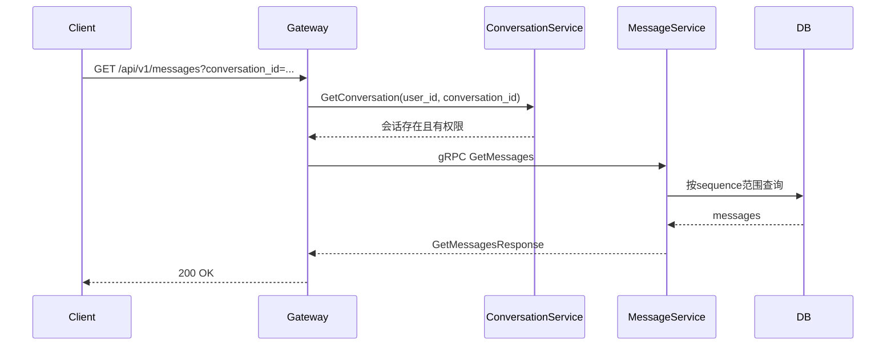

# HTTP 消息查询设计

## 1. 目标

对 MessageService 查询类能力提供标准 HTTP 接口：

- 拉取历史消息；
- 查询消息详情；
- 获取会话消息序列号（最新游标）。

## 2. 路由设计

### 2.1 历史消息

- `GET /api/v1/messages?conversation_id=...&start_seq=...&end_seq=...&limit=...&reverse=...`
- gRPC: `MessageService.GetMessages`

### 2.2 消息详情

- `GET /api/v1/messages/:messageId`
- gRPC: `MessageService.GetMessageById`

### 2.3 会话消息序列号（推荐新路径）

- `GET /api/v1/conversations/:conversationId/messages/sequence`
- gRPC: `MessageService.GetConversationSequence`

## 3. 时序（历史消息）

## 4. 安全约束

- 所有接口都在 JWT 鉴权组下。
- 读取类接口在 Gateway 先校验会话归属，避免通过 message_id 越权读取其他会话消息。
