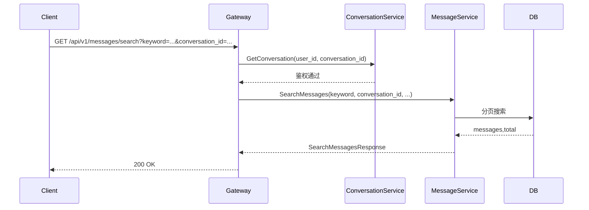

# HTTP 消息搜索设计

## 1. 路由设计

- `GET /api/v1/messages/search?keyword=...&conversation_id=...&content_type=...&limit=...&offset=...`
- gRPC: `MessageService.SearchMessages`

## 2. 参数约束

- `keyword` 必填；
- `conversation_id` 必填（当前实现仅支持会话内搜索）；
- `content_type` 选填（text/image/file 等）；
- `limit` 默认 20，最大 100；
- `offset` 默认 0。

## 3. 时序

## 4. 说明

- 该接口用于“历史消息检索”，不替代实时同步链路。
- 返回结果按存储层排序规则输出，客户端可按 `sequence` 做二次排序展示。
