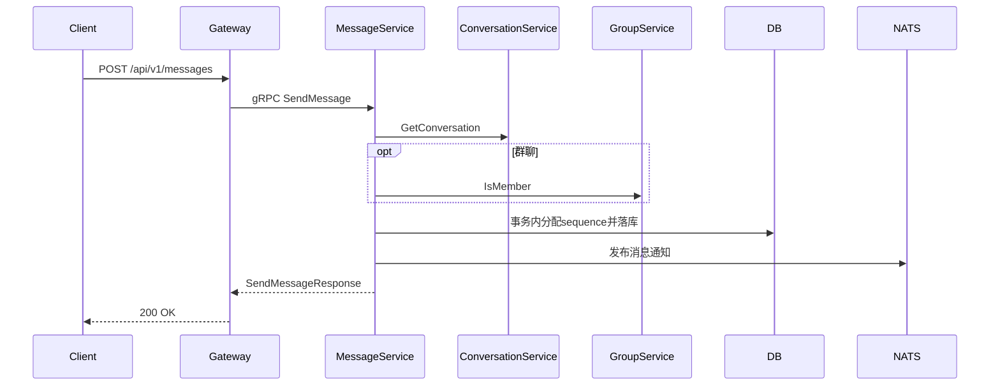

# HTTP 发送消息设计

## 1. 目标

在保留 WebSocket `message.send` 的前提下，提供 HTTP 发送消息能力，满足：

- 客户端不维护长连接时的发送兜底；
- 服务端回调/机器人等后端系统通过 HTTP 发消息；
- 弱网环境下客户端可退化到请求-响应模式。

## 2. 路由设计

- `POST /api/v1/messages`

请求体：

```json
{
  "conversation_id": "conv_xxx",
  "content_type": "text",
  "content": "{\"text\":\"hello\"}",
  "reply_to": "msg_xxx",
  "at_users": ["u1", "u2"],
  "local_id": "local-001"
}
```

响应体（data）：

```json
{
  "message_id": "msg_xxx",
  "sequence": 1024,
  "timestamp": "2026-04-08T14:23:45Z"
}
```

## 3. 时序



## 4. 约束

- `local_id` 必填，用于 `(sender_id, conversation_id, local_id)` 维度幂等。
- `conversation_type` 与 `target_id` 由服务端从会话推导，不接受客户端直传。
