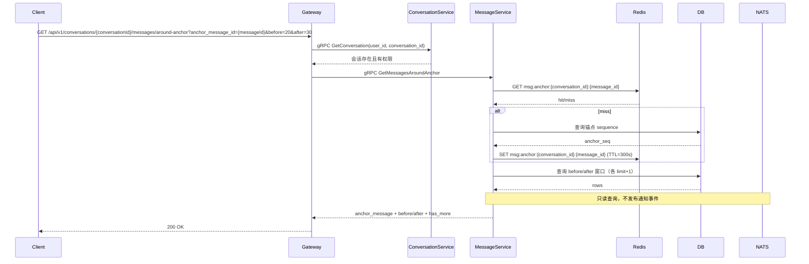

# 消息查询（锚点模式）设计

## 1. 目标

仅提供**基于锚点 `message_id`** 的消息查询能力，覆盖以下场景：

1. 获取某条消息前 `n` 条消息；
2. 获取某条消息后 `m` 条消息；
3. 获取某条消息前 `n` 条和后 `m` 条消息（指定消息跳转）；
4. 获取第一条未读消息。

## 2. 接口策略调整

- 不再提供基于 `start_seq/end_seq` 的查询接口；
- 不再对外提供“基于 seq 游标”的历史消息拉取能力；
- 统一采用 `anchor_message_id` 作为窗口定位参数。

## 3. HTTP 路由设计

### 3.1 锚点前 n 条

- `GET /api/v1/conversations/:conversationId/messages/before?anchor_message_id={messageId}&limit={n}`
- gRPC: `MessageService.GetMessagesBefore`

参数：

- `anchor_message_id` 必填；
- `limit` 选填，默认 `20`，最大 `100`。

### 3.2 锚点后 m 条

- `GET /api/v1/conversations/:conversationId/messages/after?anchor_message_id={messageId}&limit={m}`
- gRPC: `MessageService.GetMessagesAfter`

参数同 3.1。

### 3.3 锚点前 n 后 m（主跳转接口）

- `GET /api/v1/conversations/:conversationId/messages/around-anchor?anchor_message_id={messageId}&before={n}&after={m}&include_anchor=true`
- gRPC: `MessageService.GetMessagesAroundAnchor`

参数：

- `anchor_message_id` 必填；
- `before` 选填，默认 `20`，最大 `100`；
- `after` 选填，默认 `20`，最大 `100`；
- `include_anchor` 选填，默认 `true`。

响应（`data`）示例：

```json
{
  "anchor_message": { "message_id": "msg_350", "sequence": 350 },
  "before_messages": [{ "message_id": "msg_330", "sequence": 330 }],
  "after_messages": [{ "message_id": "msg_351", "sequence": 351 }],
  "has_more_before": true,
  "has_more_after": true
}
```

### 3.4 第一条未读锚点

- `GET /api/v1/conversations/:conversationId/messages/first-unread-anchor?with_context=true&before=20&after=20`
- gRPC: `MessageService.GetFirstUnreadAnchor`

参数：

- `with_context` 选填，默认 `false`；
- `before/after` 仅在 `with_context=true` 时生效。

说明：

- `found=true` 时返回 `anchor_message`；
- `found=false` 时表示无未读消息；
- 返回的第一条未读消息可直接作为 3.1/3.2/3.3 的锚点。

### 3.5 消息详情

- `GET /api/v1/messages/:messageId`
- gRPC: `MessageService.GetMessageById`

## 4. gRPC 设计（MessageService）

```protobuf
rpc GetMessagesBefore(GetMessagesBeforeRequest) returns (GetMessagesBeforeResponse);
rpc GetMessagesAfter(GetMessagesAfterRequest) returns (GetMessagesAfterResponse);
rpc GetMessagesAroundAnchor(GetMessagesAroundAnchorRequest) returns (GetMessagesAroundAnchorResponse);
rpc GetFirstUnreadAnchor(GetFirstUnreadAnchorRequest) returns (GetFirstUnreadAnchorResponse);
rpc GetMessageById(GetMessageByIdRequest) returns (Message);
```

## 5. 数据访问策略

1. 先查 `anchor_message_id` 得到锚点 `sequence`；
2. 按 `sequence < anchor_seq` 查 before 窗口；
3. 按 `sequence > anchor_seq` 查 after 窗口；
4. 每个方向查询 `limit+1` 用于计算 `has_more_*`；
5. 第一条未读先查 `last_read_seq`，再查 `sequence > last_read_seq` 的首条消息。

SQL 示例：

```sql
-- 1) 定位锚点
SELECT message_id, sequence
FROM messages
WHERE conversation_id = $1 AND message_id = $2 AND status = 0
LIMIT 1;

-- 2) before
SELECT *
FROM messages
WHERE conversation_id = $1 AND status = 0 AND sequence < $2
ORDER BY sequence DESC
LIMIT $3; -- 实际传 limit + 1

-- 3) after
SELECT *
FROM messages
WHERE conversation_id = $1 AND status = 0 AND sequence > $2
ORDER BY sequence ASC
LIMIT $4; -- 实际传 limit + 1
```

## 6. 时序（锚点前 n 后 m）



## 7. 安全约束

- 所有接口必须走 JWT 鉴权；
- Gateway 先校验会话归属，再转发 MessageService；
- MessageService 再次校验会话可访问性，防止绕过 Gateway 的越权读取；
- 锚点不存在或不在当前会话时返回 `404`。
