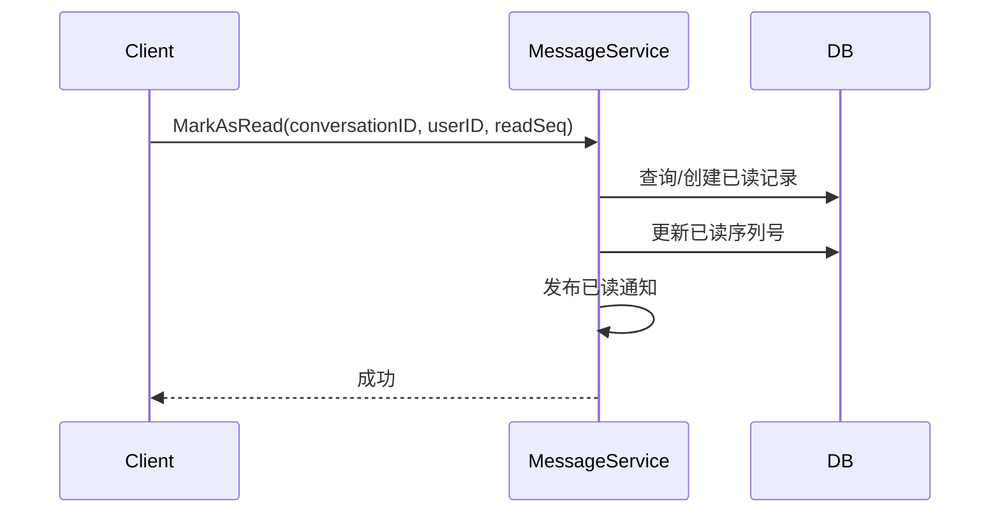
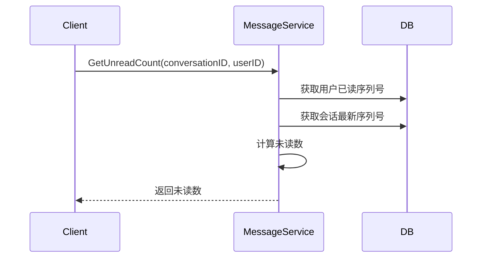

# 已读回执设计

## 1. 概述

已读回执功能用于跟踪消息阅读状态，支持单聊和群聊。

## 2. 功能列表

- [x] 标记消息已读
- [x] 获取未读数
- [x] 获取已读回执列表（群聊）

## 3. 数据模型

### 3.1 ReadReceipt 表

```go
type ReadReceipt struct {
    ID             int64     // 主键
    MessageID      string    // 消息ID
    ConversationID string    // 会话ID
    UserID         string    // 已读用户ID
    ReadSeq        int64     // 已读到的序列号
    CreatedAt      time.Time
}
```

## 4. 业务流程

### 4.1 标记已读



### 4.2 获取未读数



## 5. API设计

### 5.1 标记已读

```protobuf
message MarkAsReadRequest {
    string conversation_id = 1;
    string user_id = 2;
    int64 read_seq = 3;
}
```

### 5.2 获取未读数

```protobuf
message GetUnreadCountRequest {
    string conversation_id = 1;
    string user_id = 2;
    int64 last_read_seq = 3;
}

message GetUnreadCountResponse {
    int64 unread_count = 1;
}
```

## 6. 群聊已读回执

群聊中已读回执需要显示：
- 已读人数
- 已读用户列表

## 7. 通知主题

- `notification.message.read_receipt.{from_user_id}` - 已读回执通知
