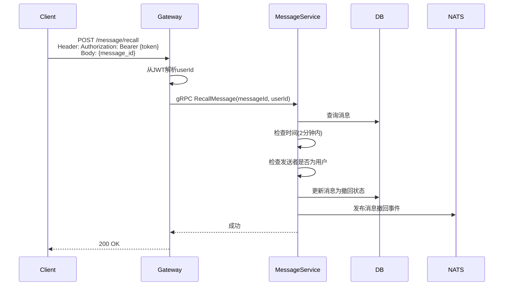
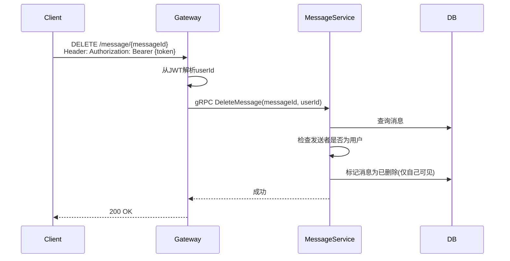

# 消息撤回与删除设计

## 1. 概述

消息撤回与删除功能允许用户撤回或删除消息。

## 2. 功能列表

- [x] 消息撤回（2分钟内）
- [x] 消息删除（仅本地）

## 3. 业务流程

### 3.1 撤回消息



### 3.2 删除消息



## 4. API设计

### 4.1 撤回消息

```protobuf
message RecallMessageRequest {
    string message_id = 1;
    string user_id = 2;
}
```

### 4.2 删除消息

```protobuf
message DeleteMessageRequest {
    string message_id = 1;
    string user_id = 2;
}
```

## 5. 撤回规则

- 发送后2分钟内可撤回
- 撤回后消息显示为"消息已撤回"
- 群聊中任意成员可撤回自己发送的消息
- 单聊中只能撤回自己发送的消息
