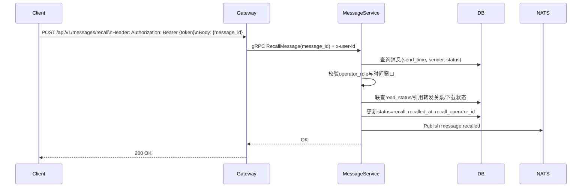
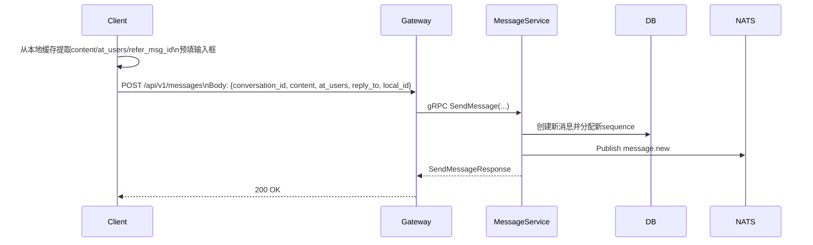

# 消息撤回与撤回后重新编辑设计

## 1. 概述

消息撤回用于在规则允许范围内撤销已发送消息。撤回后，消息在会话中保留原位置，但内容统一替换为撤回提示。

撤回后重新编辑是客户端本地快捷能力：将本地缓存的原消息内容预填输入框，用户修改后按新消息发送。该行为不修改原消息，也不复用原消息 ID。

## 2. 功能范围

- [x] 发送方在时限内撤回自己消息
- [x] 群主/管理员在扩展时限内撤回成员消息
- [x] 支持已读后是否允许撤回的策略开关
- [x] 撤回后引用消息展示“原消息已撤回”
- [x] 撤回后客户端本地重新编辑并发送新消息


## 3. 核心规则

### 3.1 时间窗口规则

- 普通发送者：发送后 2 分钟内可撤回
- 群主/管理员：可撤回任意成员消息，窗口默认 24 小时
- 时间判断基准：`send_time` 与服务端接收撤回请求时的当前时间比较
- 不信任客户端请求时间，防止时间篡改

### 3.2 权限规则

- 单聊：仅发送者可撤回自己的消息
- 群聊：
  - 普通成员仅可撤回自己消息
  - 群主/管理员可撤回任意成员消息
- `operator_role` 由服务端查询群成员角色得到，不接受客户端透传作为最终依据

### 3.3 已读策略

通过配置控制是否允许已读后撤回：

- `allow_recall_after_read = true`：已读不阻塞撤回
- `allow_recall_after_read = false`：已读后拒绝撤回

当策略为禁止已读撤回时，服务端在撤回链路中联查 `read_status`。

### 3.4 不可撤回场景

- 超过对应角色的撤回时限
- 消息状态非正常（已撤回、已删除、已过期、已自动清理）
- 消息已被转发/引用且相关接收方已读
- 多媒体消息处于下载中

### 3.5 撤回后状态

- 原消息状态更新为 `recall/revoked`
- 会话流保留原 `sequence`
- 原 `content` 不再透出，返回撤回占位内容
- UI 统一展示撤回提示
  - 自己撤回：你撤回了一条消息
  - 他人撤回：某某撤回了一条消息
  - 管理员代撤回：管理员撤回了某某的消息

### 3.6 引用消息规则

- `refer_msg_id`/`reply_to` 关系保留
- 被引用消息为撤回状态时，引用区域按状态渲染“原消息已撤回”
- 不展示原引用正文

### 3.7 撤回后重新编辑规则

- 入口仅在当前客户端仍持有本地消息快照时展示
- 预填字段：文本内容、`@` 信息、引用关系
- 用户确认后按新消息发送
- 新消息生成新的 `message_id` 与 `sequence`
- 新旧消息无关联 ID

## 4. API 设计

### 4.1 HTTP

- `POST /api/v1/messages/recall`

请求体：

```json
{
  "message_id": "msg_xxx"
}
```

### 4.2 gRPC

```protobuf
message RecallMessageRequest {
  string message_id = 1;
}
```

说明：操作用户通过调用链路 `x-user-id` 元数据透传。

### 4.3 配置项

```yaml
message:
  recall:
    sender_window_seconds: 120
    admin_window_seconds: 86400
    allow_recall_after_read: false
```

## 5. 数据模型

建议在 `messages` 表补充：

```sql
ALTER TABLE messages
    ADD COLUMN recalled_at TIMESTAMPTZ NULL,
    ADD COLUMN recall_operator_id VARCHAR(36) NULL;
```

字段说明：

- `recalled_at`：撤回时间
- `recall_operator_id`：撤回操作者 ID（管理员代撤回时与 `sender_id` 不同）

## 6. 业务流程

### 6.1 撤回消息



### 6.2 撤回后重新编辑并发送新消息



## 7. 通知与离线同步

### 7.1 撤回通知

通知类型：`message.recalled`

推荐 payload：

```json
{
  "message_id": "msg_xxx",
  "conversation_id": "conv_xxx",
  "conversation_type": "group",
  "target_id": "group_xxx",
  "operator_user_id": "u_admin",
  "sender_user_id": "u_member",
  "recalled_at": 1775700000,
  "status": "recall"
}
```

### 7.2 在线处理

- 收到撤回通知后立即替换会话气泡
- 若当前展示引用预览，同步刷新为“原消息已撤回”
- 若本地有快照，可展示“重新编辑”入口

### 7.3 离线处理

- 消息已进入推送/离线队列时，仍需下发撤回事件
- 客户端重连同步时，按 `message_id` 应用撤回状态覆盖原展示

## 8. 测试计划

### 8.1 集成测试

- 发送后 2 分钟内撤回成功，双方在线展示正确
- 已读且策略禁止时撤回失败
- 管理员 24 小时内撤回成员消息成功
- 对方离线后收到撤回状态并覆盖原消息
- 撤回后本地重新编辑发送新消息成功

## 9. 实施顺序

1. 完成撤回状态查询语义：历史列表占位、详情脱敏、引用降级
2. 完成权限与策略：`operator_role`、时间窗口、已读策略开关
3. 完成复杂约束：引用/转发已读判定、多媒体下载态判定
4. 完成客户端本地重新编辑交互
