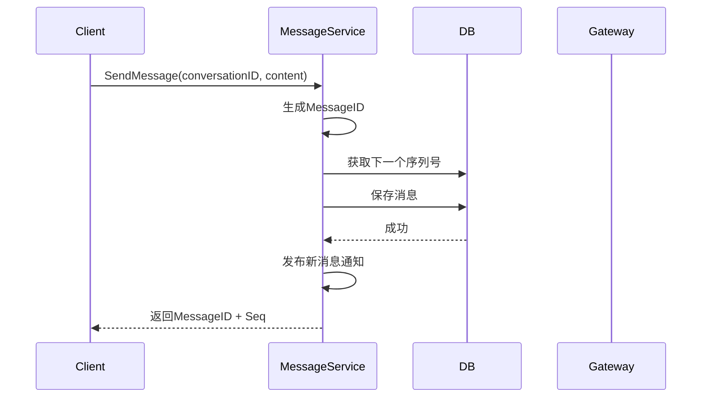

# 消息发送与接收设计

## 1. 概述

消息服务负责消息的发送、存储、序列号管理，支持单聊和群聊。

## 2. 功能列表

- [x] 发送消息（单聊/群聊）
- [x] 获取消息历史
- [x] 消息序列号生成

## 3. 数据模型

### 3.1 Message 表

```go
type Message struct {
    ID             string    // 消息ID (UUID)
    MessageSeq     int64     // 消息序列号
    ConversationID string    // 会话ID
    SenderID       string    // 发送者ID
    SenderName     string    // 发送者昵称
    MessageType    int       // 消息类型
    Content        string    // 消息内容 (JSON)
    Body           string    // 消息摘要
    CreatedAt      time.Time
    UpdatedAt      time.Time
}
```

### 3.2 消息类型

```go
const (
    MsgTypeText     = 1  // 文本
    MsgTypeImage    = 2  // 图片
    MsgTypeVideo    = 3  // 视频
    MsgTypeVoice    = 4  // 语音
    MsgTypeFile     = 5  // 文件
    MsgTypeLocation = 6  // 位置
    MsgTypeCard     = 7  // 名片
    MsgTypeRecall   = 8  // 撤回
    MsgTypeSystem   = 9  // 系统消息
)
```

## 4. 业务流程

### 4.1 发送消息



## 5. API设计

### 5.1 发送消息

```protobuf
message SendMessageRequest {
    string conversation_id = 1;
    string sender_id = 2;
    int32 message_type = 3;
    string content = 4;  // JSON格式
}

message SendMessageResponse {
    string message_id = 1;
    int64 message_seq = 2;
    int64 created_at = 3;
}
```

### 5.2 获取消息

```protobuf
message GetMessagesRequest {
    string conversation_id = 1;
    int64 start_seq = 2;
    int32 limit = 3;
}

message GetMessagesResponse {
    repeated Message messages = 1;
    bool has_more = 2;
}
```

## 6. 通知主题

- `notification.message.new.{to_user_id}` - 新消息通知
