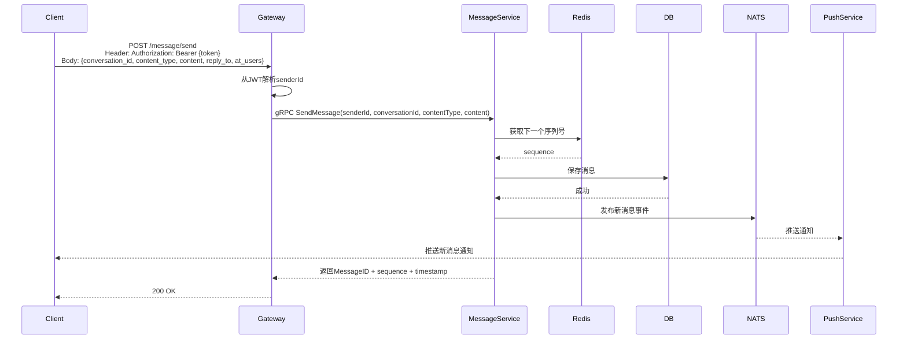
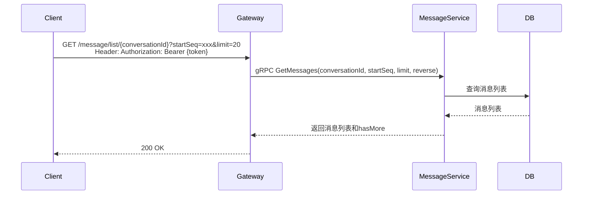

# 消息发送与接收设计

## 1. 概述

消息服务负责消息的发送、存储、序列号管理，支持单聊和群聊。

## 2. 功能列表

- [x] 发送消息（单聊/群聊）
- [x] 获取消息历史
- [x] 消息序列号生成

## 3. 数据模型

### 3.1 Message 表

```go
type Message struct {
    ID             string    // 消息ID (UUID)
    MessageSeq     int64     // 消息序列号
    ConversationID string    // 会话ID
    SenderID       string    // 发送者ID
    SenderName     string    // 发送者昵称
    MessageType    int       // 消息类型
    Content        string    // 消息内容 (JSON)
    Body           string    // 消息摘要
    CreatedAt      time.Time
    UpdatedAt      time.Time
}
```

### 3.2 消息类型

```go
const (
    MsgTypeText     = 1  // 文本
    MsgTypeImage    = 2  // 图片
    MsgTypeVideo    = 3  // 视频
    MsgTypeVoice    = 4  // 语音
    MsgTypeFile     = 5  // 文件
    MsgTypeLocation = 6  // 位置
    MsgTypeCard     = 7  // 名片
    MsgTypeRecall   = 8  // 撤回
    MsgTypeSystem   = 9  // 系统消息
)
```

## 4. 业务流程

### 4.1 发送消息



### 4.2 获取消息历史



## 5. API设计

### 5.1 发送消息

```protobuf
message SendMessageRequest {
    string sender_id = 1;
    string conversation_id = 2;
    string conversation_type = 3;  // single/group
    string content_type = 4;        // text/image/video/audio/file/location/card
    string content = 5;            // JSON string
    optional string reply_to = 6;   // 回复的消息ID
    repeated string at_users = 7;   // @用户列表
    optional string local_id = 8;   // 客户端本地ID（用于关联）
}

message SendMessageResponse {
    string message_id = 1;
    int64 sequence = 2;
    google.protobuf.Timestamp timestamp = 3;
}
```

### 5.2 获取消息

```protobuf
message GetMessagesRequest {
    string conversation_id = 1;
    optional int64 start_seq = 2;   // 起始序列号
    optional int64 end_seq = 3;     // 结束序列号
    int32 limit = 4;                // 数量限制
    bool reverse = 5;              // 是否倒序（从新到旧）
}

message GetMessagesResponse {
    repeated Message messages = 1;
    int64 total = 2;
    bool has_more = 3;
}
```

### 5.3 Message 消息结构

```protobuf
message Message {
    string message_id = 1;
    string conversation_id = 2;
    string conversation_type = 3;   // single/group
    string sender_id = 4;
    string content_type = 5;        // text/image/video/audio/file/location/card
    string content = 6;              // JSON string
    int64 sequence = 7;
    optional string reply_to = 8;
    repeated string at_users = 9;
    int32 status = 10;              // 0-正常 1-撤回 2-删除
    google.protobuf.Timestamp created_at = 11;
    google.protobuf.Timestamp updated_at = 12;
    optional common.UserInfo sender_info = 20;
    optional Message reply_to_message = 21;
}
```

## 6. 消息内容类型

| 类型 | content_type | 说明 |
|------|--------------|------|
| 文本 | text | 普通文本消息 |
| 图片 | image | 图片消息 |
| 视频 | video | 视频消息 |
| 语音 | audio | 语音消息 |
| 文件 | file | 文件消息 |
| 位置 | location | 位置消息 |
| 名片 | card | 名片消息 |
| 撤回 | recall | 撤回消息 |
| 系统 | system | 系统消息 |

## 7. 通知主题

- `notification.message.new.{to_user_id}` - 新消息通知
- `message.event.{conversation_id}` - 消息事件（NATS主题）
