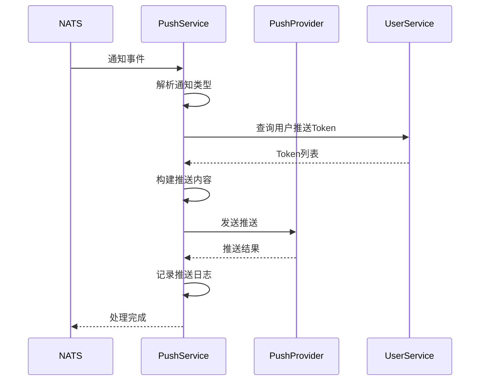

# 离线推送设计

## 1. 概述

推送服务负责离线消息推送，支持多平台推送通道。

## 2. 功能列表

- [x] 消息推送
- [x] 推送日志记录
- [x] NATS 事件监听

## 3. 推送平台

| 平台 | 说明 |
|------|------|
| APNs | Apple 推送 |
| FCM | Firebase Cloud Messaging |
| 极光 | 国产Android推送 |
| 华为 | 华为推送 |
| 小米 | 小米推送 |

## 4. 业务流程



## 5. API设计

### 5.1 发送推送

```protobuf
message SendPushRequest {
    repeated string user_ids = 1;
    string title = 2;
    string content = 3;
    string push_type = 4;
    map<string, string> extras = 5;
}

message SendPushResponse {
    int32 success_count = 1;
    int32 failure_count = 2;
    string msg_id = 3;
}
```

## 6. 推送类型

| 类型 | 标题 |
|------|------|
| message_new | 新消息 |
| message_mentioned | 有人@了你 |
| friend_request | 好友申请 |
| group_invited | 群组邀请 |
| livekit_call_invite | 来电 |

## 7. 数据模型

### 7.1 PushLog 表

```go
type PushLog struct {
    ID          string    // 推送日志ID
    MsgID       string    // 消息ID
    UserID      string    // 用户ID
    Title       string    // 推送标题
    Content     string    // 推送内容
    PushType    string    // 推送类型
    Platform    string    // 推送平台
    Status      int       // 状态: 0-待发送 1-成功 2-失败
    ErrorMsg    string    // 错误信息
    CreatedAt   time.Time
}
```

## 8. 依赖服务

- **UserService**: 推送Token查询
- **NATS**: 通知事件订阅
- **APNs/FCM/极光**: 推送通道
