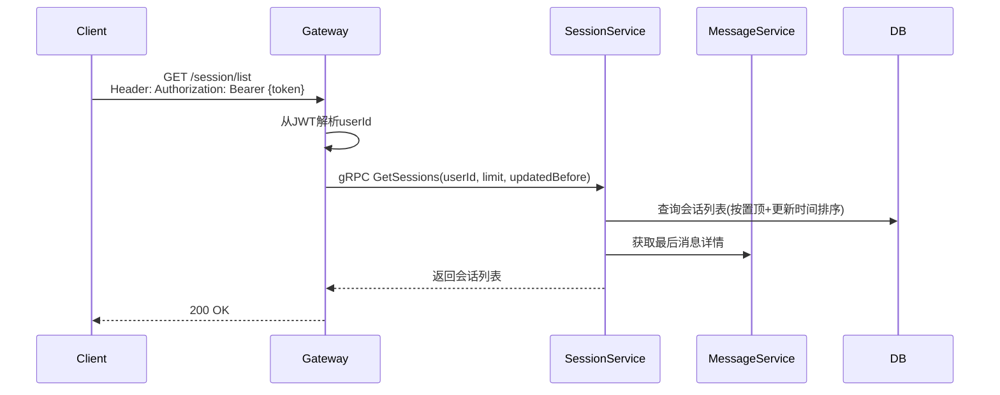
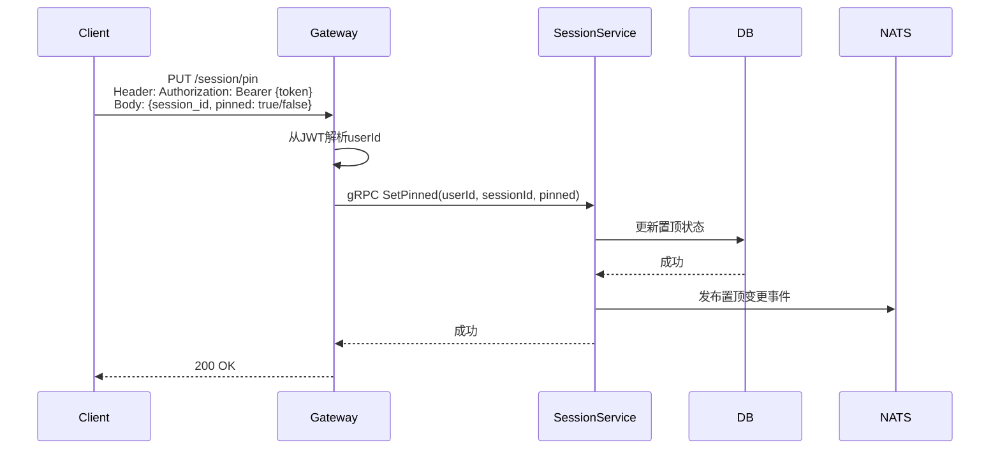
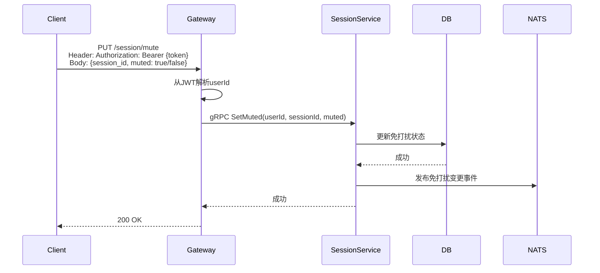
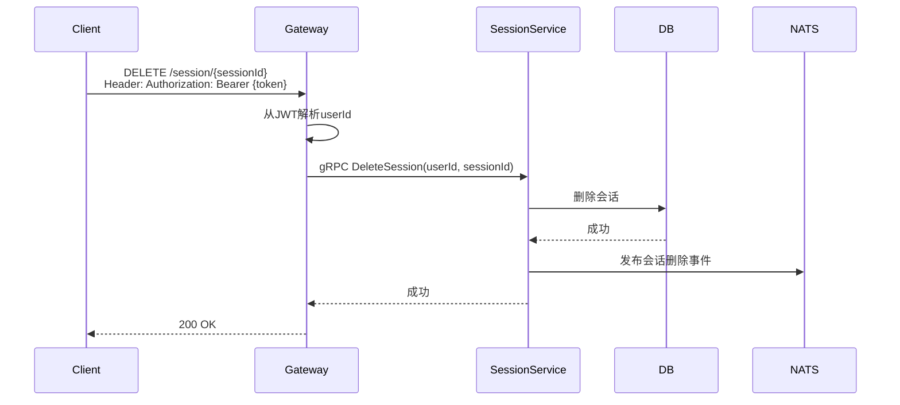

# 会话管理设计

## 1. 概述

会话管理提供会话列表、置顶、免打扰、未读数等核心功能。

## 2. 功能列表

- [x] 获取会话列表
- [x] 创建/更新会话
- [x] 删除会话
- [x] 会话置顶
- [x] 会话免打扰
- [x] 未读数管理

## 3. 数据模型

### 3.1 Session 表

```go
type Session struct {
    ID             string    // 会话ID
    UserID         string    // 用户ID
    ConversationID string    // 会话ID（关联MessageService）
    ConversationType int    // 会话类型: 1-单聊 2-群聊
    LastMessageID  string    // 最后一条消息ID
    LastMessageSeq int64    // 最后消息序列号
    LastMessageContent string // 最后消息摘要
    UnreadCount    int32     // 未读数
    IsPinned       bool      // 是否置顶
    IsMuted        bool      // 是否免打扰
    CreatedAt      time.Time
    UpdatedAt      time.Time
}
```

## 4. 业务流程

### 4.1 获取会话列表



### 4.2 会话置顶



### 4.3 会话免打扰



### 4.4 删除会话



## 5. API设计

### 5.1 获取会话列表

```protobuf
message GetSessionsRequest {
    string user_id = 1;
    int32 limit = 2;
    int64 updated_before = 3;
}

message GetSessionsResponse {
    repeated Session sessions = 1;
}
```

### 5.2 置顶/免打扰

```protobuf
message SetPinnedRequest {
    string user_id = 1;
    string session_id = 2;
    bool pinned = 3;
}

message SetMutedRequest {
    string user_id = 1;
    string session_id = 2;
    bool muted = 3;
}
```

## 6. 通知主题

- `notification.session.pin_updated.{user_id}` - 置顶状态变更
- `notification.session.mute_updated.{user_id}` - 免打扰状态变更
- `notification.session.deleted.{user_id}` - 会话删除
- `notification.session.unread_updated.{user_id}` - 未读数变更
