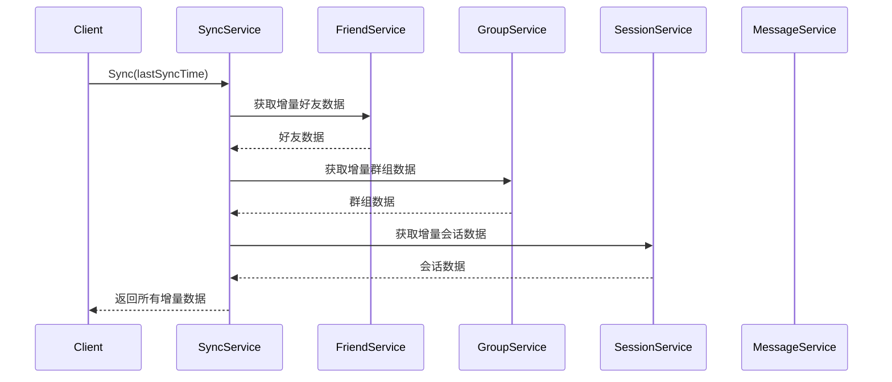

# 数据同步设计

## 1. 概述

数据同步服务负责跨端数据同步，支持增量同步和全量同步。

## 2. 功能列表

- [x] 全量同步
- [x] 增量同步
- [x] 消息同步

## 3. 同步范围

| 数据类型 | 同步内容 |
|----------|----------|
| 会话 | 会话列表、置顶、免打扰 |
| 消息 | 消息历史、未读状态 |
| 好友 | 好友列表、黑名单 |
| 群组 | 群组列表、成员 |
| 用户 | 用户资料 |

## 4. 业务流程



## 5. API设计

### 5.1 全量同步

```protobuf
message SyncRequest {
    string user_id = 1;
    int64 last_sync_time = 2;
}

message SyncResponse {
    repeated FriendInfo friends = 1;
    repeated GroupInfo groups = 2;
    repeated Session sessions = 3;
    int64 sync_time = 4;
}
```

### 5.2 消息同步

```protobuf
message SyncMessagesRequest {
    string user_id = 1;
    string conversation_id = 2;
    int64 start_seq = 3;
    int32 limit = 4;
}

message SyncMessagesResponse {
    repeated Message messages = 1;
    bool has_more = 2;
}
```
