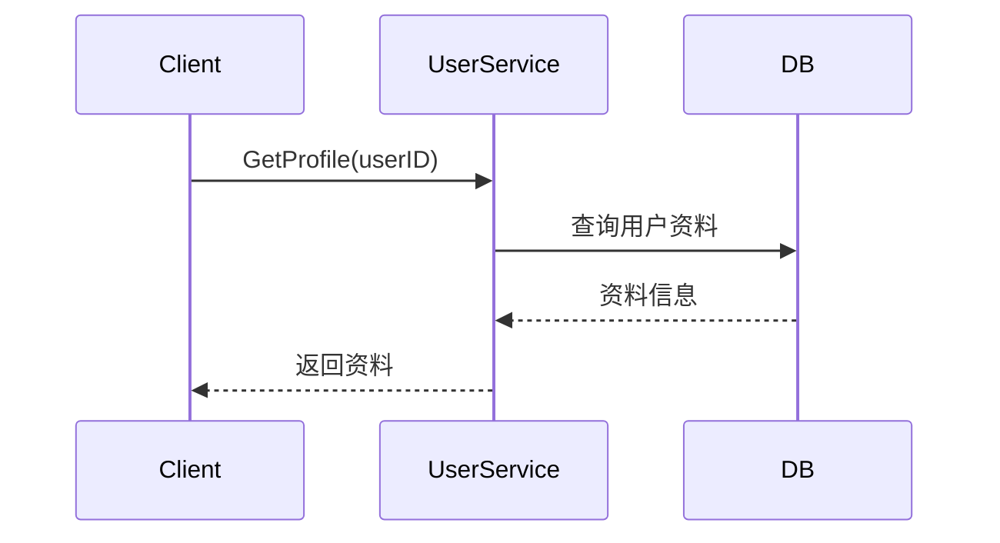
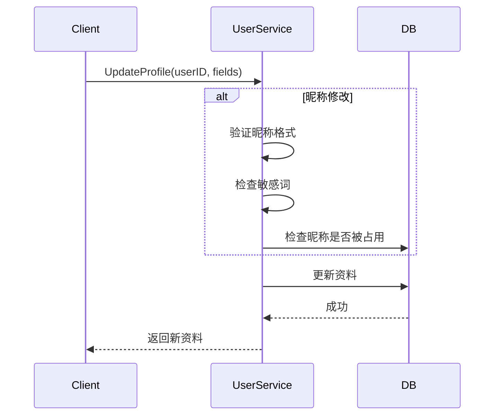

# 用户资料管理设计

## 1. 概述

用户资料管理提供个人资料获取、修改、查看其他用户资料、用户搜索等功能。

## 2. 功能列表

- [x] 获取个人资料
- [x] 修改个人资料（昵称、头像、签名、性别、地区、生日）
- [x] 查看其他用户资料
- [x] 用户搜索（昵称、账号）

## 3. 数据模型

### 3.1 UserProfile 表

```go
type UserProfile struct {
    UserID    string    // 用户ID
    Nickname  string    // 昵称
    Avatar    string    // 头像URL
    Signature string    // 个性签名
    Gender    int       // 性别: 0-未知 1-男 2-女
    Birthday  *time.Time// 生日
    Region    string    // 地区
    QRCodeURL string    // 二维码URL
    CreatedAt time.Time
    UpdatedAt time.Time
}
```

### 3.2 性别枚举

```go
const (
    GenderUnknown = 0  // 未知
    GenderMale   = 1  // 男
    GenderFemale = 2  // 女
)
```

## 4. 业务流程

### 4.1 获取个人资料



### 4.2 修改个人资料



## 5. API设计

### 5.1 获取个人资料

```protobuf
message GetProfileRequest {
    string user_id = 1;
}

message UserProfileResponse {
    string user_id = 1;
    string nickname = 2;
    string avatar = 3;
    string signature = 4;
    int32 gender = 5;
    string birthday = 6;
    string region = 7;
    string qr_code_url = 8;
    string created_at = 9;
}
```

### 5.2 修改个人资料

```protobuf
message UpdateProfileRequest {
    string nickname = 1;
    string avatar = 2;
    string signature = 3;
    int32 gender = 4;
    string birthday = 5;
    string region = 6;
}
```

### 5.3 搜索用户

```protobuf
message SearchUsersRequest {
    string keyword = 1;
    int32 page = 2;
    int32 page_size = 3;
}

message SearchUsersResponse {
    repeated UserBriefInfo users = 1;
    int32 total = 2;
}
```

## 6. 验证规则

| 字段 | 规则 |
|------|------|
| 昵称 | 2-20位中英文数字下划线 |
| 头像 | URL格式 |
| 签名 | 最大200字符 |
| 性别 | 0/1/2 |
| 地区 | 最大50字符 |

## 7. 安全考虑

1. **敏感词过滤**: 昵称需过滤敏感词
2. **唯一性检查**: 昵称不能重复
3. **隐私保护**: 可配置查看权限
