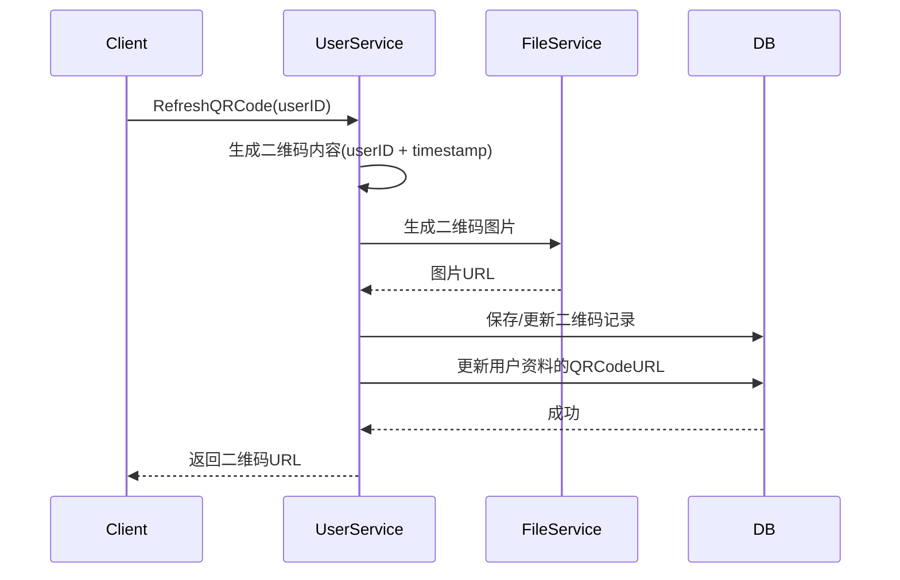
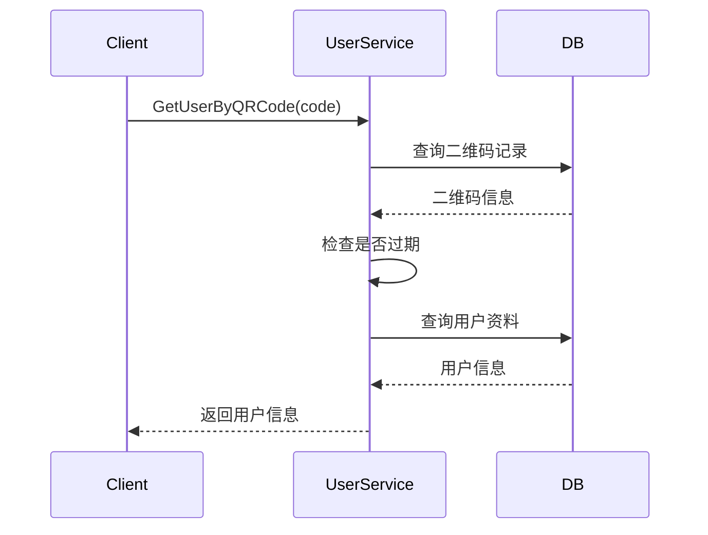

# 二维码管理设计

## 1. 概述

二维码功能用于用户便捷添加好友、分享个人名片。

## 2. 功能列表

- [x] 生成个人二维码
- [x] 刷新二维码
- [x] 扫码解析用户信息

## 3. 数据模型

```go
type UserQRCode struct {
    ID        string    // 主键
    UserID    string    // 用户ID
    Code      string    // 二维码内容
    ExpiredAt *time.Time// 过期时间
    CreatedAt time.Time
    UpdatedAt time.Time
}
```

## 4. 业务流程

### 4.1 生成二维码



### 4.2 扫码解析



## 5. API设计

### 5.1 刷新二维码

```protobuf
message RefreshQRCodeRequest {
    string user_id = 1;
}

message QRCodeResponse {
    string user_id = 1;
    string qr_code_url = 2;
}
```

### 5.2 扫码解析

```protobuf
message GetUserByQRCodeRequest {
    string code = 1;
}

message UserBriefInfo {
    string user_id = 1;
    string nickname = 2;
    string avatar = 3;
}
```

## 6. 二维码规格

- **内容格式**: JSON: `{"uid":"xxx","ts":xxx}`
- **有效期**: 24小时
- **图片格式**: PNG
- **尺寸**: 300x300

## 7. 依赖服务

- **FileService**: 二维码图片生成
- **PostgreSQL**: 二维码记录持久化
