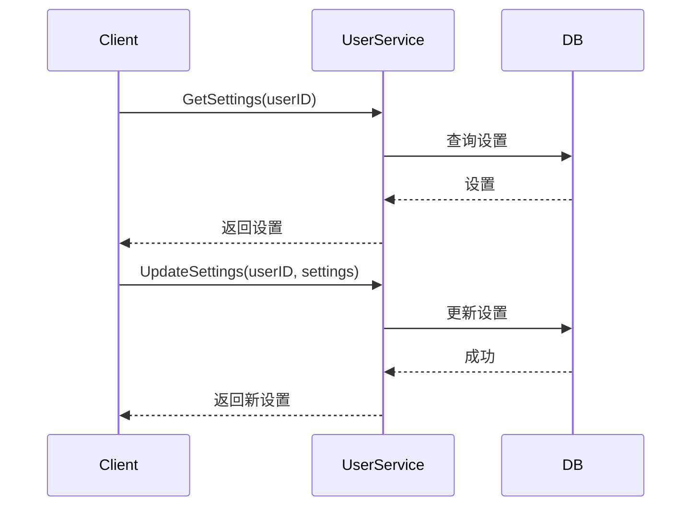

# 用户设置设计

## 1. 概述

用户设置管理用户偏好配置，包括通知设置、隐私设置等。

## 2. 功能列表

- [x] 获取用户设置
- [x] 更新用户设置

## 3. 数据模型

```go
type UserSettings struct {
    UserID                string // 用户ID
    NotificationEnabled   bool   // 通知开关
    SoundEnabled          bool   // 声音
    VibrationEnabled     bool   // 震动
    MessagePreviewEnabled bool   // 消息预览
    FriendVerifyRequired  bool   // 好友验证需要
    SearchByPhone         bool   // 可通过手机号搜索
    SearchByID            bool   // 可通过ID搜索
    Language              string // 语言: zh_CN/en_US
    CreatedAt             time.Time
    UpdatedAt             time.Time
}
```

## 4. 业务流程



## 5. API设计

### 5.1 获取设置

```protobuf
message GetSettingsRequest {
    string user_id = 1;
}

message UserSettingsResponse {
    bool notification_enabled = 1;
    bool sound_enabled = 2;
    bool vibration_enabled = 3;
    bool message_preview_enabled = 4;
    bool friend_verify_required = 5;
    bool search_by_phone = 6;
    bool search_by_id = 7;
    string language = 8;
}
```

### 5.2 更新设置

```protobuf
message UpdateSettingsRequest {
    bool notification_enabled = 1;
    bool sound_enabled = 2;
    bool vibration_enabled = 3;
    bool message_preview_enabled = 4;
    bool friend_verify_required = 5;
    bool search_by_phone = 6;
    bool search_by_id = 7;
    string language = 8;
}
```

## 6. 默认值

| 设置项 | 默认值 |
|--------|--------|
| NotificationEnabled | true |
| SoundEnabled | true |
| VibrationEnabled | true |
| MessagePreviewEnabled | true |
| FriendVerifyRequired | true |
| SearchByPhone | true |
| SearchByID | true |
| Language | zh_CN |
